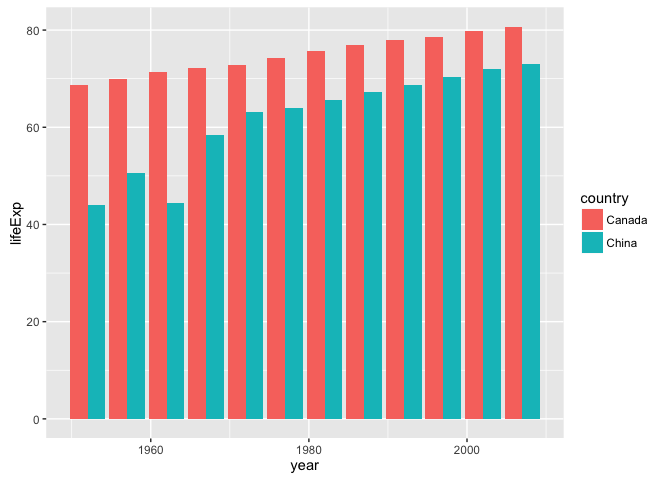
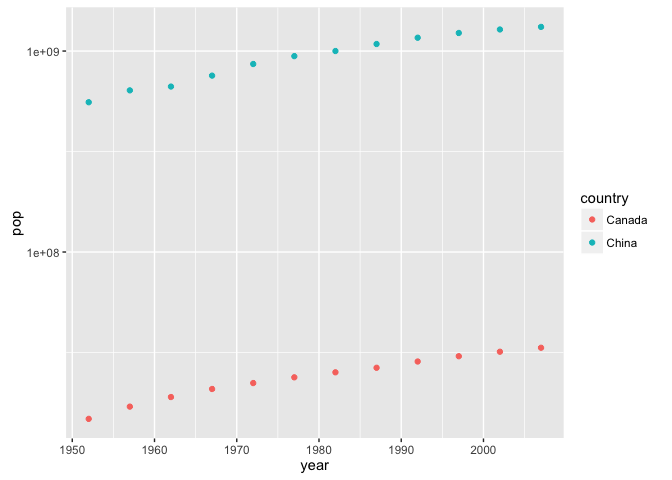
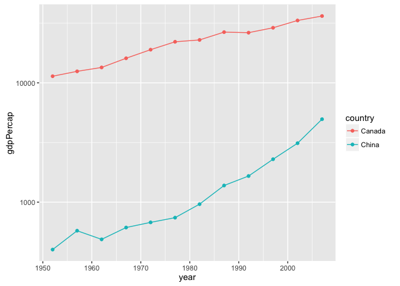

Explore Gapminder and Use dplyr
================
Ke Dai
2016/9/27

Bring rectangular data in
-------------------------

``` r
library(gapminder)
library(tidyverse)
```

    ## Loading tidyverse: ggplot2
    ## Loading tidyverse: tibble
    ## Loading tidyverse: tidyr
    ## Loading tidyverse: readr
    ## Loading tidyverse: purrr
    ## Loading tidyverse: dplyr

    ## Conflicts with tidy packages ----------------------------------------------

    ## filter(): dplyr, stats
    ## lag():    dplyr, stats

Smell test the data
-------------------

**Explore the gapminder object**

-   **Is it a data.frame, a matrix, a vector, a list?**

``` r
is.data.frame(gapminder)
```

    ## [1] TRUE

``` r
is.matrix(gapminder)
```

    ## [1] FALSE

``` r
is.vector(gapminder)
```

    ## [1] FALSE

``` r
is.list(gapminder)
```

    ## [1] TRUE

   Gapminder is a data.frame and also a list.

-   **What’s its class?**

``` r
class(gapminder)
```

    ## [1] "tbl_df"     "tbl"        "data.frame"

   The class of gapminder is table or data.frame.

-   **How many variables/columns?**

``` r
ncol(gapminder)
```

    ## [1] 6

   Gapminder has 6 variables or columns.

-   **How many rows/observations?**

``` r
nrow(gapminder)
```

    ## [1] 1704

   Gapminder has 1704 observations or rows.

-   **Can you get these facts about “extent” or “size” in more than one way? Can you imagine different functions being useful in different contexts?**

``` r
str(gapminder)
```

    ## Classes 'tbl_df', 'tbl' and 'data.frame':    1704 obs. of  6 variables:
    ##  $ country  : Factor w/ 142 levels "Afghanistan",..: 1 1 1 1 1 1 1 1 1 1 ...
    ##  $ continent: Factor w/ 5 levels "Africa","Americas",..: 3 3 3 3 3 3 3 3 3 3 ...
    ##  $ year     : int  1952 1957 1962 1967 1972 1977 1982 1987 1992 1997 ...
    ##  $ lifeExp  : num  28.8 30.3 32 34 36.1 ...
    ##  $ pop      : int  8425333 9240934 10267083 11537966 13079460 14880372 12881816 13867957 16317921 22227415 ...
    ##  $ gdpPercap: num  779 821 853 836 740 ...

``` r
glimpse(gapminder)
```

    ## Observations: 1,704
    ## Variables: 6
    ## $ country   <fctr> Afghanistan, Afghanistan, Afghanistan, Afghanistan,...
    ## $ continent <fctr> Asia, Asia, Asia, Asia, Asia, Asia, Asia, Asia, Asi...
    ## $ year      <int> 1952, 1957, 1962, 1967, 1972, 1977, 1982, 1987, 1992...
    ## $ lifeExp   <dbl> 28.801, 30.332, 31.997, 34.020, 36.088, 38.438, 39.8...
    ## $ pop       <int> 8425333, 9240934, 10267083, 11537966, 13079460, 1488...
    ## $ gdpPercap <dbl> 779.4453, 820.8530, 853.1007, 836.1971, 739.9811, 78...

``` r
dim(gapminder)
```

    ## [1] 1704    6

   We can also use str, glimpse and dim function to get the size. Compared to nrow and ncol, dim can get    the number of both row and column. And str and glimpse can get the name and type of each variable in    addition to the number of row and column. So str and glimpse seem more powerful.

-   **What flavor is each variable?**

   We can get the flavor of each variable using str(gapminder) as mentioned before. Country and continent      variable are of factor flavor. Year, lifeExp, pop and gdpPercap variable are of numeric flavor.

Explore individual variables
----------------------------

**Pick at least one categorical variable and at least one quantitative variable to explore.**

-   **Characterize what’s possible, i.e. all possible values or max vs. min … whatever’s appropriate.**
-   **What’s typical? What’s the spread? What’s the distribution? Etc., tailored to the variable at hand.**
-   **Feel free to use summary stats, tables, figures. We’re NOT expecting high production value (yet).**

``` r
levels(gapminder$continent)
```

    ## [1] "Africa"   "Americas" "Asia"     "Europe"   "Oceania"

For categorical variable, I choose continent. We can see that the possible values of continent are Africa, America, Asia, Europe, and Oceania respectively.

``` r
summary(gapminder$lifeExp)
```

    ##    Min. 1st Qu.  Median    Mean 3rd Qu.    Max. 
    ##   23.60   48.20   60.71   59.47   70.85   82.60

For quantitative variable, I choose lifeExp. We can see that the minimum value is 23.60. The maximum value is 82.60. The median value is 60.71. The mean value is 59.47. The first quantile is 48.20. The third quantile is 70.85.

``` r
ggplot(data = gapminder, mapping = aes(x = as.integer(lifeExp))) + 
  geom_bar()
```


``` r
range(gapminder$lifeExp)
```

    ## [1] 23.599 82.603

``` r
sd(gapminder$lifeExp)
```

    ## [1] 12.91711

From the figures above, we can see that the most typical value of lifeExp is around 70 and the values below 30 are odd. We can also get the value range of lifeExp (from 23.599 to 82.603) using range function instead of min and max function or summary function. The distribution of lifeExp is well demonstrated by the bar graph.

Explore various plot types
--------------------------

**See the ggplot2 tutorial, which also uses the gapminder data, for ideas.**

**Make a few plots, probably of the same variable you chose to characterize numerically. Try to explore more than one plot type. Just as an example of what I mean:**

-   **A scatterplot of two quantitative variables.**

-   **A plot of one quantitative variable. Maybe a histogram or densityplot or frequency polygon.**

-   **A plot of one quantitative variable and one categorical. Maybe boxplots for several continents or countries.**

**You don’t have to use all the data in every plot! It’s fine to filter down to one country or small handful of countries.**

``` r
ggplot(data = gapminder, mapping = aes(x = gdpPercap, y = lifeExp)) +
  scale_x_log10() +
  geom_point() +
  facet_wrap(~ continent)
```


``` r
library(mosaic)
```

    ## Loading required package: lattice

    ## Loading required package: mosaicData

    ## Loading required package: Matrix

    ## 
    ## Attaching package: 'Matrix'

    ## The following object is masked from 'package:tidyr':
    ## 
    ##     expand

    ## 
    ## The 'mosaic' package masks several functions from core packages in order to add additional features.  
    ## The original behavior of these functions should not be affected by this.

    ## 
    ## Attaching package: 'mosaic'

    ## The following object is masked from 'package:Matrix':
    ## 
    ##     mean

    ## The following objects are masked from 'package:dplyr':
    ## 
    ##     count, do, tally

    ## The following objects are masked from 'package:stats':
    ## 
    ##     binom.test, cor, cov, D, fivenum, IQR, median, prop.test,
    ##     quantile, sd, t.test, var

    ## The following objects are masked from 'package:base':
    ## 
    ##     max, mean, min, prod, range, sample, sum

``` r
library(lattice)
histogram(gapminder$lifeExp)
```


``` r
freqpolygon(gapminder$lifeExp)
```


``` r
densityplot(gapminder$lifeExp)
```


``` r
ggplot(data = gapminder, mapping = aes(x = continent, y = lifeExp)) +
  geom_boxplot()
```

 As shown above, I plot a scatterplot of lifeExp and gdpPercap, a histogram, a densityplot and frequency polygon of life Exp, and a plot of lifeExp and continent.

Use filter(), select(), and %&gt;%
----------------------------------

**Use filter() to create data subsets that you want to plot.** **Practice piping together filter() and select(). Possibly even piping into ggplot().**

``` r
gapminder %>% 
   filter(country == "Canada" | country == "China") %>% 
   select(country, year, lifeExp) %>%
   ggplot(aes(x = year, y = lifeExp, color = country)) +
   geom_point()
```



``` r
gapminder %>% 
   filter(country == "Canada" | country == "China") %>% 
   select(country, year, pop) %>%
   ggplot(aes(x = year, y = pop, color = country)) +
   geom_point()
```



``` r
gapminder %>% 
   filter(country == "Canada" | country == "China") %>% 
   select(country, year, gdpPercap) %>%
   ggplot(aes(x = year, y = gdpPercap, color = country)) +
   geom_point()
```



As I am from China, I am interested in make some comparison between China and Canana. In the first graph, I compared the lifeExp of the two countries. We can see that the present life expectancy of China is still shorter than that of Canada although it has grown more rapidly in the last fifty years. In the second graph, I compared the pop of them. We can see that the pupulation of China has more than doubled while the population of Canada remains stable. In the third graph, I compared the gdpPercap between them. We can see that the GDP per capita of Canada has experienced a significant growth while China has only a slight growth in it.

But I want to do more!
----------------------

**For people who want to take things further.**

**Evaluate this code and describe the result. Presumably the analyst’s intent was to get the data for Rwanda and Afghanistan. Did she succeed? Why or why not? If not, what is the correct way to do this?**

``` r
filter(gapminder, country == c("Rwanda", "Afghanistan"))
```

    ## # A tibble: 12 × 6
    ##        country continent  year lifeExp      pop gdpPercap
    ##         <fctr>    <fctr> <int>   <dbl>    <int>     <dbl>
    ## 1  Afghanistan      Asia  1957  30.332  9240934  820.8530
    ## 2  Afghanistan      Asia  1967  34.020 11537966  836.1971
    ## 3  Afghanistan      Asia  1977  38.438 14880372  786.1134
    ## 4  Afghanistan      Asia  1987  40.822 13867957  852.3959
    ## 5  Afghanistan      Asia  1997  41.763 22227415  635.3414
    ## 6  Afghanistan      Asia  2007  43.828 31889923  974.5803
    ## 7       Rwanda    Africa  1952  40.000  2534927  493.3239
    ## 8       Rwanda    Africa  1962  43.000  3051242  597.4731
    ## 9       Rwanda    Africa  1972  44.600  3992121  590.5807
    ## 10      Rwanda    Africa  1982  46.218  5507565  881.5706
    ## 11      Rwanda    Africa  1992  23.599  7290203  737.0686
    ## 12      Rwanda    Africa  2002  43.413  7852401  785.6538

The code above is not correct, it misses 12 obsersations in total. The correct code is as follows:

``` r
filter(gapminder, country %in% c("Rwanda", "Afghanistan"))
```

    ## # A tibble: 24 × 6
    ##        country continent  year lifeExp      pop gdpPercap
    ##         <fctr>    <fctr> <int>   <dbl>    <int>     <dbl>
    ## 1  Afghanistan      Asia  1952  28.801  8425333  779.4453
    ## 2  Afghanistan      Asia  1957  30.332  9240934  820.8530
    ## 3  Afghanistan      Asia  1962  31.997 10267083  853.1007
    ## 4  Afghanistan      Asia  1967  34.020 11537966  836.1971
    ## 5  Afghanistan      Asia  1972  36.088 13079460  739.9811
    ## 6  Afghanistan      Asia  1977  38.438 14880372  786.1134
    ## 7  Afghanistan      Asia  1982  39.854 12881816  978.0114
    ## 8  Afghanistan      Asia  1987  40.822 13867957  852.3959
    ## 9  Afghanistan      Asia  1992  41.674 16317921  649.3414
    ## 10 Afghanistan      Asia  1997  41.763 22227415  635.3414
    ## # ... with 14 more rows

**Present numerical tables in a more attractive form, such as using knitr::kable().**

``` r
gapminder %>% 
  filter(country == "Canada" | country == "China") %>% 
  select(country, year, lifeExp, pop, gdpPercap) %>%
  knitr::kable()
```

| country |  year|   lifeExp|         pop|   gdpPercap|
|:--------|-----:|---------:|-----------:|-----------:|
| Canada  |  1952|  68.75000|    14785584|  11367.1611|
| Canada  |  1957|  69.96000|    17010154|  12489.9501|
| Canada  |  1962|  71.30000|    18985849|  13462.4855|
| Canada  |  1967|  72.13000|    20819767|  16076.5880|
| Canada  |  1972|  72.88000|    22284500|  18970.5709|
| Canada  |  1977|  74.21000|    23796400|  22090.8831|
| Canada  |  1982|  75.76000|    25201900|  22898.7921|
| Canada  |  1987|  76.86000|    26549700|  26626.5150|
| Canada  |  1992|  77.95000|    28523502|  26342.8843|
| Canada  |  1997|  78.61000|    30305843|  28954.9259|
| Canada  |  2002|  79.77000|    31902268|  33328.9651|
| Canada  |  2007|  80.65300|    33390141|  36319.2350|
| China   |  1952|  44.00000|   556263527|    400.4486|
| China   |  1957|  50.54896|   637408000|    575.9870|
| China   |  1962|  44.50136|   665770000|    487.6740|
| China   |  1967|  58.38112|   754550000|    612.7057|
| China   |  1972|  63.11888|   862030000|    676.9001|
| China   |  1977|  63.96736|   943455000|    741.2375|
| China   |  1982|  65.52500|  1000281000|    962.4214|
| China   |  1987|  67.27400|  1084035000|   1378.9040|
| China   |  1992|  68.69000|  1164970000|   1655.7842|
| China   |  1997|  70.42600|  1230075000|   2289.2341|
| China   |  2002|  72.02800|  1280400000|   3119.2809|
| China   |  2007|  72.96100|  1318683096|   4959.1149|

**Use more of the dplyr functions for operating on a single table.**

``` r
## using *arrange()* and *desc()* to change the order of the subset of gapminder
gapminder %>%
  filter(country == "Canada" | country == "China") %>% 
  select(country, year, lifeExp, pop, gdpPercap) %>% 
  arrange(desc(year))
```

    ## # A tibble: 24 × 5
    ##    country  year lifeExp        pop gdpPercap
    ##     <fctr> <int>   <dbl>      <int>     <dbl>
    ## 1   Canada  2007  80.653   33390141 36319.235
    ## 2    China  2007  72.961 1318683096  4959.115
    ## 3   Canada  2002  79.770   31902268 33328.965
    ## 4    China  2002  72.028 1280400000  3119.281
    ## 5   Canada  1997  78.610   30305843 28954.926
    ## 6    China  1997  70.426 1230075000  2289.234
    ## 7   Canada  1992  77.950   28523502 26342.884
    ## 8    China  1992  68.690 1164970000  1655.784
    ## 9   Canada  1987  76.860   26549700 26626.515
    ## 10   China  1987  67.274 1084035000  1378.904
    ## # ... with 14 more rows

``` r
## using *mutate()* to add a new variable gdp to the gapminder data set.
mutate(gapminder, gdp = gdpPercap * pop)
```

    ## # A tibble: 1,704 × 7
    ##        country continent  year lifeExp      pop gdpPercap         gdp
    ##         <fctr>    <fctr> <int>   <dbl>    <int>     <dbl>       <dbl>
    ## 1  Afghanistan      Asia  1952  28.801  8425333  779.4453  6567086330
    ## 2  Afghanistan      Asia  1957  30.332  9240934  820.8530  7585448670
    ## 3  Afghanistan      Asia  1962  31.997 10267083  853.1007  8758855797
    ## 4  Afghanistan      Asia  1967  34.020 11537966  836.1971  9648014150
    ## 5  Afghanistan      Asia  1972  36.088 13079460  739.9811  9678553274
    ## 6  Afghanistan      Asia  1977  38.438 14880372  786.1134 11697659231
    ## 7  Afghanistan      Asia  1982  39.854 12881816  978.0114 12598563401
    ## 8  Afghanistan      Asia  1987  40.822 13867957  852.3959 11820990309
    ## 9  Afghanistan      Asia  1992  41.674 16317921  649.3414 10595901589
    ## 10 Afghanistan      Asia  1997  41.763 22227415  635.3414 14121995875
    ## # ... with 1,694 more rows

``` r
## using *group_by()*, *summarise()* and ggplot() to plot the average life expectancy of each continent from 1952 to 2007.
gapminder %>% 
  group_by(continent, year) %>% 
  summarise(avgLifeExp = mean(lifeExp, na.rm = TRUE)) %>% 
  ggplot(aes(x = year, y = avgLifeExp, color = continent)) +
  geom_point()
```


**Adapt exercises from the chapters in the “Explore” section of R for Data Science to the Gapminder dataset.**

Report your process
-------------------

Before starting doing Homework 02, I first spent serveral hours reading Explore part of the book ***R for Data Science***. For the first time reading, I did not force myself to memorize the syntax of each command exactly. I just want to have an impression of the content. And then I get started with the homework. When I got stuck on a specific question, I tried to find the answer or get some ideas from the book or the notes in the lecture. I have to say this book is really useful. I can find the answers to most of my questions in it. For the questions I cannot solve through the book, I tried to search the answers or relative information by google or baidu (a popular search engine for Chinese people). Although I have spared no effort to figure out every question I had, there are still some questions remaining to be solved. Anyway, the process is interesting. I learned a lot from this assignment.

My questions
------------

1.  What is the difference among *typeof()*, *mode()* and *class()*?
2.  When I apply *is.data.frame()* and *is.list()* to gapminder, both of them return true. So is it that *is.<type>(obj)* returns true as long as this object is of the given type or class.
3.  In the below code chunk, I create a list. Why do *typeof(a)* and *mode(a)* not return list?

``` r
a = c(1, 2, 3)
typeof(a)
```

    ## [1] "double"

``` r
mode(a)
```

    ## [1] "numeric"
