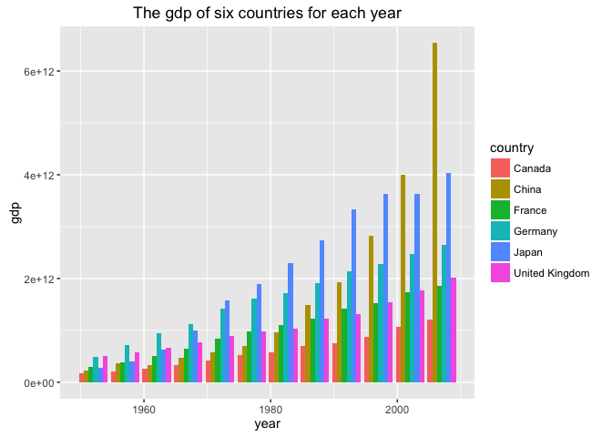
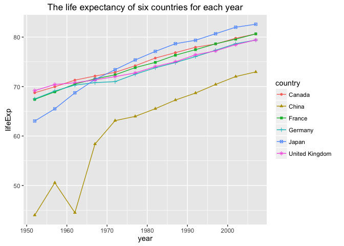

Homework 03: Use dplyr to manipulate and explore data (also use ggplot2)
================
Ke Dai
2016/9/30

Import gapminder, dplyr and ggplot2
-----------------------------------

``` r
library(gapminder)
library(dplyr)
```

    ## 
    ## Attaching package: 'dplyr'

    ## The following objects are masked from 'package:stats':
    ## 
    ##     filter, lag

    ## The following objects are masked from 'package:base':
    ## 
    ##     intersect, setdiff, setequal, union

``` r
library(ggplot2)
```

Task menu
---------

### Get the maximum and minimum of GDP per capita for all continents.

``` r
gdp_min_max <- gapminder %>% 
         group_by(continent) %>% 
         summarise(minGdpPercap = min(gdpPercap, na.rm = TRUE), 
                   maxGdpPercap = max(gdpPercap, na.rm = TRUE))
knitr::kable(gdp_min_max)
```

| continent |  minGdpPercap|  maxGdpPercap|
|:----------|-------------:|-------------:|
| Africa    |      241.1659|      21951.21|
| Americas  |     1201.6372|      42951.65|
| Asia      |      331.0000|     113523.13|
| Europe    |      973.5332|      49357.19|
| Oceania   |    10039.5956|      34435.37|

``` r
gdp_min = gapminder %>% 
  group_by(continent) %>% 
  summarise(minGdpPercap = min(gdpPercap, na.rm = TRUE)) %>% 
  mutate(gdpPercap = minGdpPercap, min_max = "min", minGdpPercap = NULL) 
gdp_max = gapminder %>% 
  group_by(continent) %>% 
  summarise(maxGdpPercap = max(gdpPercap, na.rm = TRUE)) %>%    
  mutate(gdpPercap = maxGdpPercap, min_max = "max", maxGdpPercap = NULL) 
gdp_min_max_shaped = rbind(gdp_min, gdp_max)
gdp_min_max_shaped %>% 
  ggplot(aes(x = continent, y = gdpPercap, fill = min_max)) +
  scale_y_log10() +
  geom_bar(stat = "identity", position = "dodge") +
  ggtitle("GDP per capita by continent")
```


### Look at the spread of GDP per capita within the continents.

``` r
gdp_spread <- gapminder %>% 
  group_by(continent) %>% 
  summarise(min = min(gdpPercap), max = max(gdpPercap), mean = mean(gdpPercap),
            median = median(gdpPercap), sd = sd(gdpPercap), IQR = IQR(gdpPercap))
knitr::kable(gdp_spread)
```

| continent |         min|        max|       mean|     median|         sd|        IQR|
|:----------|-----------:|----------:|----------:|----------:|----------:|----------:|
| Africa    |    241.1659|   21951.21|   2193.755|   1192.138|   2827.930|   1616.170|
| Americas  |   1201.6372|   42951.65|   7136.110|   5465.510|   6396.764|   4402.431|
| Asia      |    331.0000|  113523.13|   7902.150|   2646.787|  14045.373|   7492.262|
| Europe    |    973.5332|   49357.19|  14469.476|  12081.749|   9355.213|  13248.301|
| Oceania   |  10039.5956|   34435.37|  18621.609|  17983.304|   6358.983|   8072.258|

``` r
gapminder %>% 
  ggplot(aes(x = continent, y = gdpPercap, color = continent)) +
  geom_boxplot() +
  ggtitle("The spread of GDP per capita within the continents")
```


### Compute a trimmed mean of life expectancy for different years. Or a weighted mean, weighting by population. Just try something other than the plain vanilla mean.

``` r
## compute a 10% trimmed mean of life expectancy for different years
lifeExp_trimmedMean <- gapminder %>% 
  group_by(year) %>% 
  summarise(trimmedMeanLifeExp = mean(lifeExp, trim = 0.1))
knitr::kable(lifeExp_trimmedMean)
```

|  year|  trimmedMeanLifeExp|
|-----:|-------------------:|
|  1952|            48.57668|
|  1957|            51.26888|
|  1962|            53.58075|
|  1967|            55.86538|
|  1972|            58.01444|
|  1977|            60.10206|
|  1982|            62.11694|
|  1987|            63.92106|
|  1992|            65.18519|
|  1997|            66.01736|
|  2002|            66.71641|
|  2007|            68.11489|

``` r
lifeExp_trimmedMean %>% 
  ggplot(aes(x = year, y = trimmedMeanLifeExp)) +
  geom_point(color = "red") +
  geom_path(color = "red") +
  ggtitle("10% trimmed mean of life expectancy for different years")
```


``` r
## compute a weighted mean of life expectancy on population for different years
lifeExp_weightedMean <- gapminder %>% 
  group_by(year) %>% 
  summarise(weightedMeanLifeExp = weighted.mean(lifeExp, pop))
knitr::kable(lifeExp_weightedMean)
```

|  year|  weightedMeanLifeExp|
|-----:|--------------------:|
|  1952|             48.94424|
|  1957|             52.12189|
|  1962|             52.32438|
|  1967|             56.98431|
|  1972|             59.51478|
|  1977|             61.23726|
|  1982|             62.88176|
|  1987|             64.41635|
|  1992|             65.64590|
|  1997|             66.84934|
|  2002|             67.83904|
|  2007|             68.91909|

``` r
lifeExp_weightedMean %>% 
  ggplot(aes(x = year, y = weightedMeanLifeExp)) +
  geom_point(color = "blue") +
  geom_path(color = "blue") +
  ggtitle("Weighted mean of life expectancy on population for different years")
```


### How is life expectancy changing over time on different continents?

``` r
## compute a mean of life expectancy for different continents and different years
lifeExp_mean <- gapminder %>% 
  group_by(continent, year) %>% 
  summarise(meanLifeExp = mean(lifeExp))
knitr::kable(lifeExp_mean)
```

| continent |  year|  meanLifeExp|
|:----------|-----:|------------:|
| Africa    |  1952|     39.13550|
| Africa    |  1957|     41.26635|
| Africa    |  1962|     43.31944|
| Africa    |  1967|     45.33454|
| Africa    |  1972|     47.45094|
| Africa    |  1977|     49.58042|
| Africa    |  1982|     51.59287|
| Africa    |  1987|     53.34479|
| Africa    |  1992|     53.62958|
| Africa    |  1997|     53.59827|
| Africa    |  2002|     53.32523|
| Africa    |  2007|     54.80604|
| Americas  |  1952|     53.27984|
| Americas  |  1957|     55.96028|
| Americas  |  1962|     58.39876|
| Americas  |  1967|     60.41092|
| Americas  |  1972|     62.39492|
| Americas  |  1977|     64.39156|
| Americas  |  1982|     66.22884|
| Americas  |  1987|     68.09072|
| Americas  |  1992|     69.56836|
| Americas  |  1997|     71.15048|
| Americas  |  2002|     72.42204|
| Americas  |  2007|     73.60812|
| Asia      |  1952|     46.31439|
| Asia      |  1957|     49.31854|
| Asia      |  1962|     51.56322|
| Asia      |  1967|     54.66364|
| Asia      |  1972|     57.31927|
| Asia      |  1977|     59.61056|
| Asia      |  1982|     62.61794|
| Asia      |  1987|     64.85118|
| Asia      |  1992|     66.53721|
| Asia      |  1997|     68.02052|
| Asia      |  2002|     69.23388|
| Asia      |  2007|     70.72848|
| Europe    |  1952|     64.40850|
| Europe    |  1957|     66.70307|
| Europe    |  1962|     68.53923|
| Europe    |  1967|     69.73760|
| Europe    |  1972|     70.77503|
| Europe    |  1977|     71.93777|
| Europe    |  1982|     72.80640|
| Europe    |  1987|     73.64217|
| Europe    |  1992|     74.44010|
| Europe    |  1997|     75.50517|
| Europe    |  2002|     76.70060|
| Europe    |  2007|     77.64860|
| Oceania   |  1952|     69.25500|
| Oceania   |  1957|     70.29500|
| Oceania   |  1962|     71.08500|
| Oceania   |  1967|     71.31000|
| Oceania   |  1972|     71.91000|
| Oceania   |  1977|     72.85500|
| Oceania   |  1982|     74.29000|
| Oceania   |  1987|     75.32000|
| Oceania   |  1992|     76.94500|
| Oceania   |  1997|     78.19000|
| Oceania   |  2002|     79.74000|
| Oceania   |  2007|     80.71950|

``` r
lifeExp_mean %>% 
  ggplot(aes(x = year, y = meanLifeExp, color = continent)) +
  geom_point() +
  geom_path() +
  ggtitle("Life expectancy changing over time on different continents")
```


### Report the absolute and/or relative abundance of countries with low life expectancy over time by continent: Compute some measure of worldwide life expectancy – you decide – a mean or median or some other quantile or perhaps your current age. The determine how many countries on each continent have a life expectancy less than this benchmark, for each year.

``` r
# compute the mean of the life expectancy of all the countries in 2007 as the benchmark
gap_2007 <- gapminder %>% 
  filter(year == 2007) %>% 
  select(lifeExp)
avgLifeExp_2007 = mean(gap_2007$lifeExp)
avgLifeExp_2007
```

    ## [1] 67.00742

``` r
# compute how many countries on each continent have a life expectancy less than this benchmark for each year
gdp_lowLifeExp <- gapminder %>%
  select(continent, year, lifeExp) %>% 
  group_by(continent, year) %>% 
  filter(lifeExp < avgLifeExp_2007) %>% 
  summarise(lowLifeExpNum = n())
knitr::kable(gdp_lowLifeExp)
```

| continent |  year|  lowLifeExpNum|
|:----------|-----:|--------------:|
| Africa    |  1952|             52|
| Africa    |  1957|             52|
| Africa    |  1962|             52|
| Africa    |  1967|             52|
| Africa    |  1972|             52|
| Africa    |  1977|             51|
| Africa    |  1982|             51|
| Africa    |  1987|             50|
| Africa    |  1992|             47|
| Africa    |  1997|             45|
| Africa    |  2002|             45|
| Africa    |  2007|             45|
| Americas  |  1952|             23|
| Americas  |  1957|             21|
| Americas  |  1962|             21|
| Americas  |  1967|             19|
| Americas  |  1972|             17|
| Americas  |  1977|             13|
| Americas  |  1982|             12|
| Americas  |  1987|              9|
| Americas  |  1992|              7|
| Americas  |  1997|              3|
| Americas  |  2002|              2|
| Americas  |  2007|              2|
| Asia      |  1952|             33|
| Asia      |  1957|             32|
| Asia      |  1962|             30|
| Asia      |  1967|             28|
| Asia      |  1972|             27|
| Asia      |  1977|             26|
| Asia      |  1982|             22|
| Asia      |  1987|             18|
| Asia      |  1992|             13|
| Asia      |  1997|             11|
| Asia      |  2002|             11|
| Asia      |  2007|             10|
| Europe    |  1952|             20|
| Europe    |  1957|             12|
| Europe    |  1962|              7|
| Europe    |  1967|              6|
| Europe    |  1972|              1|
| Europe    |  1977|              1|
| Europe    |  1982|              1|
| Europe    |  1987|              1|
| Europe    |  1992|              1|

``` r
gdp_lowLifeExp %>% 
  ggplot(aes(x = year, y = lowLifeExpNum, color = continent)) +
  geom_point() +
  geom_path() +
  ggtitle("The number of countries on each continent which have a life expectancy 
less than the worldwide average life expectancy in 2007 for each year")
```


### Find countries with interesting stories. Open-ended and, therefore, hard. Promising but unsuccessful attempts are encouraged. This will generate interesting questions to follow up on in class.

``` r
## get the life expectancy of China from 1950 to 2007
gapminder %>% 
  filter(country == "China") %>% 
  ggplot(aes(x = year, y = lifeExp)) +
  geom_point(color = "orange") +
  geom_path(color = "orange") +
  ggtitle("The life expectancy of China from 1950 to 2007")
```


Look at this graph, you may be wondering why there is a sharp decline of life expectancy for China in 1962. It will make this figure understandable if you learn a little bit about the so-called <a href = "https://en.wikipedia.org/wiki/Great_Chinese_Famine">Three Years of Great Chinese Famine</a> which happened in China from 1959 to 1961. It is a great shame in Chinese history. I would not like to talk about it more here.

### Make up your own! Between the dplyr coverage in class and the list above, I think you get the idea.

``` r
## compute the gdp of Japan, the United Kingdom, Canada, Germany, France and China for each year
gdp <- gapminder %>% 
  filter(country %in% c("Japan", "United Kingdom", "Canada", "Germany", "France", "China")) %>% 
  select(year, country, pop, gdpPercap) %>% 
  mutate(gdp = pop * gdpPercap, pop = NULL, gdpPercap = NULL)
knitr::kable(gdp)
```

|  year| country        |           gdp|
|-----:|:---------------|-------------:|
|  1952| Canada         |  1.680701e+11|
|  1957| Canada         |  2.124560e+11|
|  1962| Canada         |  2.555967e+11|
|  1967| Canada         |  3.347108e+11|
|  1972| Canada         |  4.227497e+11|
|  1977| Canada         |  5.256835e+11|
|  1982| Canada         |  5.770931e+11|
|  1987| Canada         |  7.069260e+11|
|  1992| Canada         |  7.513913e+11|
|  1997| Canada         |  8.775034e+11|
|  2002| Canada         |  1.063270e+12|
|  2007| Canada         |  1.212704e+12|
|  1952| China          |  2.227550e+11|
|  1957| China          |  3.671387e+11|
|  1962| China          |  3.246787e+11|
|  1967| China          |  4.623171e+11|
|  1972| China          |  5.835082e+11|
|  1977| China          |  6.993242e+11|
|  1982| China          |  9.626918e+11|
|  1987| China          |  1.494780e+12|
|  1992| China          |  1.928939e+12|
|  1997| China          |  2.815930e+12|
|  2002| China          |  3.993927e+12|
|  2007| China          |  6.539501e+12|
|  1952| France         |  2.984834e+11|
|  1957| France         |  3.838577e+11|
|  1962| France         |  4.976523e+11|
|  1967| France         |  6.443929e+11|
|  1972| France         |  8.332572e+11|
|  1977| France         |  9.725283e+11|
|  1982| France         |  1.104669e+12|
|  1987| France         |  1.227558e+12|
|  1992| France         |  1.417360e+12|
|  1997| France         |  1.517748e+12|
|  2002| France         |  1.733394e+12|
|  2007| France         |  1.861228e+12|
|  1952| Germany        |  4.939866e+11|
|  1957| Germany        |  7.235300e+11|
|  1962| Germany        |  9.514162e+11|
|  1967| Germany        |  1.126101e+12|
|  1972| Germany        |  1.418181e+12|
|  1977| Germany        |  1.603306e+12|
|  1982| Germany        |  1.725846e+12|
|  1987| Germany        |  1.914916e+12|
|  1992| Germany        |  2.136268e+12|
|  1997| Germany        |  2.278996e+12|
|  2002| Germany        |  2.473468e+12|
|  2007| Germany        |  2.650871e+12|
|  1952| Japan          |  2.781349e+11|
|  1957| Japan          |  3.953411e+11|
|  1962| Japan          |  6.302519e+11|
|  1967| Japan          |  9.929060e+11|
|  1972| Japan          |  1.584113e+12|
|  1977| Japan          |  1.891465e+12|
|  1982| Japan          |  2.296144e+12|
|  1987| Japan          |  2.731908e+12|
|  1992| Japan          |  3.335120e+12|
|  1997| Japan          |  3.629636e+12|
|  2002| Japan          |  3.634667e+12|
|  2007| Japan          |  4.035135e+12|
|  1952| United Kingdom |  5.032666e+11|
|  1957| United Kingdom |  5.802938e+11|
|  1962| United Kingdom |  6.649337e+11|
|  1967| United Kingdom |  7.772769e+11|
|  1972| United Kingdom |  8.913822e+11|
|  1977| United Kingdom |  9.791297e+11|
|  1982| United Kingdom |  1.027209e+12|
|  1987| United Kingdom |  1.234495e+12|
|  1992| United Kingdom |  1.313861e+12|
|  1997| United Kingdom |  1.533398e+12|
|  2002| United Kingdom |  1.766159e+12|
|  2007| United Kingdom |  2.017969e+12|

``` r
gdp %>% 
  ggplot(aes(x = year, y = gdp, fill = country)) +
  geom_bar(stat = "identity", position = "dodge") +
  ggtitle("The gdp of six countries for each year")
```



``` r
## get the life expectancy of Japan, the United Kingdom, Canada, Germany, France and China for each year
lifeExp <- gapminder %>% 
  filter(country %in% c("Japan", "United Kingdom", "Canada", "Germany", "France", "China")) %>% 
  select(year, country, lifeExp)
knitr::kable(lifeExp)
```

|  year| country        |   lifeExp|
|-----:|:---------------|---------:|
|  1952| Canada         |  68.75000|
|  1957| Canada         |  69.96000|
|  1962| Canada         |  71.30000|
|  1967| Canada         |  72.13000|
|  1972| Canada         |  72.88000|
|  1977| Canada         |  74.21000|
|  1982| Canada         |  75.76000|
|  1987| Canada         |  76.86000|
|  1992| Canada         |  77.95000|
|  1997| Canada         |  78.61000|
|  2002| Canada         |  79.77000|
|  2007| Canada         |  80.65300|
|  1952| China          |  44.00000|
|  1957| China          |  50.54896|
|  1962| China          |  44.50136|
|  1967| China          |  58.38112|
|  1972| China          |  63.11888|
|  1977| China          |  63.96736|
|  1982| China          |  65.52500|
|  1987| China          |  67.27400|
|  1992| China          |  68.69000|
|  1997| China          |  70.42600|
|  2002| China          |  72.02800|
|  2007| China          |  72.96100|
|  1952| France         |  67.41000|
|  1957| France         |  68.93000|
|  1962| France         |  70.51000|
|  1967| France         |  71.55000|
|  1972| France         |  72.38000|
|  1977| France         |  73.83000|
|  1982| France         |  74.89000|
|  1987| France         |  76.34000|
|  1992| France         |  77.46000|
|  1997| France         |  78.64000|
|  2002| France         |  79.59000|
|  2007| France         |  80.65700|
|  1952| Germany        |  67.50000|
|  1957| Germany        |  69.10000|
|  1962| Germany        |  70.30000|
|  1967| Germany        |  70.80000|
|  1972| Germany        |  71.00000|
|  1977| Germany        |  72.50000|
|  1982| Germany        |  73.80000|
|  1987| Germany        |  74.84700|
|  1992| Germany        |  76.07000|
|  1997| Germany        |  77.34000|
|  2002| Germany        |  78.67000|
|  2007| Germany        |  79.40600|
|  1952| Japan          |  63.03000|
|  1957| Japan          |  65.50000|
|  1962| Japan          |  68.73000|
|  1967| Japan          |  71.43000|
|  1972| Japan          |  73.42000|
|  1977| Japan          |  75.38000|
|  1982| Japan          |  77.11000|
|  1987| Japan          |  78.67000|
|  1992| Japan          |  79.36000|
|  1997| Japan          |  80.69000|
|  2002| Japan          |  82.00000|
|  2007| Japan          |  82.60300|
|  1952| United Kingdom |  69.18000|
|  1957| United Kingdom |  70.42000|
|  1962| United Kingdom |  70.76000|
|  1967| United Kingdom |  71.36000|
|  1972| United Kingdom |  72.01000|
|  1977| United Kingdom |  72.76000|
|  1982| United Kingdom |  74.04000|
|  1987| United Kingdom |  75.00700|
|  1992| United Kingdom |  76.42000|
|  1997| United Kingdom |  77.21800|
|  2002| United Kingdom |  78.47100|
|  2007| United Kingdom |  79.42500|

``` r
lifeExp %>% 
  ggplot(aes(x = year, y = lifeExp, shape = country, color = country)) +
  geom_point() +
  geom_path() +
  ggtitle("The life expectancy of six countries for each year")
```



Report your process
-------------------

I think Homework 3 is not very difficult for me. Most of tasks are similar to what we have practised in the class. For something that I am not sure, I searched the answer through the book ***R for Data Science*** and on the Internet. This homework is helpful for me to be more familiar with various functions in dplyr and ggplot2 library. I finished all the tasks in this homework. I think the first task is relatively more difficult compared to the other tasks because I have to do some transformation on the data in order to plot it approriately.

Specifically, I can get the minimum and maximum value of GDP per capita for each continent using the following sentences.

``` r
gdp_min_max <- gapminder %>% 
         group_by(continent) %>% 
         summarise(minGdpPercap = min(gdpPercap, na.rm = TRUE), 
                   maxGdpPercap = max(gdpPercap, na.rm = TRUE))
knitr::kable(gdp_min_max)
```

| continent |  minGdpPercap|  maxGdpPercap|
|:----------|-------------:|-------------:|
| Africa    |      241.1659|      21951.21|
| Americas  |     1201.6372|      42951.65|
| Asia      |      331.0000|     113523.13|
| Europe    |      973.5332|      49357.19|
| Oceania   |    10039.5956|      34435.37|

But this format of data is difficult to plot it. So I transformed it to the format below which is convenient to visualize it using various plotting functions in ggplot2 library.

``` r
gdp_min = gapminder %>% 
  group_by(continent) %>% 
  summarise(minGdpPercap = min(gdpPercap, na.rm = TRUE)) %>% 
  mutate(gdpPercap = minGdpPercap, min_max = "min", minGdpPercap = NULL) 
gdp_max = gapminder %>% 
  group_by(continent) %>% 
  summarise(maxGdpPercap = max(gdpPercap, na.rm = TRUE)) %>%    
  mutate(gdpPercap = maxGdpPercap, min_max = "max", maxGdpPercap = NULL) 
gdp_min_max_shaped = rbind(gdp_min, gdp_max)
knitr::kable(gdp_min_max_shaped)
```

| continent |    gdpPercap| min\_max |
|:----------|------------:|:---------|
| Africa    |     241.1659| min      |
| Americas  |    1201.6372| min      |
| Asia      |     331.0000| min      |
| Europe    |     973.5332| min      |
| Oceania   |   10039.5956| min      |
| Africa    |   21951.2118| max      |
| Americas  |   42951.6531| max      |
| Asia      |  113523.1329| max      |
| Europe    |   49357.1902| max      |
| Oceania   |   34435.3674| max      |

I learned that rbind can combine two tables or data.frames together with the same number and names of variables searching on the internet.
