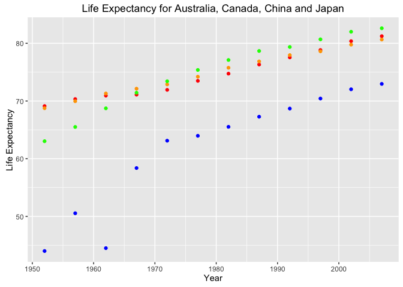

Homework 04: Tidy data and joins
================
Ke Dai
2016/10/11

Import gapminder, tidyverse and knitr
-------------------------------------

``` r
library(gapminder)
library(tidyverse)
```

    ## Loading tidyverse: ggplot2
    ## Loading tidyverse: tibble
    ## Loading tidyverse: tidyr
    ## Loading tidyverse: readr
    ## Loading tidyverse: purrr
    ## Loading tidyverse: dplyr

    ## Conflicts with tidy packages ----------------------------------------------

    ## filter(): dplyr, stats
    ## lag():    dplyr, stats

``` r
library(countrycode)
library(geonames)
```

    ## No geonamesUsername set. See http://geonames.wordpress.com/2010/03/16/ddos-part-ii/ and set one with options(geonamesUsername="foo") for some services to work

``` r
library(knitr)
```

General data reshaping and relationship to aggregation
------------------------------------------------------

**Problem**: You have data in one “shape” but you wish it were in another. Usually this is because the alternative shape is superior for presenting a table, making a figure, or doing aggregation and statistical analysis.

**Solution**: Reshape your data. For simple reshaping, gather() and spread() from tidyr will suffice. Do the thing that it possible / easier now that your data has a new shape.

**Prompts**:

Activity \#2

-   Make a tibble with one row per year and columns for life expectancy for two or more countries.
    -   Use knitr::kable() to make this table look pretty in your rendered homework.
    -   Take advantage of this new data shape to scatterplot life expectancy for one country against that of another.

``` r
lifeExp_spread <- gapminder %>% 
  filter(country %in% c('China', 'Japan', 'Canada', 'Australia')) %>% 
  select(year, country, lifeExp) %>% 
  spread(key = country, value = lifeExp)

kable(lifeExp_spread)
```

|  year|  Australia|  Canada|     China|   Japan|
|-----:|----------:|-------:|---------:|-------:|
|  1952|     69.120|  68.750|  44.00000|  63.030|
|  1957|     70.330|  69.960|  50.54896|  65.500|
|  1962|     70.930|  71.300|  44.50136|  68.730|
|  1967|     71.100|  72.130|  58.38112|  71.430|
|  1972|     71.930|  72.880|  63.11888|  73.420|
|  1977|     73.490|  74.210|  63.96736|  75.380|
|  1982|     74.740|  75.760|  65.52500|  77.110|
|  1987|     76.320|  76.860|  67.27400|  78.670|
|  1992|     77.560|  77.950|  68.69000|  79.360|
|  1997|     78.830|  78.610|  70.42600|  80.690|
|  2002|     80.370|  79.770|  72.02800|  82.000|
|  2007|     81.235|  80.653|  72.96100|  82.603|

``` r
lifeExp_spread %>% 
  ggplot() +
  geom_point(aes(x = year, y = Australia), color = 'red') +
  geom_point(aes(x = year, y = Canada), color = 'orange') +
  geom_point(aes(x = year, y = China), color = 'blue') +
  geom_point(aes(x = year, y = Japan), color = 'green') +
  labs(title = "Life Expectancy for Australia, Canada, China and Japan",
       x = "Year", y = "Life Expectancy")
```



Activity \#3

-   Compute some measure of life expectancy (mean? median? min? max?) for all possible combinations of continent and year. Reshape that to have one row per year and one variable for each continent. Or the other way around: one row per continent and one variable per year.
    -   Use knitr::kable() to make these tables look pretty in your rendered homework.
    -   Is there a plot that is easier to make with the data in this shape versis the usual form? If so (or you think so), try it! Reflect.

``` r
lifeExp_cont_year <- gapminder %>% 
  group_by(year, continent) %>% 
  summarise(mean_lifeExp = mean(lifeExp))

## Reshape lifeExp_cont_year to have one row per year and one variable for each continent.
lifeExp_spreadByCont <- lifeExp_cont_year %>% 
  spread(key = continent, value = mean_lifeExp)

kable(lifeExp_spreadByCont)
```

|  year|    Africa|  Americas|      Asia|    Europe|  Oceania|
|-----:|---------:|---------:|---------:|---------:|--------:|
|  1952|  39.13550|  53.27984|  46.31439|  64.40850|  69.2550|
|  1957|  41.26635|  55.96028|  49.31854|  66.70307|  70.2950|
|  1962|  43.31944|  58.39876|  51.56322|  68.53923|  71.0850|
|  1967|  45.33454|  60.41092|  54.66364|  69.73760|  71.3100|
|  1972|  47.45094|  62.39492|  57.31927|  70.77503|  71.9100|
|  1977|  49.58042|  64.39156|  59.61056|  71.93777|  72.8550|
|  1982|  51.59287|  66.22884|  62.61794|  72.80640|  74.2900|
|  1987|  53.34479|  68.09072|  64.85118|  73.64217|  75.3200|
|  1992|  53.62958|  69.56836|  66.53721|  74.44010|  76.9450|
|  1997|  53.59827|  71.15048|  68.02052|  75.50517|  78.1900|
|  2002|  53.32523|  72.42204|  69.23388|  76.70060|  79.7400|
|  2007|  54.80604|  73.60812|  70.72848|  77.64860|  80.7195|

``` r
## Reshape lifeExp_cont_year to have one row per continent and one variable per year.
lifeExp_spreadByYear <- lifeExp_cont_year %>% 
  spread(key = year, value = mean_lifeExp)

kable(lifeExp_spreadByYear)
```

| continent |      1952|      1957|      1962|      1967|      1972|      1977|      1982|      1987|      1992|      1997|      2002|      2007|
|:----------|---------:|---------:|---------:|---------:|---------:|---------:|---------:|---------:|---------:|---------:|---------:|---------:|
| Africa    |  39.13550|  41.26635|  43.31944|  45.33454|  47.45094|  49.58042|  51.59287|  53.34479|  53.62958|  53.59827|  53.32523|  54.80604|
| Americas  |  53.27984|  55.96028|  58.39876|  60.41092|  62.39492|  64.39156|  66.22884|  68.09072|  69.56836|  71.15048|  72.42204|  73.60812|
| Asia      |  46.31439|  49.31854|  51.56322|  54.66364|  57.31927|  59.61056|  62.61794|  64.85118|  66.53721|  68.02052|  69.23388|  70.72848|
| Europe    |  64.40850|  66.70307|  68.53923|  69.73760|  70.77503|  71.93777|  72.80640|  73.64217|  74.44010|  75.50517|  76.70060|  77.64860|
| Oceania   |  69.25500|  70.29500|  71.08500|  71.31000|  71.91000|  72.85500|  74.29000|  75.32000|  76.94500|  78.19000|  79.74000|  80.71950|

Activity \#4

-   In Window functions, we formed a tibble with 24 rows: 2 per year, giving the country with both the lowest and highest life expectancy (in Asia). Take that table (or a similar one for all continents) and reshape it so you have one row per year or per year \* continent combination.

``` r
## prepare the tibble with 24 rows: 2 per year, giving the country with both the lowest and highest life expectancy (in Asia).
my_gap <- gapminder %>%
  filter(continent == "Asia") %>%
  select(year, country, lifeExp) %>%
  group_by(year) %>%
  filter(min_rank(desc(lifeExp)) < 2 | min_rank(lifeExp) < 2) %>% 
  arrange(year)

my_gap_spreadByCountry <- my_gap %>% 
  spread(key = country, value = lifeExp)
kable(my_gap_spreadByCountry)
```

|  year|  Afghanistan|  Cambodia|  Israel|   Japan|
|-----:|------------:|---------:|-------:|-------:|
|  1952|       28.801|        NA|   65.39|      NA|
|  1957|       30.332|        NA|   67.84|      NA|
|  1962|       31.997|        NA|   69.39|      NA|
|  1967|       34.020|        NA|      NA|  71.430|
|  1972|       36.088|        NA|      NA|  73.420|
|  1977|           NA|     31.22|      NA|  75.380|
|  1982|       39.854|        NA|      NA|  77.110|
|  1987|       40.822|        NA|      NA|  78.670|
|  1992|       41.674|        NA|      NA|  79.360|
|  1997|       41.763|        NA|      NA|  80.690|
|  2002|       42.129|        NA|      NA|  82.000|
|  2007|       43.828|        NA|      NA|  82.603|

Join, merge, look up
--------------------

**Problem**: You have two data sources and you need info from both in one new data object.

**Solution**: Perform a **join**, which borrows terminology from the database world, specifically SQL.

**Prompts**:

Activity \#1

-   Create a second data frame, complementary to Gapminder. Join this with (part of) Gapminder using a dplyr join function and make some observations about the process and result. Explore the different types of joins. Examples of a second data frame you could build:
    -   One row per country, a country variable and one or more variables with extra info, such as language spoken, NATO membership, national animal, or capitol city. If you really want to be helpful, you could attempt to make a pull request to resolve this issue, where I would like to bring ISO country codes into the gapminder package.
    -   One row per continent, a continent variable and one or more variables with extra info, such as northern versus southern hemisphere.

join gapminder with a country information table
-----------------------------------------------

``` r
options(geonamesUsername = "ke_dai")

countryInfo <- GNcountryInfo()

country_df <- countryInfo %>% 
  tbl_df %>% 
  select(countryCode,
         country = countryName,
         capital,
         languages,
         area = areaInSqKm) %>% 
  mutate(area = as.double(area))

gapminder_code <- gapminder %>% 
  mutate(countryCode = countrycode(country, "country.name", "iso2c"))

gap_inner_join <- gapminder_code %>% 
  inner_join(country_df, by = "countryCode")

kable(head(gap_inner_join))
```

| country.x   | continent |  year|  lifeExp|       pop|  gdpPercap| countryCode | country.y                       | capital | languages         |    area|
|:------------|:----------|-----:|--------:|---------:|----------:|:------------|:--------------------------------|:--------|:------------------|-------:|
| Afghanistan | Asia      |  1952|   28.801|   8425333|   779.4453| AF          | Islamic Republic of Afghanistan | Kabul   | fa-AF,ps,uz-AF,tk |  647500|
| Afghanistan | Asia      |  1957|   30.332|   9240934|   820.8530| AF          | Islamic Republic of Afghanistan | Kabul   | fa-AF,ps,uz-AF,tk |  647500|
| Afghanistan | Asia      |  1962|   31.997|  10267083|   853.1007| AF          | Islamic Republic of Afghanistan | Kabul   | fa-AF,ps,uz-AF,tk |  647500|
| Afghanistan | Asia      |  1967|   34.020|  11537966|   836.1971| AF          | Islamic Republic of Afghanistan | Kabul   | fa-AF,ps,uz-AF,tk |  647500|
| Afghanistan | Asia      |  1972|   36.088|  13079460|   739.9811| AF          | Islamic Republic of Afghanistan | Kabul   | fa-AF,ps,uz-AF,tk |  647500|
| Afghanistan | Asia      |  1977|   38.438|  14880372|   786.1134| AF          | Islamic Republic of Afghanistan | Kabul   | fa-AF,ps,uz-AF,tk |  647500|

``` r
gap_left_join <- gapminder_code %>% 
  left_join(country_df, by = "countryCode")

kable(head(gap_left_join))
```

| country.x   | continent |  year|  lifeExp|       pop|  gdpPercap| countryCode | country.y                       | capital | languages         |    area|
|:------------|:----------|-----:|--------:|---------:|----------:|:------------|:--------------------------------|:--------|:------------------|-------:|
| Afghanistan | Asia      |  1952|   28.801|   8425333|   779.4453| AF          | Islamic Republic of Afghanistan | Kabul   | fa-AF,ps,uz-AF,tk |  647500|
| Afghanistan | Asia      |  1957|   30.332|   9240934|   820.8530| AF          | Islamic Republic of Afghanistan | Kabul   | fa-AF,ps,uz-AF,tk |  647500|
| Afghanistan | Asia      |  1962|   31.997|  10267083|   853.1007| AF          | Islamic Republic of Afghanistan | Kabul   | fa-AF,ps,uz-AF,tk |  647500|
| Afghanistan | Asia      |  1967|   34.020|  11537966|   836.1971| AF          | Islamic Republic of Afghanistan | Kabul   | fa-AF,ps,uz-AF,tk |  647500|
| Afghanistan | Asia      |  1972|   36.088|  13079460|   739.9811| AF          | Islamic Republic of Afghanistan | Kabul   | fa-AF,ps,uz-AF,tk |  647500|
| Afghanistan | Asia      |  1977|   38.438|  14880372|   786.1134| AF          | Islamic Republic of Afghanistan | Kabul   | fa-AF,ps,uz-AF,tk |  647500|

``` r
gap_right_join <- gapminder_code %>% 
  right_join(country_df, by = "countryCode")

kable(head(gap_right_join))
```

| country.x   | continent |  year|  lifeExp|       pop|  gdpPercap| countryCode | country.y                       | capital          | languages         |    area|
|:------------|:----------|-----:|--------:|---------:|----------:|:------------|:--------------------------------|:-----------------|:------------------|-------:|
| NA          | NA        |    NA|       NA|        NA|         NA| AD          | Principality of Andorra         | Andorra la Vella | ca                |     468|
| NA          | NA        |    NA|       NA|        NA|         NA| AE          | United Arab Emirates            | Abu Dhabi        | ar-AE,fa,en,hi,ur |   82880|
| Afghanistan | Asia      |  1952|   28.801|   8425333|   779.4453| AF          | Islamic Republic of Afghanistan | Kabul            | fa-AF,ps,uz-AF,tk |  647500|
| Afghanistan | Asia      |  1957|   30.332|   9240934|   820.8530| AF          | Islamic Republic of Afghanistan | Kabul            | fa-AF,ps,uz-AF,tk |  647500|
| Afghanistan | Asia      |  1962|   31.997|  10267083|   853.1007| AF          | Islamic Republic of Afghanistan | Kabul            | fa-AF,ps,uz-AF,tk |  647500|
| Afghanistan | Asia      |  1967|   34.020|  11537966|   836.1971| AF          | Islamic Republic of Afghanistan | Kabul            | fa-AF,ps,uz-AF,tk |  647500|

``` r
gap_full_join <- gapminder_code %>% 
  full_join(country_df, by = "countryCode")

kable(head(gap_full_join))
```

| country.x   | continent |  year|  lifeExp|       pop|  gdpPercap| countryCode | country.y                       | capital | languages         |    area|
|:------------|:----------|-----:|--------:|---------:|----------:|:------------|:--------------------------------|:--------|:------------------|-------:|
| Afghanistan | Asia      |  1952|   28.801|   8425333|   779.4453| AF          | Islamic Republic of Afghanistan | Kabul   | fa-AF,ps,uz-AF,tk |  647500|
| Afghanistan | Asia      |  1957|   30.332|   9240934|   820.8530| AF          | Islamic Republic of Afghanistan | Kabul   | fa-AF,ps,uz-AF,tk |  647500|
| Afghanistan | Asia      |  1962|   31.997|  10267083|   853.1007| AF          | Islamic Republic of Afghanistan | Kabul   | fa-AF,ps,uz-AF,tk |  647500|
| Afghanistan | Asia      |  1967|   34.020|  11537966|   836.1971| AF          | Islamic Republic of Afghanistan | Kabul   | fa-AF,ps,uz-AF,tk |  647500|
| Afghanistan | Asia      |  1972|   36.088|  13079460|   739.9811| AF          | Islamic Republic of Afghanistan | Kabul   | fa-AF,ps,uz-AF,tk |  647500|
| Afghanistan | Asia      |  1977|   38.438|  14880372|   786.1134| AF          | Islamic Republic of Afghanistan | Kabul   | fa-AF,ps,uz-AF,tk |  647500|

join gapminder with a continent information table
-------------------------------------------------

``` r
continent <- tribble(
  ~continent, ~position, 
  "Africa", "south",
  "Antarctica", "south",
  "Asia", "north",
  "Europe", "north",
  "North America", "north",
  "South America", "south",
  "Oceania", "south")

continent <- continent %>% 
  mutate(continent = as.factor(continent),
         position = as.factor(position))

gap_cont <- gapminder %>% 
  group_by(year, continent) %>% 
  summarise(mean_gdpPercap = mean(gdpPercap),
            mean_lifeExp = mean(lifeExp))

gap_cont_inner_join <- gap_cont %>% 
  inner_join(continent, by = "continent")
```

    ## Warning in inner_join_impl(x, y, by$x, by$y, suffix$x, suffix$y): joining
    ## factors with different levels, coercing to character vector

``` r
kable(gap_cont_inner_join)
```

|  year| continent |  mean\_gdpPercap|  mean\_lifeExp| position |
|-----:|:----------|----------------:|--------------:|:---------|
|  1952| Africa    |         1252.572|       39.13550| south    |
|  1952| Asia      |         5195.484|       46.31439| north    |
|  1952| Europe    |         5661.057|       64.40850| north    |
|  1952| Oceania   |        10298.086|       69.25500| south    |
|  1957| Africa    |         1385.236|       41.26635| south    |
|  1957| Asia      |         5787.733|       49.31854| north    |
|  1957| Europe    |         6963.013|       66.70307| north    |
|  1957| Oceania   |        11598.522|       70.29500| south    |
|  1962| Africa    |         1598.079|       43.31944| south    |
|  1962| Asia      |         5729.370|       51.56322| north    |
|  1962| Europe    |         8365.487|       68.53923| north    |
|  1962| Oceania   |        12696.452|       71.08500| south    |
|  1967| Africa    |         2050.364|       45.33454| south    |
|  1967| Asia      |         5971.173|       54.66364| north    |
|  1967| Europe    |        10143.824|       69.73760| north    |
|  1967| Oceania   |        14495.022|       71.31000| south    |
|  1972| Africa    |         2339.616|       47.45094| south    |
|  1972| Asia      |         8187.469|       57.31927| north    |
|  1972| Europe    |        12479.575|       70.77503| north    |
|  1972| Oceania   |        16417.333|       71.91000| south    |
|  1977| Africa    |         2585.939|       49.58042| south    |
|  1977| Asia      |         7791.314|       59.61056| north    |
|  1977| Europe    |        14283.979|       71.93777| north    |
|  1977| Oceania   |        17283.958|       72.85500| south    |
|  1982| Africa    |         2481.593|       51.59287| south    |
|  1982| Asia      |         7434.135|       62.61794| north    |
|  1982| Europe    |        15617.897|       72.80640| north    |
|  1982| Oceania   |        18554.710|       74.29000| south    |
|  1987| Africa    |         2282.669|       53.34479| south    |
|  1987| Asia      |         7608.227|       64.85118| north    |
|  1987| Europe    |        17214.311|       73.64217| north    |
|  1987| Oceania   |        20448.040|       75.32000| south    |
|  1992| Africa    |         2281.810|       53.62958| south    |
|  1992| Asia      |         8639.690|       66.53721| north    |
|  1992| Europe    |        17061.568|       74.44010| north    |
|  1992| Oceania   |        20894.046|       76.94500| south    |
|  1997| Africa    |         2378.760|       53.59827| south    |
|  1997| Asia      |         9834.093|       68.02052| north    |
|  1997| Europe    |        19076.782|       75.50517| north    |
|  1997| Oceania   |        24024.175|       78.19000| south    |
|  2002| Africa    |         2599.385|       53.32523| south    |
|  2002| Asia      |        10174.090|       69.23388| north    |
|  2002| Europe    |        21711.732|       76.70060| north    |
|  2002| Oceania   |        26938.778|       79.74000| south    |
|  2007| Africa    |         3089.033|       54.80604| south    |
|  2007| Asia      |        12473.027|       70.72848| north    |
|  2007| Europe    |        25054.482|       77.64860| north    |
|  2007| Oceania   |        29810.188|       80.71950| south    |

``` r
gap_cont_left_join <- gap_cont %>% 
  left_join(continent, by = "continent")
```

    ## Warning in left_join_impl(x, y, by$x, by$y, suffix$x, suffix$y): joining
    ## factors with different levels, coercing to character vector

``` r
kable(gap_cont_left_join)
```

|  year| continent |  mean\_gdpPercap|  mean\_lifeExp| position |
|-----:|:----------|----------------:|--------------:|:---------|
|  1952| Africa    |         1252.572|       39.13550| south    |
|  1952| Americas  |         4079.063|       53.27984| NA       |
|  1952| Asia      |         5195.484|       46.31439| north    |
|  1952| Europe    |         5661.057|       64.40850| north    |
|  1952| Oceania   |        10298.086|       69.25500| south    |
|  1957| Africa    |         1385.236|       41.26635| south    |
|  1957| Americas  |         4616.044|       55.96028| NA       |
|  1957| Asia      |         5787.733|       49.31854| north    |
|  1957| Europe    |         6963.013|       66.70307| north    |
|  1957| Oceania   |        11598.522|       70.29500| south    |
|  1962| Africa    |         1598.079|       43.31944| south    |
|  1962| Americas  |         4901.542|       58.39876| NA       |
|  1962| Asia      |         5729.370|       51.56322| north    |
|  1962| Europe    |         8365.487|       68.53923| north    |
|  1962| Oceania   |        12696.452|       71.08500| south    |
|  1967| Africa    |         2050.364|       45.33454| south    |
|  1967| Americas  |         5668.253|       60.41092| NA       |
|  1967| Asia      |         5971.173|       54.66364| north    |
|  1967| Europe    |        10143.824|       69.73760| north    |
|  1967| Oceania   |        14495.022|       71.31000| south    |
|  1972| Africa    |         2339.616|       47.45094| south    |
|  1972| Americas  |         6491.334|       62.39492| NA       |
|  1972| Asia      |         8187.469|       57.31927| north    |
|  1972| Europe    |        12479.575|       70.77503| north    |
|  1972| Oceania   |        16417.333|       71.91000| south    |
|  1977| Africa    |         2585.939|       49.58042| south    |
|  1977| Americas  |         7352.007|       64.39156| NA       |
|  1977| Asia      |         7791.314|       59.61056| north    |
|  1977| Europe    |        14283.979|       71.93777| north    |
|  1977| Oceania   |        17283.958|       72.85500| south    |
|  1982| Africa    |         2481.593|       51.59287| south    |
|  1982| Americas  |         7506.737|       66.22884| NA       |
|  1982| Asia      |         7434.135|       62.61794| north    |
|  1982| Europe    |        15617.897|       72.80640| north    |
|  1982| Oceania   |        18554.710|       74.29000| south    |
|  1987| Africa    |         2282.669|       53.34479| south    |
|  1987| Americas  |         7793.400|       68.09072| NA       |
|  1987| Asia      |         7608.227|       64.85118| north    |
|  1987| Europe    |        17214.311|       73.64217| north    |
|  1987| Oceania   |        20448.040|       75.32000| south    |
|  1992| Africa    |         2281.810|       53.62958| south    |
|  1992| Americas  |         8044.934|       69.56836| NA       |
|  1992| Asia      |         8639.690|       66.53721| north    |
|  1992| Europe    |        17061.568|       74.44010| north    |
|  1992| Oceania   |        20894.046|       76.94500| south    |
|  1997| Africa    |         2378.760|       53.59827| south    |
|  1997| Americas  |         8889.301|       71.15048| NA       |
|  1997| Asia      |         9834.093|       68.02052| north    |
|  1997| Europe    |        19076.782|       75.50517| north    |
|  1997| Oceania   |        24024.175|       78.19000| south    |
|  2002| Africa    |         2599.385|       53.32523| south    |
|  2002| Americas  |         9287.677|       72.42204| NA       |
|  2002| Asia      |        10174.090|       69.23388| north    |
|  2002| Europe    |        21711.732|       76.70060| north    |
|  2002| Oceania   |        26938.778|       79.74000| south    |
|  2007| Africa    |         3089.033|       54.80604| south    |
|  2007| Americas  |        11003.032|       73.60812| NA       |
|  2007| Asia      |        12473.027|       70.72848| north    |
|  2007| Europe    |        25054.482|       77.64860| north    |
|  2007| Oceania   |        29810.188|       80.71950| south    |

``` r
gap_cont_right_join <- gap_cont %>% 
  right_join(continent, by = "continent")
```

    ## Warning in right_join_impl(x, y, by$x, by$y, suffix$x, suffix$y): joining
    ## factors with different levels, coercing to character vector

``` r
kable(gap_cont_right_join)
```

|  year| continent     |  mean\_gdpPercap|  mean\_lifeExp| position |
|-----:|:--------------|----------------:|--------------:|:---------|
|  1952| Africa        |         1252.572|       39.13550| south    |
|  1957| Africa        |         1385.236|       41.26635| south    |
|  1962| Africa        |         1598.079|       43.31944| south    |
|  1967| Africa        |         2050.364|       45.33454| south    |
|  1972| Africa        |         2339.616|       47.45094| south    |
|  1977| Africa        |         2585.939|       49.58042| south    |
|  1982| Africa        |         2481.593|       51.59287| south    |
|  1987| Africa        |         2282.669|       53.34479| south    |
|  1992| Africa        |         2281.810|       53.62958| south    |
|  1997| Africa        |         2378.760|       53.59827| south    |
|  2002| Africa        |         2599.385|       53.32523| south    |
|  2007| Africa        |         3089.033|       54.80604| south    |
|    NA| Antarctica    |               NA|             NA| south    |
|  1952| Asia          |         5195.484|       46.31439| north    |
|  1957| Asia          |         5787.733|       49.31854| north    |
|  1962| Asia          |         5729.370|       51.56322| north    |
|  1967| Asia          |         5971.173|       54.66364| north    |
|  1972| Asia          |         8187.469|       57.31927| north    |
|  1977| Asia          |         7791.314|       59.61056| north    |
|  1982| Asia          |         7434.135|       62.61794| north    |
|  1987| Asia          |         7608.227|       64.85118| north    |
|  1992| Asia          |         8639.690|       66.53721| north    |
|  1997| Asia          |         9834.093|       68.02052| north    |
|  2002| Asia          |        10174.090|       69.23388| north    |
|  2007| Asia          |        12473.027|       70.72848| north    |
|  1952| Europe        |         5661.057|       64.40850| north    |
|  1957| Europe        |         6963.013|       66.70307| north    |
|  1962| Europe        |         8365.487|       68.53923| north    |
|  1967| Europe        |        10143.824|       69.73760| north    |
|  1972| Europe        |        12479.575|       70.77503| north    |
|  1977| Europe        |        14283.979|       71.93777| north    |
|  1982| Europe        |        15617.897|       72.80640| north    |
|  1987| Europe        |        17214.311|       73.64217| north    |
|  1992| Europe        |        17061.568|       74.44010| north    |
|  1997| Europe        |        19076.782|       75.50517| north    |
|  2002| Europe        |        21711.732|       76.70060| north    |
|  2007| Europe        |        25054.482|       77.64860| north    |
|    NA| North America |               NA|             NA| north    |
|    NA| South America |               NA|             NA| south    |
|  1952| Oceania       |        10298.086|       69.25500| south    |
|  1957| Oceania       |        11598.522|       70.29500| south    |
|  1962| Oceania       |        12696.452|       71.08500| south    |
|  1967| Oceania       |        14495.022|       71.31000| south    |
|  1972| Oceania       |        16417.333|       71.91000| south    |
|  1977| Oceania       |        17283.958|       72.85500| south    |
|  1982| Oceania       |        18554.710|       74.29000| south    |
|  1987| Oceania       |        20448.040|       75.32000| south    |
|  1992| Oceania       |        20894.046|       76.94500| south    |
|  1997| Oceania       |        24024.175|       78.19000| south    |
|  2002| Oceania       |        26938.778|       79.74000| south    |
|  2007| Oceania       |        29810.188|       80.71950| south    |

``` r
gap_cont_full_join <- gap_cont %>% 
  full_join(continent, by = "continent")
```

    ## Warning in full_join_impl(x, y, by$x, by$y, suffix$x, suffix$y): joining
    ## factors with different levels, coercing to character vector

``` r
kable(gap_cont_full_join)
```

|  year| continent     |  mean\_gdpPercap|  mean\_lifeExp| position |
|-----:|:--------------|----------------:|--------------:|:---------|
|  1952| Africa        |         1252.572|       39.13550| south    |
|  1952| Americas      |         4079.063|       53.27984| NA       |
|  1952| Asia          |         5195.484|       46.31439| north    |
|  1952| Europe        |         5661.057|       64.40850| north    |
|  1952| Oceania       |        10298.086|       69.25500| south    |
|  1957| Africa        |         1385.236|       41.26635| south    |
|  1957| Americas      |         4616.044|       55.96028| NA       |
|  1957| Asia          |         5787.733|       49.31854| north    |
|  1957| Europe        |         6963.013|       66.70307| north    |
|  1957| Oceania       |        11598.522|       70.29500| south    |
|  1962| Africa        |         1598.079|       43.31944| south    |
|  1962| Americas      |         4901.542|       58.39876| NA       |
|  1962| Asia          |         5729.370|       51.56322| north    |
|  1962| Europe        |         8365.487|       68.53923| north    |
|  1962| Oceania       |        12696.452|       71.08500| south    |
|  1967| Africa        |         2050.364|       45.33454| south    |
|  1967| Americas      |         5668.253|       60.41092| NA       |
|  1967| Asia          |         5971.173|       54.66364| north    |
|  1967| Europe        |        10143.824|       69.73760| north    |
|  1967| Oceania       |        14495.022|       71.31000| south    |
|  1972| Africa        |         2339.616|       47.45094| south    |
|  1972| Americas      |         6491.334|       62.39492| NA       |
|  1972| Asia          |         8187.469|       57.31927| north    |
|  1972| Europe        |        12479.575|       70.77503| north    |
|  1972| Oceania       |        16417.333|       71.91000| south    |
|  1977| Africa        |         2585.939|       49.58042| south    |
|  1977| Americas      |         7352.007|       64.39156| NA       |
|  1977| Asia          |         7791.314|       59.61056| north    |
|  1977| Europe        |        14283.979|       71.93777| north    |
|  1977| Oceania       |        17283.958|       72.85500| south    |
|  1982| Africa        |         2481.593|       51.59287| south    |
|  1982| Americas      |         7506.737|       66.22884| NA       |
|  1982| Asia          |         7434.135|       62.61794| north    |
|  1982| Europe        |        15617.897|       72.80640| north    |
|  1982| Oceania       |        18554.710|       74.29000| south    |
|  1987| Africa        |         2282.669|       53.34479| south    |
|  1987| Americas      |         7793.400|       68.09072| NA       |
|  1987| Asia          |         7608.227|       64.85118| north    |
|  1987| Europe        |        17214.311|       73.64217| north    |
|  1987| Oceania       |        20448.040|       75.32000| south    |
|  1992| Africa        |         2281.810|       53.62958| south    |
|  1992| Americas      |         8044.934|       69.56836| NA       |
|  1992| Asia          |         8639.690|       66.53721| north    |
|  1992| Europe        |        17061.568|       74.44010| north    |
|  1992| Oceania       |        20894.046|       76.94500| south    |
|  1997| Africa        |         2378.760|       53.59827| south    |
|  1997| Americas      |         8889.301|       71.15048| NA       |
|  1997| Asia          |         9834.093|       68.02052| north    |
|  1997| Europe        |        19076.782|       75.50517| north    |
|  1997| Oceania       |        24024.175|       78.19000| south    |
|  2002| Africa        |         2599.385|       53.32523| south    |
|  2002| Americas      |         9287.677|       72.42204| NA       |
|  2002| Asia          |        10174.090|       69.23388| north    |
|  2002| Europe        |        21711.732|       76.70060| north    |
|  2002| Oceania       |        26938.778|       79.74000| south    |
|  2007| Africa        |         3089.033|       54.80604| south    |
|  2007| Americas      |        11003.032|       73.60812| NA       |
|  2007| Asia          |        12473.027|       70.72848| north    |
|  2007| Europe        |        25054.482|       77.64860| north    |
|  2007| Oceania       |        29810.188|       80.71950| south    |
|    NA| Antarctica    |               NA|             NA| south    |
|    NA| North America |               NA|             NA| north    |
|    NA| South America |               NA|             NA| south    |

Activity \#2

-   Create your own cheatsheet patterned after mine but focused on something you care about more than comics! Inspirational examples:
    -   Pets I have owned + breed + friendly vs. unfriendly + ??. Join to a table of pet breed, including variables for furry vs not furry, mammal true or false, etc.
    -   Movies and studios….
    -   Athletes and teams….

You will likely need to iterate between your data prep and your joining to make your explorations comprehensive and interesting. For example, you will want a specific amount (or lack) of overlap between the two data.frames, in order to demonstrate all the different joins. You will want both the data frames to be as small as possible, while still retaining the expository value.

``` r
## create a student table

student <- tribble(
  ~name, ~gender, ~nationality, ~degree, ~deptId,
  "David", "male", "Canada", "PhD", "04",
  "Jennifer", "female", "US", "Bachelor", "02",
  "Kevin", "male", "England", "Master", "03",
  "Alice", "femal", "France", "Bachelor", "01",
  "Mike", "male", "Australia", "PhD", "07",
  "Emma", "female", "Singapore", "Master", "06",
  "Xizhe", "male", "China", "PhD", "05",
  "Anna", "female", "New Zealand", "Master", "16"
)
student <- student %>% 
  mutate(degree = as.factor(degree), deptId = as.integer(deptId))
kable(student)
```

| name     | gender | nationality | degree   |  deptId|
|:---------|:-------|:------------|:---------|-------:|
| David    | male   | Canada      | PhD      |       4|
| Jennifer | female | US          | Bachelor |       2|
| Kevin    | male   | England     | Master   |       3|
| Alice    | femal  | France      | Bachelor |       1|
| Mike     | male   | Australia   | PhD      |       7|
| Emma     | female | Singapore   | Master   |       6|
| Xizhe    | male   | China       | PhD      |       5|
| Anna     | female | New Zealand | Master   |      16|

``` r
department <- tribble(
  ~deptId, ~deptName, ~director,
  "01", "Math", "John Williams", 
  "02", "Physics", "Evan Poole",
  "03", "Chemistry", "Luke Oliver",
  "04", "Biology", "Liam Langdon", 
  "05", "Medicine", "Jonathan Lambert",
  "06", "Computer Science", "Brian Glover",
  "07", "Forest Sciences", "Justin Davies",
  "08", "Mechanical Engineering", "Peter Ogden"
)
department <- department %>% 
  mutate(deptId = as.integer(deptId))
kable(department)
```

|  deptId| deptName               | director         |
|-------:|:-----------------------|:-----------------|
|       1| Math                   | John Williams    |
|       2| Physics                | Evan Poole       |
|       3| Chemistry              | Luke Oliver      |
|       4| Biology                | Liam Langdon     |
|       5| Medicine               | Jonathan Lambert |
|       6| Computer Science       | Brian Glover     |
|       7| Forest Sciences        | Justin Davies    |
|       8| Mechanical Engineering | Peter Ogden      |

``` r
student_inner_join <- student %>% 
  inner_join(department, by = "deptId")
kable(student_inner_join)
```

| name     | gender | nationality | degree   |  deptId| deptName         | director         |
|:---------|:-------|:------------|:---------|-------:|:-----------------|:-----------------|
| David    | male   | Canada      | PhD      |       4| Biology          | Liam Langdon     |
| Jennifer | female | US          | Bachelor |       2| Physics          | Evan Poole       |
| Kevin    | male   | England     | Master   |       3| Chemistry        | Luke Oliver      |
| Alice    | femal  | France      | Bachelor |       1| Math             | John Williams    |
| Mike     | male   | Australia   | PhD      |       7| Forest Sciences  | Justin Davies    |
| Emma     | female | Singapore   | Master   |       6| Computer Science | Brian Glover     |
| Xizhe    | male   | China       | PhD      |       5| Medicine         | Jonathan Lambert |

``` r
student_left_join <- student %>% 
  left_join(department, by = "deptId")
kable(student_left_join)
```

| name     | gender | nationality | degree   |  deptId| deptName         | director         |
|:---------|:-------|:------------|:---------|-------:|:-----------------|:-----------------|
| David    | male   | Canada      | PhD      |       4| Biology          | Liam Langdon     |
| Jennifer | female | US          | Bachelor |       2| Physics          | Evan Poole       |
| Kevin    | male   | England     | Master   |       3| Chemistry        | Luke Oliver      |
| Alice    | femal  | France      | Bachelor |       1| Math             | John Williams    |
| Mike     | male   | Australia   | PhD      |       7| Forest Sciences  | Justin Davies    |
| Emma     | female | Singapore   | Master   |       6| Computer Science | Brian Glover     |
| Xizhe    | male   | China       | PhD      |       5| Medicine         | Jonathan Lambert |
| Anna     | female | New Zealand | Master   |      16| NA               | NA               |

``` r
student_right_join <- student %>% 
  right_join(department, by = "deptId")
kable(student_right_join)
```

| name     | gender | nationality | degree   |  deptId| deptName               | director         |
|:---------|:-------|:------------|:---------|-------:|:-----------------------|:-----------------|
| Alice    | femal  | France      | Bachelor |       1| Math                   | John Williams    |
| Jennifer | female | US          | Bachelor |       2| Physics                | Evan Poole       |
| Kevin    | male   | England     | Master   |       3| Chemistry              | Luke Oliver      |
| David    | male   | Canada      | PhD      |       4| Biology                | Liam Langdon     |
| Xizhe    | male   | China       | PhD      |       5| Medicine               | Jonathan Lambert |
| Emma     | female | Singapore   | Master   |       6| Computer Science       | Brian Glover     |
| Mike     | male   | Australia   | PhD      |       7| Forest Sciences        | Justin Davies    |
| NA       | NA     | NA          | NA       |       8| Mechanical Engineering | Peter Ogden      |

``` r
student_full_join <- student %>% 
  full_join(department, by = "deptId")
kable(student_full_join)
```

| name     | gender | nationality | degree   |  deptId| deptName               | director         |
|:---------|:-------|:------------|:---------|-------:|:-----------------------|:-----------------|
| David    | male   | Canada      | PhD      |       4| Biology                | Liam Langdon     |
| Jennifer | female | US          | Bachelor |       2| Physics                | Evan Poole       |
| Kevin    | male   | England     | Master   |       3| Chemistry              | Luke Oliver      |
| Alice    | femal  | France      | Bachelor |       1| Math                   | John Williams    |
| Mike     | male   | Australia   | PhD      |       7| Forest Sciences        | Justin Davies    |
| Emma     | female | Singapore   | Master   |       6| Computer Science       | Brian Glover     |
| Xizhe    | male   | China       | PhD      |       5| Medicine               | Jonathan Lambert |
| Anna     | female | New Zealand | Master   |      16| NA                     | NA               |
| NA       | NA     | NA          | NA       |       8| Mechanical Engineering | Peter Ogden      |

From the above tables, we can see that

1.  only matched rows are included using *inner\_join()*;
2.  all rows in the left table are included using *left\_join()*;
3.  all rows in the right table are included using *right\_join()*;
4.  all rows in both tables are included using *full\_join()*.

Activity \#3

-   This is really an optional add-on to either of the previous activities.
-   Explore the base function merge(), which also does joins. Compare and contrast with dplyr joins.
-   Explore the base function match(), which is related to joins and merges, but is really more of a “table lookup”. Compare and contrast with a true join/merge.
