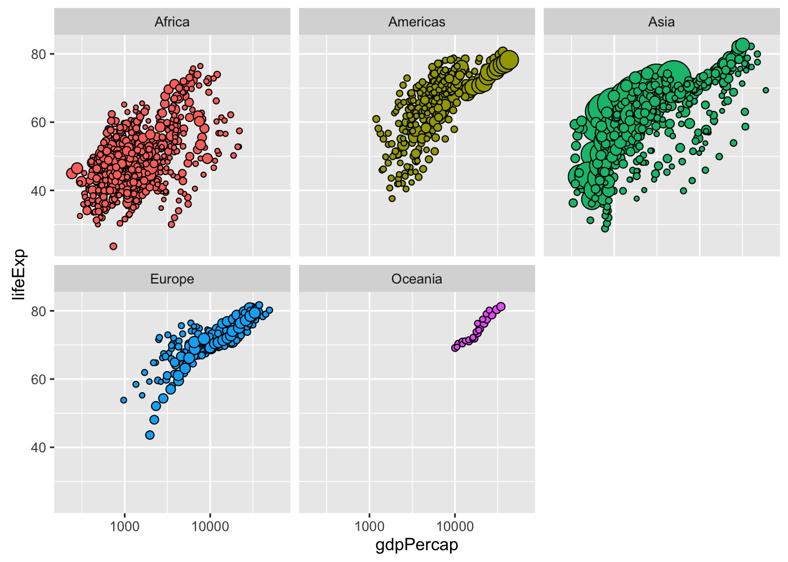
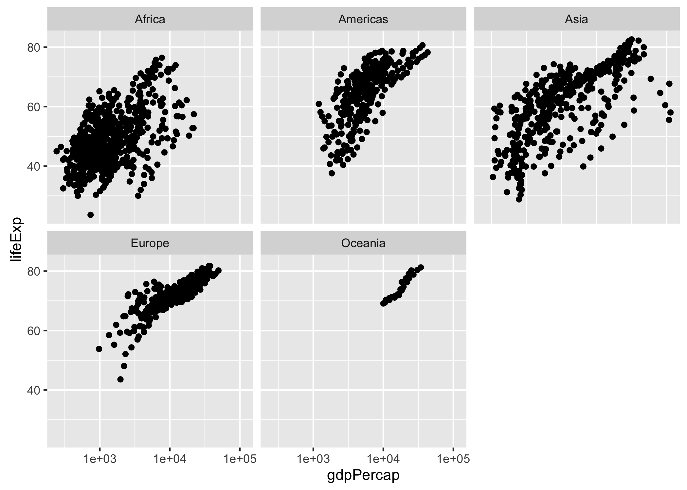

```{r setup, include=FALSE}
knitr::opts_chunk$set(echo = TRUE)
```

## Import gapminder and tools
```{r}
library(gapminder)
library(tidyverse)
library(knitr)
library(forcats)
```

## Factor management
**Drop Oceania**. Filter the Gapminder data to remove observations associated with the continent of Oceania. Additionally, remove unused factor levels. Provide concrete information on the data before and after removing these rows and Oceania; address the number of rows and the levels of the affected factors.

**Reorder the levels of country or continent**. Use the forcats package to change the order of the factor levels, based on a principled summary of one of the quantitative variables. Consider experimenting with a summary statistic beyond the most basic choice of the median. While you’re here, practice writing to file and reading back in (see next section).

Characterize the (derived) data before and after your factor re-leveling.

- Explore the effects of arrange(). Does merely arranging the data have any effect on, say, a figure?
- Explore the effects of reordering a factor and factor reordering coupled with arrange(). Especially, what effect does this have on a figure?

These explorations should involve the data, the factor levels, and some figures.

**Drop Oceania**
```{r}
gap_dropped <- gapminder %>% 
  filter(continent != "Oceania") %>% 
  droplevels()
```
```{r}
str(gapminder)
str(gap_dropped)
```

We can see that there are 5 levels for continent and 142 levels for country before dropping Oceania while there are 4 levels for continent and 140 levels for country after dropping Oceania. We can also see that there are 1704 observations before dropping Oceania while there are 1680 observations after dropping Oceania.

Supposing I do not have the knowledge about which countries are in Oceania, I want to further explore which country levels are associated with Oceania. Let's get started.

```{r}
gapminder %>% 
  filter(continent == "Oceania") %>% 
  count(country) %>% 
  kable()
```

We can see that the countries associated with Oceania are Australia and New Zealand and there are 24 observations for these two countries which are just the rows removed from gapminder.

**Reorder the levels of country or continent**
```{r}
## get the subset of gapminder for all European countries
gap_euro <- gapminder %>% 
  filter(continent == "Europe") %>%
  select(year, country, gdpPercap) %>% 
  droplevels()

## reorder the subset
gap_reordered <- gap_euro %>% 
  mutate(country = reorder(country, gdpPercap, mean))

## arrnage the subset
gap_arranged <- gap_euro %>% 
  arrange(gdpPercap)
```


```{r}
kable(gap_euro)

kable(gap_reordered)

kable(gap_arranged)
```

From the three tables above, we can see that the output table of the reordered data set is the same as the original table. However, the rows of the arranged data set are ordered according to the values of the specified veriable.

```{r}
gap_euro %>% 
  ggplot(aes(x = gdpPercap, y = country, color = year)) +
  geom_point() +
  labs(title = "The GDP per capita for all European countries from 1952 to 2007")

gap_reordered %>% 
  ggplot(aes(x = gdpPercap, y = country, color = year)) +
  geom_point() +
  labs(title = "The GDP per capita for all European countries from 1952 to 2007")

gap_arranged %>% 
  ggplot(aes(x = gdpPercap, y = country, color = year)) +
  geom_point() +
  labs(title = "The GDP per capita for all European countries from 1952 to 2007")
```

From the three figures above, we can see that the output figure of the arranged data set is the same as the orignial figure. However, the levels of country of the reordered data set are ordered according to the values of gdpPercap.

```{r}
## combine reorder() with arrange

gap_reordered_and_arranged <- gap_euro %>% 
  mutate(country = reorder(country, gdpPercap, mean))  %>% 
  arrange(gdpPercap)

kable(gap_reordered_and_arranged)

gap_reordered_and_arranged %>% 
  ggplot(aes(x = gdpPercap, y = country, color = year)) +
  geom_point() +
  labs(title = "The GDP per capita for all European countries from 1952 to 2007")
```

Now we can see that the rows of the table above are ordered according to the values of gdpPercap. Meanwhile, the levels of country are also ordered according to the mean values of gdpPercap for each country from 1952 to 2007. So arrange() and reorder() are suitable for different situations respectively. Specifically, arrange() is mainly used for displaying a data set using a table while reorder() is mainly used for displaying a data set using a figure.

## File I/O
Experiment with one or more of write_csv()/read_csv() (and/or TSV friends), saveRDS()/readRDS(), dput()/dget(). Create something new, probably by filtering or grouped-summarization of Gapminder. I highly recommend you fiddle with the factor levels, i.e. make them non-alphabetical (see previous section). Explore whether this survives the round trip of writing to file then reading back in.

**create a new data set**
```{r}
gap_cont <- gapminder %>% 
  group_by(year, continent) %>% 
  summarise(medianLifeExp = median(lifeExp)) %>% 
  ungroup()

kable(head(gap_cont))
```

**write_csv()/read_csv()**
```{r}
## fiddle with the factor levels

gap_cont_csv <- gap_cont %>% 
  mutate(continent = fct_recode(continent, "Africa#$123" = "Africa"))

kable(head(gap_cont_csv))

## write_csv
write_csv(gap_cont_csv, "gap_cont.csv")
rm(gap_cont_csv)

## read_csv
gap_cont_csv <- read_csv("gap_cont.csv")
kable(head(gap_cont_csv))
```

**saveRDS()/readRDS()**
```{r}
## fiddle with the factor levels

gap_cont_rds <- gap_cont %>% 
  mutate(continent = fct_recode(continent, "Africa#$123" = "Africa"))

kable(head(gap_cont_rds))

## saveRDS()
saveRDS(gap_cont_rds, "gap_cont.rds")
rm(gap_cont_rds)

## readRDS()
gap_cont_rds <- readRDS("gap_cont.rds")
kable(head(gap_cont_rds))
```

**dput()/dget()**
```{r}
## fiddle with the factor levels

gap_cont_txt <- gap_cont %>% 
  mutate(continent = fct_recode(continent, "Africa#$123" = "Africa"))

kable(head(gap_cont_txt))

## dput()
dput(gap_cont_txt, "gap_cont.txt")
rm(gap_cont_txt)

## dget()
gap_cont_txt <- dget("gap_cont.txt")
kable(head(gap_cont_txt))
```

I created a new data set: the median life expectacy for each continent and each year, modified Africa to Africa#$123, and then wrote and read the data set using write_csv()/read_csv(), saveRDS()/readRDS() and dput()/dget(). From the experiments above, we can see the factor level "Africa#$123" survived all three round trips of writing to file then reading back in. 

## Visualization design
Remake at least one figure, in light of something you learned in the recent class meetings about visualization design and color. Maybe juxtapose before and after and reflect on the differences. Use the country or continent color scheme that ships with Gapminder. Consult the guest lecture from Tamara Munzner and everything here.

I want to remake a figure in my Homework 02. Here is the original figure.
```{r}
originalFigure <- ggplot(data = gapminder, mapping = aes(x = gdpPercap, y = lifeExp)) +
  scale_x_log10() +
  geom_point() +
  facet_wrap(~ continent)

originalFigure
```

The new figure is shown below.
```{r}
newFigure <- gapminder %>% 
  mutate(country = reorder(country, -1 * pop)) %>% 
  ggplot(aes(x = gdpPercap, y = lifeExp, size = pop, fill = continent)) + 
  scale_x_log10(limits = c(200, 65000)) +
  geom_point(pch = 21, show.legend = FALSE) +
  scale_size_continuous(range = c(1,10)) +
  facet_wrap(~ continent)

newFigure
```

Now it looks much better. Different continents are represented with different colors and the population is also reflected with the area of the circle.

## Writing figures to file
Use ggsave() to explicitly write a figure to file. Embed it in your report. Things to play around with:

- Arguments of ggsave(), such as width, height, resolution or text scaling.
- Various graphics devices, e.g. a vector vs. raster format.
- Explicit provision of the plot object p via ggsave(..., plot = p). Show a situation in which this actually matters.

**width and height**
```{r}
ggsave("figure1.png", width = 15, height = 10, units = "cm")
```


```{r}
ggsave("figure2.png", width = 30, height = 20, units = "cm")
```


**resolution**
```{r}
ggsave("figure3.png", dpi = 200)
```


```{r}
ggsave("figure4.png", dpi = 300)
```


**plot**
```{r}
## By default, ggsave() saves the last plot. So if I want to save another plot, I have to specify the argument plot. 
ggsave("figure5.png", plot = originalFigure)
```
