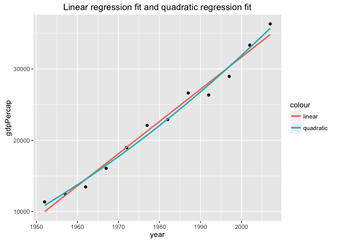
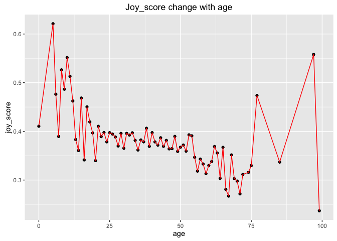
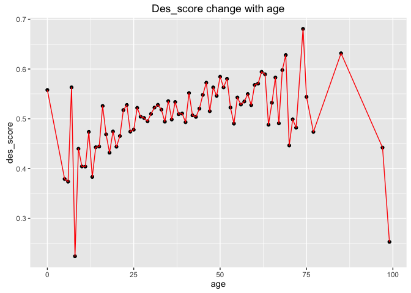

Homework 06: Data wrangling conclusion
================
Ke Dai
2016/11/13

Import tidyverse, stringr, gapminder, ggplot2, and knitr
--------------------------------------------------------

``` r
library(tidyverse)
```

    ## Loading tidyverse: ggplot2
    ## Loading tidyverse: tibble
    ## Loading tidyverse: tidyr
    ## Loading tidyverse: readr
    ## Loading tidyverse: purrr
    ## Loading tidyverse: dplyr

    ## Conflicts with tidy packages ----------------------------------------------

    ## filter(): dplyr, stats
    ## lag():    dplyr, stats

``` r
library(stringr)
library(gapminder)
library(ggplot2)
library(knitr)
```

Character data
--------------

### 14.2.5 Exercises

#### 1. In code that doesn’t use stringr, you’ll often see paste() and paste0(). What’s the difference between the two functions? What stringr function are they equivalent to? How do the functions differ in their handling of NA?

``` r
months <- c(
  "Jan", "Feb", "Mar", "Apr", "May", "Jun", 
  "Jul", "Aug", "Sep", "Oct", "Nov", "Dec"
)
months <- factor(months)
paste(months[1], months[2], months[3])
```

    ## [1] "Jan Feb Mar"

``` r
paste(months[1], months[2], months[3], sep = "")
```

    ## [1] "JanFebMar"

``` r
paste0(months[1], months[2], months[3])
```

    ## [1] "JanFebMar"

``` r
str_c(months[1], months[2], months[3])
```

    ## [1] "JanFebMar"

``` r
paste(months[1], months[2], months[3], NA)
```

    ## [1] "Jan Feb Mar NA"

``` r
paste0(months[1], months[2], months[3], NA)
```

    ## [1] "JanFebMarNA"

``` r
str_c(months[1], months[2], months[3], NA)
```

    ## [1] NA

From the above experiments, we can see that paste0(..., collapse) is equivalent to paste(..., sep = "", collapse). These two functions are equivalent to str\_c() function. Paste() and paste0() coerces NA character(the character missing value) to "NA" while str\_c() returns NA when one of concatenated terms is NA in terms of their handling of NA.

#### 2. In your own words, describe the difference between the sep and collapse arguments to str\_c().

``` r
str_c("a", "b", "c", sep = ", ")
```

    ## [1] "a, b, c"

``` r
str_c(c("a", "b", "c"), collapse = ", ")
```

    ## [1] "a, b, c"

Sep specifies a character string to separate individual strings while collapse specifies a character string to separate a string vector.

#### 3. Use str\_length() and str\_sub() to extract the middle character from a string. What will you do if the string has an even number of characters?

``` r
middleChar <- function(string) {
  stopifnot(is.character(string))
  charLength <- str_length(string)
  if(charLength %% 2 == 0) {
    str_sub(string, charLength %/% 2, charLength %/% 2 + 1)
  } else {
    str_sub(string, (charLength + 1) %/% 2, (charLength + 1) %/% 2)
  }
}
middleChar("apple")
```

    ## [1] "p"

``` r
middleChar("banana")
```

    ## [1] "na"

If the string has an even number of characters, extract the middle two characters from the string as shown in the middleChar function above.

#### 4. What does str\_wrap() do? When might you want to use it?

``` r
text <- "Regexps are a very terse language that allow you to describe patterns in strings. They take a little while to get your head around, but once you understand them, you’ll find them extremely useful."

cat(str_wrap(text, width = 80, indent = 4))
```

    ##     Regexps are a very terse language that allow you to describe patterns in
    ## strings. They take a little while to get your head around, but once you
    ## understand them, you’ll find them extremely useful.

As shown above, str\_wrap() is used to wrap strings into nicely formatted paragraphs. You can set the line width by specifying the width argument a positive integer value, and set the indentation of first line and following lines in each paragraph by specifying the indent and exdent arguments.

#### 5. What does str\_trim() do? What’s the opposite of str\_trim()?

``` r
str_trim(" apple   ")
```

    ## [1] "apple"

``` r
str_pad("apple", 9, "both")
```

    ## [1] "  apple  "

As shown above, str\_trim() is used to trim whitespace from start and end of string. The opposite of str\_trim() is str\_pad() which is used to pad a string with whitespace or other characters.

#### 6. Write a function that turns (e.g.) a vector c("a", "b", "c") into the string a, b, and c. Think carefully about what it should do if given a vector of length 0, 1, or 2.

``` r
vecToStr <- function(vec) {
  stopifnot(is.vector(vec))
  for (i in vec) {
    
  }
}
a <- c("a", "b", "c")
```

### 14.3.1.1 Exercises

#### 1. Explain why each of these strings don’t match a \\: "\\", "\\\\", "\\\\\\".

\\ is used as an escape character in regular expressions. To match a literal \\, you need to escape it, creating the regular expression \\\\. To create that regular expression, you need to use a string, which also needs to escape \\. That means to match a literal \\ you need to write "\\\\\\\\" — you need four backslashes to match one!

#### 2. How would you match the sequence "'\\?

``` r
x <- "ab\"'\\c"
writeLines(x)
```

    ## ab"'\c

``` r
str_detect(x, "\"'\\\\")
```

    ## [1] TRUE

As shown above, we can use "\\"'\\\\\\\\" to match "'\\.

#### 3. What patterns will the regular expression \\..\\..\\.. match? How would you represent it as a string?

``` r
x <- "wer.a.3.$wer"
writeLines(x)
```

    ## wer.a.3.$wer

``` r
str_detect(x, "\\..\\..\\..")
```

    ## [1] TRUE

As shown above, the regular expression \\..\\..\\.. match a pattern like .x.x.x(x represents any character except a newline). We can represent this regular expression with "\\\\..\\\\..\\\\..".

### 14.3.2.1 Exercises

#### 1. How would you match the literal string "\(^\)"?

``` r
x <- "$^$"
str_detect(x, "^\\$\\^\\$$")
```

    ## [1] TRUE

#### 2. Given the corpus of common words in stringr::words, create regular expressions that find all words that:

1.  Start with “y”.
2.  End with “x”
3.  Are exactly three letters long. (Don’t cheat by using str\_length()!)
4.  Have seven letters or more. Since this list is long, you might want to use the match argument to str\_view() to show only the matching or non-matching words.

``` r
## Start with "y"
str_subset(words, "^y")
```

    ## [1] "year"      "yes"       "yesterday" "yet"       "you"       "young"

``` r
## End with "x"
str_subset(words, "x$")
```

    ## [1] "box" "sex" "six" "tax"

``` r
## Are exactly three letters long.
str_subset(words, "^...$")
```

    ##   [1] "act" "add" "age" "ago" "air" "all" "and" "any" "arm" "art" "ask"
    ##  [12] "bad" "bag" "bar" "bed" "bet" "big" "bit" "box" "boy" "bus" "but"
    ##  [23] "buy" "can" "car" "cat" "cup" "cut" "dad" "day" "die" "dog" "dry"
    ##  [34] "due" "eat" "egg" "end" "eye" "far" "few" "fit" "fly" "for" "fun"
    ##  [45] "gas" "get" "god" "guy" "hit" "hot" "how" "job" "key" "kid" "lad"
    ##  [56] "law" "lay" "leg" "let" "lie" "lot" "low" "man" "may" "mrs" "new"
    ##  [67] "non" "not" "now" "odd" "off" "old" "one" "out" "own" "pay" "per"
    ##  [78] "put" "red" "rid" "run" "say" "see" "set" "sex" "she" "sir" "sit"
    ##  [89] "six" "son" "sun" "tax" "tea" "ten" "the" "tie" "too" "top" "try"
    ## [100] "two" "use" "war" "way" "wee" "who" "why" "win" "yes" "yet" "you"

``` r
## Are exactly three letters long.
str_subset(words, "^.{7,}$")
```

    ##   [1] "absolute"    "account"     "achieve"     "address"     "advertise"  
    ##   [6] "afternoon"   "against"     "already"     "alright"     "although"   
    ##  [11] "america"     "another"     "apparent"    "appoint"     "approach"   
    ##  [16] "appropriate" "arrange"     "associate"   "authority"   "available"  
    ##  [21] "balance"     "because"     "believe"     "benefit"     "between"    
    ##  [26] "brilliant"   "britain"     "brother"     "business"    "certain"    
    ##  [31] "chairman"    "character"   "Christmas"   "colleague"   "collect"    
    ##  [36] "college"     "comment"     "committee"   "community"   "company"    
    ##  [41] "compare"     "complete"    "compute"     "concern"     "condition"  
    ##  [46] "consider"    "consult"     "contact"     "continue"    "contract"   
    ##  [51] "control"     "converse"    "correct"     "council"     "country"    
    ##  [56] "current"     "decision"    "definite"    "department"  "describe"   
    ##  [61] "develop"     "difference"  "difficult"   "discuss"     "district"   
    ##  [66] "document"    "economy"     "educate"     "electric"    "encourage"  
    ##  [71] "english"     "environment" "especial"    "evening"     "evidence"   
    ##  [76] "example"     "exercise"    "expense"     "experience"  "explain"    
    ##  [81] "express"     "finance"     "fortune"     "forward"     "function"   
    ##  [86] "further"     "general"     "germany"     "goodbye"     "history"    
    ##  [91] "holiday"     "hospital"    "however"     "hundred"     "husband"    
    ##  [96] "identify"    "imagine"     "important"   "improve"     "include"    
    ## [101] "increase"    "individual"  "industry"    "instead"     "interest"   
    ## [106] "introduce"   "involve"     "kitchen"     "language"    "machine"    
    ## [111] "meaning"     "measure"     "mention"     "million"     "minister"   
    ## [116] "morning"     "necessary"   "obvious"     "occasion"    "operate"    
    ## [121] "opportunity" "organize"    "original"    "otherwise"   "paragraph"  
    ## [126] "particular"  "pension"     "percent"     "perfect"     "perhaps"    
    ## [131] "photograph"  "picture"     "politic"     "position"    "positive"   
    ## [136] "possible"    "practise"    "prepare"     "present"     "pressure"   
    ## [141] "presume"     "previous"    "private"     "probable"    "problem"    
    ## [146] "proceed"     "process"     "produce"     "product"     "programme"  
    ## [151] "project"     "propose"     "protect"     "provide"     "purpose"    
    ## [156] "quality"     "quarter"     "question"    "realise"     "receive"    
    ## [161] "recognize"   "recommend"   "relation"    "remember"    "represent"  
    ## [166] "require"     "research"    "resource"    "respect"     "responsible"
    ## [171] "saturday"    "science"     "scotland"    "secretary"   "section"    
    ## [176] "separate"    "serious"     "service"     "similar"     "situate"    
    ## [181] "society"     "special"     "specific"    "standard"    "station"    
    ## [186] "straight"    "strategy"    "structure"   "student"     "subject"    
    ## [191] "succeed"     "suggest"     "support"     "suppose"     "surprise"   
    ## [196] "telephone"   "television"  "terrible"    "therefore"   "thirteen"   
    ## [201] "thousand"    "through"     "thursday"    "together"    "tomorrow"   
    ## [206] "tonight"     "traffic"     "transport"   "trouble"     "tuesday"    
    ## [211] "understand"  "university"  "various"     "village"     "wednesday"  
    ## [216] "welcome"     "whether"     "without"     "yesterday"

### 14.3.3.1 Exercises

#### 1. Create regular expressions to find all words that:

1.  Start with a vowel.

2.  That only contain consonants. (Hint: thinking about matching “not”-vowels.)

3.  End with ed, but not with eed.

4.  End with ing or ise.

``` r
x <- c("apple", "bcd", "Ted", "feed", "feeling", "rise")

## start with a vowel
str_subset(x, "^[aeiou]")
```

    ## [1] "apple"

``` r
## That only contain consonants
str_subset(x, "^[^aeiou]+$")
```

    ## [1] "bcd"

``` r
## End with ed, but not with eed
str_subset(x, "[^e]ed$")
```

    ## [1] "Ted"

``` r
## End with ing or ise
str_subset(x, "ing|ise$")
```

    ## [1] "feeling" "rise"

#### 2. Empirically verify the rule “i before e except after c”.

``` r
x <- c("aie", "bie", "cie")
str_subset(x, ".*[^c]ie.*")
```

    ## [1] "aie" "bie"

#### 3. Is “q” always followed by a “u”?

#### 4. Write a regular expression that matches a word if it’s probably written in British English, not American English.

``` r
x <- c("colour", "color")
str_subset(x, "our$")
```

    ## [1] "colour"

#### 5. Create a regular expression that will match telephone numbers as commonly written in your country.

``` r
x <- "778-453-8934"
str_subset(x, "^\\d{3}-\\d{3}-\\d{4}$")
```

    ## [1] "778-453-8934"

### 14.3.4.1 Exercises

#### 1. Describe the equivalents of ?, +, \* in {m,n} form.

? is equivalent to {0,1}. + is equivalent to {1,}. \* is equivalent to {0,}.

#### 2. Describe in words what these regular expressions match: (read carefully to see if I’m using a regular expression or a string that defines a regular expression.)

1.  ^.\*$
2.  "\\{.+\\}"
3.  --
4.  "\\\\{4}"

``` r
x <- c("re#$%wt3@*25&%45", "{a}", "1234-23-56", "\\\\\\\\")

str_subset(x, "^.*$")
```

    ## [1] "re#$%wt3@*25&%45" "{a}"              "1234-23-56"      
    ## [4] "\\\\\\\\"

``` r
str_subset(x, "\\{.+\\}")
```

    ## [1] "{a}"

``` r
str_subset(x, "\\d{4}-\\d{2}-\\d{2}")
```

    ## [1] "1234-23-56"

``` r
str_subset(x, "\\\\{4}")
```

    ## [1] "\\\\\\\\"

#### 3. Create regular expressions to find all words that:

1.  Start with three consonants.
2.  Have three or more vowels in a row.
3.  Have two or more vowel-consonant pairs in a row.

``` r
## Start with three consonants
str_subset(words, "^[^aeiou]{3}")
```

    ##  [1] "Christ"    "Christmas" "dry"       "fly"       "mrs"      
    ##  [6] "scheme"    "school"    "straight"  "strategy"  "street"   
    ## [11] "strike"    "strong"    "structure" "system"    "three"    
    ## [16] "through"   "throw"     "try"       "type"      "why"

``` r
## Have three or more vowels in a row


## Have two or more vowel-consonant pairs in a row
```

#### 4. Solve the beginner regexp crosswords at <https://regexcrossword.com/challenges/beginner>.

### 14.3.5.1 Exercises

#### 1. Describe, in words, what these expressions will match:

1.  (.)
2.  "(.)(.)\\2\\1"
3.  (..)
4.  "(.).\\1.\\1"
5.  "(.)(.)(.).\*\\3\\2\\1"

``` r
x <- c("aaa", "baaaa", "abab", "abaca", "abcdcccccc")
str_subset(x, "(.)\\1\\1")
```

    ## [1] "aaa"        "baaaa"      "abcdcccccc"

``` r
str_subset(x, "(.)(.)\\2\\1")
```

    ## [1] "baaaa"      "abcdcccccc"

``` r
str_subset(x, "(..)\\1")
```

    ## [1] "baaaa"      "abab"       "abcdcccccc"

``` r
str_subset(x, "(.).\\1.\\1")
```

    ## [1] "abaca"      "abcdcccccc"

``` r
str_subset(x, "(.)(.)(.).*\\3\\2\\1")
```

    ## [1] "abcdcccccc"

As shown above, (.) matches a pattern like aaa; "(.)(.)\\2\\1" matches a pattern like baaaa; (..) matches a pattern like abab; "(.).\\1.\\1" matches a pattern like abaca; "(.)(.)(.).\*\\3\\2\\1" matches a pattern like abcdcccccc(a, b, c and d can be any different letters).

#### 2. Construct regular expressions to match words that:

1.  Start and end with the same character.

2.  Contain a repeated pair of letters (e.g. “church” contains “ch” repeated twice.)

3.  Contain one letter repeated in at least three places (e.g. “eleven” contains three “e”s.)

``` r
x <- c("abca", "church", "eleven")
str_subset(x, "^(\\w)\\w*\\1$")
```

    ## [1] "abca"

``` r
str_subset(x, "(\\w{2})\\w*\\1")
```

    ## [1] "church"

``` r
str_subset(x, "(\\w)\\w*\\1\\w*\\1")
```

    ## [1] "eleven"

### 14.4.2 Exercises

#### 1. For each of the following challenges, try solving it by using both a single regular expression, and a combination of multiple str\_detect() calls.

1.  Find all words that start or end with x.

2.  Find all words that start with a vowel and end with a consonant.

3.  Are there any words that contain at least one of each different vowel?

``` r
## Find all words that start or end with x
x <- c("box", "x-ray")
df <- tibble(
  x = x,
  i = seq_along(x)
)

str_subset(x, "^x|x$")
```

    ## [1] "box"   "x-ray"

``` r
## Find all words that start with a vowel and end with a consonant.
str_subset(words, "^[aeiou]\\w*[^aeiou]$")
```

    ##   [1] "about"       "accept"      "account"     "across"      "act"        
    ##   [6] "actual"      "add"         "address"     "admit"       "affect"     
    ##  [11] "afford"      "after"       "afternoon"   "again"       "against"    
    ##  [16] "agent"       "air"         "all"         "allow"       "almost"     
    ##  [21] "along"       "already"     "alright"     "although"    "always"     
    ##  [26] "amount"      "and"         "another"     "answer"      "any"        
    ##  [31] "apart"       "apparent"    "appear"      "apply"       "appoint"    
    ##  [36] "approach"    "arm"         "around"      "art"         "as"         
    ##  [41] "ask"         "at"          "attend"      "authority"   "away"       
    ##  [46] "awful"       "each"        "early"       "east"        "easy"       
    ##  [51] "eat"         "economy"     "effect"      "egg"         "eight"      
    ##  [56] "either"      "elect"       "electric"    "eleven"      "employ"     
    ##  [61] "end"         "english"     "enjoy"       "enough"      "enter"      
    ##  [66] "environment" "equal"       "especial"    "even"        "evening"    
    ##  [71] "ever"        "every"       "exact"       "except"      "exist"      
    ##  [76] "expect"      "explain"     "express"     "identify"    "if"         
    ##  [81] "important"   "in"          "indeed"      "individual"  "industry"   
    ##  [86] "inform"      "instead"     "interest"    "invest"      "it"         
    ##  [91] "item"        "obvious"     "occasion"    "odd"         "of"         
    ##  [96] "off"         "offer"       "often"       "okay"        "old"        
    ## [101] "on"          "only"        "open"        "opportunity" "or"         
    ## [106] "order"       "original"    "other"       "ought"       "out"        
    ## [111] "over"        "own"         "under"       "understand"  "union"      
    ## [116] "unit"        "university"  "unless"      "until"       "up"         
    ## [121] "upon"        "usual"

``` r
## Are there any words that contain at least one of each different vowel?
```

#### What word has the highest number of vowels? What word has the highest proportion of vowels? (Hint: what is the denominator?)

### 14.4.3.1 Exercises

#### 1. In the previous example, you might have noticed that the regular expression matched “flickered”, which is not a colour. Modify the regex to fix the problem.

#### 2. From the Harvard sentences data, extract:

1.  The first word from each sentence.
2.  All words ending in ing.
3.  All plurals.

``` r
## The first word from each sentence
first_words <- str_extract(sentences, "^[A-Za-z']+")
first_words
```

    ##   [1] "The"        "Glue"       "It's"       "These"      "Rice"      
    ##   [6] "The"        "The"        "The"        "Four"       "Large"     
    ##  [11] "The"        "A"          "The"        "Kick"       "Help"      
    ##  [16] "A"          "Smoky"      "The"        "The"        "The"       
    ##  [21] "The"        "The"        "Press"      "The"        "The"       
    ##  [26] "Two"        "Her"        "The"        "It"         "Read"      
    ##  [31] "Hoist"      "Take"       "Note"       "Wipe"       "Mend"      
    ##  [36] "The"        "The"        "The"        "The"        "What"      
    ##  [41] "A"          "The"        "Sickness"   "The"        "The"       
    ##  [46] "Lift"       "The"        "Hop"        "The"        "Mesh"      
    ##  [51] "The"        "The"        "Adding"     "The"        "A"         
    ##  [56] "The"        "March"      "A"          "Place"      "Both"      
    ##  [61] "We"         "Use"        "He"         "The"        "A"         
    ##  [66] "Cars"       "The"        "This"       "The"        "Those"     
    ##  [71] "A"          "The"        "The"        "The"        "The"       
    ##  [76] "A"          "The"        "The"        "The"        "The"       
    ##  [81] "The"        "See"        "There"      "The"        "The"       
    ##  [86] "The"        "Cut"        "Men"        "Always"     "He"        
    ##  [91] "The"        "A"          "A"          "The"        "The"       
    ##  [96] "Bail"       "The"        "A"          "Ten"        "The"       
    ## [101] "Oak"        "Cats"       "The"        "Open"       "Add"       
    ## [106] "Thieves"    "The"        "Act"        "The"        "Move"      
    ## [111] "The"        "Leaves"     "The"        "Split"      "Burn"      
    ## [116] "He"         "Weave"      "Hemp"       "A"          "We"        
    ## [121] "Type"       "The"        "The"        "The"        "Paste"     
    ## [126] "The"        "It"         "The"        "Feel"       "The"       
    ## [131] "A"          "He"         "Pluck"      "Two"        "The"       
    ## [136] "Bring"      "Write"      "Clothes"    "We"         "Port"      
    ## [141] "The"        "Guess"      "A"          "The"        "These"     
    ## [146] "Pure"       "The"        "The"        "Mud"        "The"       
    ## [151] "The"        "A"          "He"         "The"        "The"       
    ## [156] "The"        "The"        "We"         "She"        "The"       
    ## [161] "The"        "At"         "Drop"       "A"          "An"        
    ## [166] "Wood"       "The"        "He"         "A"          "A"         
    ## [171] "Steam"      "The"        "There"      "The"        "Torn"      
    ## [176] "Sunday"     "The"        "The"        "They"       "Add"       
    ## [181] "Acid"       "Fairy"      "Eight"      "The"        "A"         
    ## [186] "Add"        "We"         "There"      "He"         "She"       
    ## [191] "The"        "Corn"       "Where"      "The"        "Sell"      
    ## [196] "The"        "The"        "Bring"      "They"       "Farmers"   
    ## [201] "The"        "The"        "Float"      "A"          "A"         
    ## [206] "The"        "After"      "The"        "He"         "Even"      
    ## [211] "The"        "The"        "The"        "Do"         "Lire"      
    ## [216] "The"        "It"         "Write"      "The"        "The"       
    ## [221] "A"          "Coax"       "Schools"    "The"        "They"      
    ## [226] "The"        "The"        "Jazz"       "Rake"       "Slash"     
    ## [231] "Try"        "They"       "He"         "They"       "The"       
    ## [236] "Whitings"   "Some"       "Jerk"       "A"          "Madam"     
    ## [241] "On"         "The"        "This"       "Add"        "The"       
    ## [246] "The"        "The"        "To"         "The"        "Jump"      
    ## [251] "Yell"       "They"       "Both"       "In"         "The"       
    ## [256] "The"        "Ducks"      "Fruit"      "These"      "Canned"    
    ## [261] "The"        "Carry"      "The"        "We"         "Gray"      
    ## [266] "The"        "High"       "Tea"        "A"          "A"         
    ## [271] "The"        "Find"       "Cut"        "The"        "Look"      
    ## [276] "The"        "Nine"       "The"        "The"        "Soak"      
    ## [281] "The"        "A"          "All"        "ii"         "To"        
    ## [286] "Shape"      "The"        "Hedge"      "Quench"     "Tight"     
    ## [291] "The"        "The"        "The"        "Watch"      "The"       
    ## [296] "The"        "Write"      "His"        "The"        "Tin"       
    ## [301] "Slide"      "The"        "The"        "Pink"       "She"       
    ## [306] "The"        "It"         "Let's"      "The"        "The"       
    ## [311] "The"        "The"        "The"        "Paper"      "The"       
    ## [316] "The"        "Screw"      "Time"       "The"        "Men"       
    ## [321] "Fill"       "He"         "We"         "Pack"       "The"       
    ## [326] "The"        "Boards"     "The"        "Glass"      "Bathe"     
    ## [331] "Nine"       "The"        "The"        "The"        "Pages"     
    ## [336] "Try"        "Women"      "The"        "A"          "Code"      
    ## [341] "Most"       "He"         "The"        "Mince"      "The"       
    ## [346] "Let"        "A"          "A"          "Tack"       "Next"      
    ## [351] "Pour"       "Each"       "The"        "The"        "The"       
    ## [356] "Just"       "A"          "Our"        "Brass"      "It"        
    ## [361] "Feed"       "The"        "He"         "The"        "Plead"     
    ## [366] "Better"     "This"       "The"        "He"         "Tend"      
    ## [371] "It"         "Mark"       "Take"       "The"        "North"     
    ## [376] "He"         "Go"         "A"          "Soap"       "That"      
    ## [381] "He"         "A"          "Grape"      "Roads"      "Fake"      
    ## [386] "The"        "Smoke"      "Serve"      "Much"       "The"       
    ## [391] "Heave"      "A"          "It's"       "His"        "The"       
    ## [396] "The"        "It"         "Beef"       "Raise"      "The"       
    ## [401] "A"          "Jerk"       "No"         "We"         "The"       
    ## [406] "The"        "Three"      "The"        "No"         "Grace"     
    ## [411] "Nudge"      "The"        "Once"       "A"          "Fasten"    
    ## [416] "A"          "He"         "The"        "The"        "There"     
    ## [421] "Seed"       "Draw"       "The"        "The"        "Hats"      
    ## [426] "The"        "Beat"       "Say"        "The"        "Screen"    
    ## [431] "This"       "The"        "He"         "These"      "The"       
    ## [436] "Twist"      "The"        "The"        "Xew"        "The"       
    ## [441] "They"       "The"        "A"          "Breakfast"  "Bottles"   
    ## [446] "The"        "He"         "Drop"       "The"        "Throw"     
    ## [451] "A"          "The"        "The"        "The"        "The"       
    ## [456] "Turn"       "The"        "The"        "To"         "The"       
    ## [461] "The"        "Dispense"   "The"        "He"         "The"       
    ## [466] "The"        "Fly"        "Thick"      "Birth"      "The"       
    ## [471] "The"        "A"          "The"        "We"         "The"       
    ## [476] "The"        "We"         "The"        "Five"       "A"         
    ## [481] "The"        "Shut"       "The"        "Crack"      "He"        
    ## [486] "Send"       "A"          "They"       "The"        "In"        
    ## [491] "A"          "Oats"       "Their"      "The"        "There"     
    ## [496] "Tuck"       "A"          "We"         "The"        "Take"      
    ## [501] "Shake"      "She"        "The"        "The"        "We"        
    ## [506] "Smile"      "A"          "The"        "Take"       "That"      
    ## [511] "The"        "The"        "Ripe"       "A"          "The"       
    ## [516] "The"        "The"        "This"       "She"        "The"       
    ## [521] "Press"      "Neat"       "The"        "The"        "The"       
    ## [526] "Shake"      "The"        "A"          "His"        "Flax"      
    ## [531] "Hurdle"     "A"          "Even"       "Peep"       "The"       
    ## [536] "Cheap"      "A"          "Flood"      "A"          "The"       
    ## [541] "Those"      "He"         "Dill"       "Down"       "Either"    
    ## [546] "The"        "If"         "At"         "Read"       "Fill"      
    ## [551] "The"        "Clams"      "The"        "The"        "Breathe"   
    ## [556] "It"         "A"          "A"          "A"          "A"         
    ## [561] "Paint"      "The"        "Bribes"     "Trample"    "The"       
    ## [566] "A"          "Footprints" "She"        "A"          "Prod"      
    ## [571] "It"         "The"        "It"         "The"        "Wake"      
    ## [576] "The"        "The"        "The"        "Hold"       "Next"      
    ## [581] "Every"      "He"         "They"       "Drive"      "Keep"      
    ## [586] "Sever"      "Paper"      "Slide"      "Help"       "A"         
    ## [591] "Stop"       "Jerk"       "Slidc"      "The"        "Light"     
    ## [596] "Set"        "Dull"       "A"          "Get"        "Choose"    
    ## [601] "A"          "He"         "There"      "The"        "Greet"     
    ## [606] "When"       "Sweet"      "A"          "A"          "Lush"      
    ## [611] "The"        "The"        "The"        "Sit"        "A"         
    ## [616] "The"        "Green"      "Tea"        "Pitch"      "The"       
    ## [621] "The"        "The"        "A"          "The"        "She"       
    ## [626] "The"        "Loop"       "Plead"      "Calves"     "Post"      
    ## [631] "Tear"       "A"          "A"          "It"         "Crouch"    
    ## [636] "Pack"       "The"        "Fine"       "Poached"    "Bad"       
    ## [641] "Ship"       "Dimes"      "They"       "The"        "The"       
    ## [646] "The"        "The"        "Pile"       "The"        "The"       
    ## [651] "The"        "The"        "A"          "The"        "The"       
    ## [656] "To"         "There"      "Cod"        "The"        "Dunk"      
    ## [661] "Hang"       "Cap"        "The"        "Be"         "Pick"      
    ## [666] "A"          "The"        "The"        "The"        "You"       
    ## [671] "Dots"       "Put"        "The"        "The"        "See"       
    ## [676] "Slide"      "Many"       "We"         "No"         "Dig"       
    ## [681] "The"        "A"          "Green"      "A"          "The"       
    ## [686] "A"          "The"        "The"        "Seven"      "Our"       
    ## [691] "The"        "It"         "One"        "Take"       "The"       
    ## [696] "The"        "The"        "Stop"       "The"        "The"       
    ## [701] "Open"       "Fish"       "Dip"        "Will"       "The"       
    ## [706] "The"        "The"        "He"         "Leave"      "The"       
    ## [711] "A"          "The"        "She"        "A"          "Small"     
    ## [716] "The"        "The"        "A"          "She"        "When"

``` r
## All words ending in ing
has_ing <- str_subset(sentences, "\\w+ing")
ing_words <- str_extract(has_ing, "\\w+ing")
ing_words
```

    ##  [1] "stocking"  "spring"    "evening"   "morning"   "winding"  
    ##  [6] "living"    "king"      "Adding"    "making"    "raging"   
    ## [11] "playing"   "sleeping"  "ring"      "glaring"   "sinking"  
    ## [16] "thing"     "dying"     "Bring"     "lodging"   "filing"   
    ## [21] "making"    "morning"   "wearing"   "Bring"     "wading"   
    ## [26] "swing"     "nothing"   "Whiting"   "ring"      "ring"     
    ## [31] "morning"   "sing"      "sleeping"  "bring"     "painting" 
    ## [36] "king"      "ring"      "walking"   "bring"     "ling"     
    ## [41] "bring"     "shipping"  "spring"    "ring"      "winding"  
    ## [46] "hing"      "puzzling"  "spring"    "thing"     "landing"  
    ## [51] "thing"     "waiting"   "ring"      "whistling" "nothing"  
    ## [56] "timing"    "thing"     "spring"    "ting"      "changing" 
    ## [61] "drenching" "moving"    "working"   "ring"

``` r
## All plurals 
## For plurals, I think it's difficult to extract all plurals because there are many irregular plurals and the third person singular form of the verbs also end with s.
has_plurals <- str_subset(sentences, "\\w+s|(es)")
plurals_words <- str_extract(has_plurals, "\\w+s|(es)")
plurals_words
```

    ##   [1] "planks"     "eas"        "Thes"       "is"         "lemons"    
    ##   [6] "was"        "hogs"       "hours"      "stockings"  "was"       
    ##  [11] "is"         "is"         "helps"      "fires"      "cus"       
    ##  [16] "across"     "bonds"      "fis"        "Press"      "was"       
    ##  [21] "fis"        "purs"       "vers"       "Hois"       "clos"      
    ##  [26] "greas"      "wris"       "kittens"    "respons"    "was"       
    ##  [31] "is"         "days"       "was"        "Sickness"   "grass"     
    ##  [36] "books"      "Mes"        "fros"       "mous"       "fas"       
    ##  [41] "was"        "is"         "wheels"     "soldiers"   "makes"     
    ##  [46] "rosebus"    "los"        "circus"     "Us"         "across"    
    ##  [51] "Cars"       "cras"       "This"       "ros"        "Thos"      
    ##  [56] "finis"      "was"        "leas"       "makes"      "strokes"   
    ##  [61] "was"        "was"        "tas"        "mous"       "factors"   
    ##  [66] "was"        "los"        "grass"      "parts"      "Always"    
    ##  [71] "slus"       "wis"        "costs"      "was"        "seems"     
    ##  [76] "tus"        "pins"       "as"         "is"         "Cats"      
    ##  [81] "rus"        "glass"      "thes"       "Thieves"    "tas"       
    ##  [86] "thes"       "was"        "Leaves"     "logs"       "is"        
    ##  [91] "his"        "simples"    "lists"      "less"       "boss"      
    ##  [96] "its"        "Pas"        "whis"       "its"        "is"        
    ## [101] "phras"      "ros"        "plus"       "eyes"       "problems"  
    ## [106] "cheris"     "Clothes"    "events"     "is"         "rus"       
    ## [111] "Guess"      "tastes"     "jus"        "Thes"       "poodles"   
    ## [116] "was"        "was"        "des"        "flas"       "this"      
    ## [121] "is"         "stories"    "pencils"    "pirates"    "cus"       
    ## [126] "is"         "figures"    "cas"        "does"       "is"        
    ## [131] "was"        "actress"    "pipes"      "hiss"       "almos"     
    ## [136] "was"        "was"        "scraps"     "is"         "thes"      
    ## [141] "was"        "las"        "burns"      "tales"      "miles"     
    ## [146] "was"        "is"         "has"        "is"         "cobs"      
    ## [151] "nois"       "is"         "tongs"      "petals"     "bes"       
    ## [156] "Farmers"    "hous"       "is"         "is"         "fres"      
    ## [161] "hostess"    "his"        "wors"       "loss"       "its"       
    ## [166] "wires"      "hous"       "is"         "was"        "writes"    
    ## [171] "Schools"    "fores"      "was"        "cras"       "fans"      
    ## [176] "rubbis"     "Slas"       "cas"        "pus"        "his"       
    ## [181] "backs"      "Whitings"   "ads"        "rings"      "makes"     
    ## [186] "this"       "islands"    "as"         "This"       "rus"       
    ## [191] "lones"      "is"         "firs"       "as"         "brothers"  
    ## [196] "his"        "houses"     "Ducks"      "flavors"    "Thes"      
    ## [201] "pears"      "clos"       "is"         "miles"      "seats"     
    ## [206] "is"         "das"        "zes"        "hors"       "binds"     
    ## [211] "ruins"      "shelves"    "is"         "dus"        "needs"     
    ## [216] "is"         "apples"     "thirs"      "curls"      "tones"     
    ## [221] "fits"       "was"        "leaves"     "fas"        "His"       
    ## [226] "was"        "cans"       "clouds"     "was"        "is"        
    ## [231] "as"         "las"        "jus"        "walls"      "discuss"   
    ## [236] "ris"        "is"         "hos"        "as"         "brings"    
    ## [241] "was"        "sometimes"  "contents"   "mules"      "records"   
    ## [246] "was"        "rays"       "Boards"     "plus"       "Glass"     
    ## [251] "grass"      "rows"       "is"         "is"         "chas"      
    ## [256] "Pages"      "lines"      "less"       "zones"      "needs"     
    ## [261] "is"         "Mos"        "us"         "is"         "gives"     
    ## [266] "cas"        "us"         "Tues"       "woods"      "piles"     
    ## [271] "logs"       "Jus"        "is"         "plans"      "Brass"     
    ## [276] "takes"      "mous"       "dis"        "des"        "has"       
    ## [281] "This"       "wanders"    "takes"      "shares"     "cats"      
    ## [286] "winds"      "asks"       "sas"        "was"        "means"     
    ## [291] "lis"        "defens"     "Roads"      "ones"       "pleas"     
    ## [296] "heroes"     "makes"      "eas"        "cuts"       "dens"      
    ## [301] "His"        "lingers"    "des"        "takes"      "is"        
    ## [306] "Rais"       "costs"      "is"         "bas"        "lis"       
    ## [311] "sens"       "hards"      "makes"      "news"       "bes"       
    ## [316] "Fas"        "restores"   "takes"      "drifts"     "was"       
    ## [321] "is"         "is"         "lines"      "his"        "was"       
    ## [326] "Hats"       "dus"        "nes"        "mats"       "This"      
    ## [331] "protects"   "Thes"       "Twis"       "rags"       "pants"     
    ## [336] "mars"       "saus"       "ros"        "Breakfas"   "Bottles"   
    ## [341] "his"        "pas"        "ashes"      "des"        "us"        
    ## [346] "means"      "drapes"     "stems"      "clothes"    "gives"     
    ## [351] "bills"      "is"         "is"         "mus"        "Dispens"   
    ## [356] "grapes"     "figs"       "sparks"     "was"        "glasses"   
    ## [361] "limits"     "is"         "priceless"  "cas"        "lanterns"  
    ## [366] "zes"        "years"      "cuts"       "is"         "waves"     
    ## [371] "makes"      "ls"         "is"         "tales"      "hous"      
    ## [376] "was"        "des"        "Oats"       "eyelids"    "revives"   
    ## [381] "ways"       "is"         "dus"        "was"        "dus"       
    ## [386] "was"        "dress"      "nas"        "is"         "this"      
    ## [391] "this"       "is"         "tales"      "was"        "pears"     
    ## [396] "was"        "pleas"      "was"        "This"       "blus"      
    ## [401] "Press"      "plans"      "press"      "was"        "hands"     
    ## [406] "vas"        "is"         "His"        "makes"      "jus"       
    ## [411] "clowns"     "drifts"     "clothes"    "caus"       "mails"     
    ## [416] "was"        "Thos"       "his"        "pickles"    "is"        
    ## [421] "dus"        "bes"        "los"        "rous"       "jus"       
    ## [426] "trinkets"   "Clams"      "its"        "edges"      "matters"   
    ## [431] "its"        "goes"       "almos"      "sockets"    "dens"      
    ## [436] "Bribes"     "els"        "was"        "was"        "Footprints"
    ## [441] "was"        "fres"       "is"         "almos"      "was"       
    ## [446] "was"        "ris"        "brass"      "lobes"      "is"        
    ## [451] "phras"      "his"        "kids"       "cons"       "des"       
    ## [456] "pres"       "gets"       "whis"       "tumbles"    "across"    
    ## [461] "was"        "makes"      "stories"    "fas"        "trus"      
    ## [466] "Choos"      "funds"      "his"        "is"         "guests"    
    ## [471] "fros"       "words"      "runs"       "comes"      "Lus"       
    ## [476] "bes"        "his"        "others"     "is"         "phas"      
    ## [481] "moss"       "has"        "goos"       "is"         "mos"       
    ## [486] "facts"      "flaps"      "loss"       "los"        "Calves"    
    ## [491] "Pos"        "cruis"      "was"        "miss"       "kits"      
    ## [496] "saves"      "eggs"       "nerves"     "maps"       "Dimes"     
    ## [501] "tunes"      "wes"        "pods"       "hors"       "hors"      
    ## [506] "vas"        "was"        "rares"      "is"         "contes"    
    ## [511] "amounts"    "is"         "is"         "was"        "biscuits"  
    ## [516] "tins"       "brass"      "miss"       "firs"       "informs"   
    ## [521] "comes"      "Dots"       "bas"        "leaves"     "hands"     
    ## [526] "faults"     "blows"      "is"         "takes"      "fros"      
    ## [531] "needs"      "fits"       "gloss"      "grass"      "seals"     
    ## [536] "troops"     "was"        "was"        "collaps"    "agains"    
    ## [541] "contents"   "puts"       "bombs"      "streets"    "leas"      
    ## [546] "firs"       "Fis"        "pleas"      "ros"        "was"       
    ## [551] "pleas"      "hous"       "was"        "grass"      "his"       
    ## [556] "his"

### 14.4.4.1 Exercises

#### 1. Find all words that come after a “number” like “one”, “two”, “three” etc. Pull out both the number and the word.

``` r
has_num <- str_subset(sentences, "(one|two|three) (\\w+)")
num_words <- str_extract(has_num, "(one|two|three) (\\w+)")
num_words
```

    ##  [1] "one over"      "two met"       "two factors"   "one and"      
    ##  [5] "three lists"   "two when"      "one floor"     "one with"     
    ##  [9] "one war"       "one button"    "one in"        "one like"     
    ## [13] "two shares"    "two distinct"  "one costs"     "two pins"     
    ## [17] "one rang"      "three story"   "one wall"      "three inches" 
    ## [21] "one before"    "three batches" "two leaves"

#### 2. Find all contractions. Separate out the pieces before and after the apostrophe.

``` r
has_apos <- str_subset(sentences, "\\w+'\\w+")
str_match(has_apos, "\\w+'\\w+")
```

    ##       [,1]        
    ##  [1,] "It's"      
    ##  [2,] "man's"     
    ##  [3,] "don't"     
    ##  [4,] "store's"   
    ##  [5,] "workmen's" 
    ##  [6,] "Let's"     
    ##  [7,] "sun's"     
    ##  [8,] "child's"   
    ##  [9,] "king's"    
    ## [10,] "It's"      
    ## [11,] "don't"     
    ## [12,] "queen's"   
    ## [13,] "don't"     
    ## [14,] "pirate's"  
    ## [15,] "neighbor's"

### 14.4.5.1 Exercises

#### 1. Replace all forward slashes in a string with backslashes.

``` r
x <- "2016/11/11"
writeLines(str_replace_all(x, "/", "\\\\"))
```

    ## 2016\11\11

#### 2. Implement a simple version of str\_to\_lower() using replace\_all().

``` r
x <- "ABCDEFG"
str_replace_all(x, "[A-Z]", "[a-z]")
```

    ## [1] "[a-z][a-z][a-z][a-z][a-z][a-z][a-z]"

#### 3. Switch the first and last letters in words. Which of those strings are still words?

### 14.4.6.1 Exercises

#### 1. Split up a string like "apples, pears, and bananas" into individual components.

``` r
x <- "apples, pears, and bananas"
str_split(x, ", ")[[1]]
```

    ## [1] "apples"      "pears"       "and bananas"

#### 2. Why is it better to split up by boundary("word") than " "?

Because there may be serveral spaces between two words.

#### 3. What does splitting with an empty string ("") do? Experiment, and then read the documentation.

``` r
x <- "apples, pears, and bananas"
str_split(x, "")[[1]]
```

    ##  [1] "a" "p" "p" "l" "e" "s" "," " " "p" "e" "a" "r" "s" "," " " "a" "n"
    ## [18] "d" " " "b" "a" "n" "a" "n" "a" "s"

As shown above, we find that splitting with an empty string splits a string into individual letters.

### 14.5.1 Exercises

#### 1. How would you find all strings containing  with regex() vs. with fixed()?

``` r
x <- "2016\\11\\11"
writeLines(x)
```

    ## 2016\11\11

``` r
str_subset(x, regex("\\\\"))
```

    ## [1] "2016\\11\\11"

``` r
str_subset(x, fixed("\\"))
```

    ## [1] "2016\\11\\11"

As shown above, we can match  with either regex("\\\\") or fixed("\\").

#### 2. What are the five most common words in sentences?

Writing functions
-----------------

-   **Write one (or more) functions that do something useful to pieces of the Gapminder data. It is logical to think about computing on the mini-data frames corresponding to the data for each specific country. This would pair well with the prompt below about working with a nested data frame, as you could apply your function there.**

-   **Make it something you can’t easily do with built-in functions. Make it something that’s not trivial to do with the simple dplyr verbs. The linear regression function presented here is a good starting point. You could generalize that to do quadratic regression (include a squared term) or use robust regression, using MASS::rlm() or robustbase::lmrob().**

``` r
(my_gap <- gapminder %>% 
  filter(country == "Canada"))
```

    ## # A tibble: 12 × 6
    ##    country continent  year lifeExp      pop gdpPercap
    ##     <fctr>    <fctr> <int>   <dbl>    <int>     <dbl>
    ## 1   Canada  Americas  1952  68.750 14785584  11367.16
    ## 2   Canada  Americas  1957  69.960 17010154  12489.95
    ## 3   Canada  Americas  1962  71.300 18985849  13462.49
    ## 4   Canada  Americas  1967  72.130 20819767  16076.59
    ## 5   Canada  Americas  1972  72.880 22284500  18970.57
    ## 6   Canada  Americas  1977  74.210 23796400  22090.88
    ## 7   Canada  Americas  1982  75.760 25201900  22898.79
    ## 8   Canada  Americas  1987  76.860 26549700  26626.52
    ## 9   Canada  Americas  1992  77.950 28523502  26342.88
    ## 10  Canada  Americas  1997  78.610 30305843  28954.93
    ## 11  Canada  Americas  2002  79.770 31902268  33328.97
    ## 12  Canada  Americas  2007  80.653 33390141  36319.24

``` r
my_gap %>% 
  ggplot(aes(x = year, y = gdpPercap)) +
  geom_point() +
  geom_smooth(method = "lm", se = FALSE)
```



``` r
my_fit <- function(dat, offset = 1952) {
  the_fit <- lm(gdpPercap ~ I(year - offset), dat)
  setNames(coef(the_fit), c("intercept", "slope"))
}
my_fit(my_gap)
```

    ## intercept     slope 
    ## 9995.7799  451.4533

Work with the candy data
------------------------

**In 2015, we explored a dataset based on a Halloween candy survey (but it included many other odd and interesting questions). Work on something from this homework from 2015. It is good practice on basic data ingest, exploration, character data cleanup, and wrangling.**

### Examining the raw data and choosing a task

**Familiarize yourself with the raw data if you haven’t already. Based on the information available, formulate a task you want to complete and explain what it is. Make it fairly specific, like the tasks above.**

Let's load the candy data first.

``` r
raw <- read_csv("CANDY-HIERARCHY-2015 SURVEY-Responses.csv",
                col_types = cols(
                  Timestamp = col_datetime("%m/%d/%Y %H:%M:%S")
                ))
```

``` r
str(raw)
```

    ## Classes 'tbl_df', 'tbl' and 'data.frame':    5658 obs. of  124 variables:
    ##  $ Timestamp                                                                                                        : POSIXct, format: "2015-10-23 08:46:20" "2015-10-23 08:46:52" ...
    ##  $ How old are you?                                                                                                 : chr  "35" "41" "33" "31" ...
    ##  $ Are you going actually going trick or treating yourself?                                                         : chr  "No" "No" "No" "No" ...
    ##  $ [Butterfinger]                                                                                                   : chr  "JOY" "JOY" "DESPAIR" "JOY" ...
    ##  $ [100 Grand Bar]                                                                                                  : chr  NA "JOY" "DESPAIR" "JOY" ...
    ##  $ [Anonymous brown globs that come in black and orange wrappers]                                                   : chr  "DESPAIR" "DESPAIR" "DESPAIR" "DESPAIR" ...
    ##  $ [Any full-sized candy bar]                                                                                       : chr  "JOY" "JOY" "JOY" "JOY" ...
    ##  $ [Black Jacks]                                                                                                    : chr  NA "DESPAIR" "DESPAIR" "DESPAIR" ...
    ##  $ [Bonkers]                                                                                                        : chr  NA "DESPAIR" "DESPAIR" "DESPAIR" ...
    ##  $ [Bottle Caps]                                                                                                    : chr  NA "JOY" "DESPAIR" "JOY" ...
    ##  $ [Box’o’ Raisins]                                                                                               : chr  NA "DESPAIR" "JOY" "DESPAIR" ...
    ##  $ [Brach products (not including candy corn)]                                                                      : chr  "DESPAIR" "DESPAIR" "DESPAIR" "DESPAIR" ...
    ##  $ [Bubble Gum]                                                                                                     : chr  "DESPAIR" "DESPAIR" "DESPAIR" "DESPAIR" ...
    ##  $ [Cadbury Creme Eggs]                                                                                             : chr  "DESPAIR" "DESPAIR" "JOY" "DESPAIR" ...
    ##  $ [Candy Corn]                                                                                                     : chr  NA "DESPAIR" "JOY" "DESPAIR" ...
    ##  $ [Vials of pure high fructose corn syrup, for main-lining into your vein]                                         : chr  "DESPAIR" "DESPAIR" "DESPAIR" "DESPAIR" ...
    ##  $ [Candy that is clearly just the stuff given out for free at restaurants]                                         : chr  "DESPAIR" "DESPAIR" "DESPAIR" "DESPAIR" ...
    ##  $ [Cash, or other forms of legal tender]                                                                           : chr  "JOY" "JOY" "JOY" "JOY" ...
    ##  $ [Chiclets]                                                                                                       : chr  NA "DESPAIR" "DESPAIR" "DESPAIR" ...
    ##  $ [Caramellos]                                                                                                     : chr  NA "DESPAIR" "JOY" "JOY" ...
    ##  $ [Snickers]                                                                                                       : chr  "JOY" "JOY" "JOY" "JOY" ...
    ##  $ [Dark Chocolate Hershey]                                                                                         : chr  "JOY" "DESPAIR" "JOY" "JOY" ...
    ##  $ [Dental paraphenalia]                                                                                            : chr  "DESPAIR" "DESPAIR" "DESPAIR" "DESPAIR" ...
    ##  $ [Dots]                                                                                                           : chr  "JOY" "JOY" "DESPAIR" "DESPAIR" ...
    ##  $ [Fuzzy Peaches]                                                                                                  : chr  "DESPAIR" "DESPAIR" "DESPAIR" "DESPAIR" ...
    ##  $ [Generic Brand Acetaminophen]                                                                                    : chr  "DESPAIR" "JOY" "DESPAIR" "DESPAIR" ...
    ##  $ [Glow sticks]                                                                                                    : chr  "DESPAIR" "JOY" "DESPAIR" "JOY" ...
    ##  $ [Broken glow stick]                                                                                              : chr  "DESPAIR" "DESPAIR" "DESPAIR" "DESPAIR" ...
    ##  $ [Goo Goo Clusters]                                                                                               : chr  NA "DESPAIR" "DESPAIR" "JOY" ...
    ##  $ [Good N' Plenty]                                                                                                 : chr  "DESPAIR" "DESPAIR" "DESPAIR" "DESPAIR" ...
    ##  $ [Gum from baseball cards]                                                                                        : chr  "DESPAIR" "DESPAIR" "DESPAIR" "DESPAIR" ...
    ##  $ [Gummy Bears straight up]                                                                                        : chr  "DESPAIR" "DESPAIR" "JOY" "DESPAIR" ...
    ##  $ [Creepy Religious comics/Chick Tracts]                                                                           : chr  "DESPAIR" "DESPAIR" "DESPAIR" "DESPAIR" ...
    ##  $ [Healthy Fruit]                                                                                                  : chr  "DESPAIR" "DESPAIR" "JOY" "DESPAIR" ...
    ##  $ [Heath Bar]                                                                                                      : chr  NA "JOY" "DESPAIR" "JOY" ...
    ##  $ [Hershey’s Kissables]                                                                                           : chr  NA "JOY" "JOY" "JOY" ...
    ##  $ [Hershey’s Milk Chocolate]                                                                                      : chr  "JOY" "JOY" "JOY" "JOY" ...
    ##  $ [Hugs (actual physical hugs)]                                                                                    : chr  "DESPAIR" "DESPAIR" "JOY" "DESPAIR" ...
    ##  $ [Jolly Rancher (bad flavor)]                                                                                     : chr  NA "DESPAIR" "DESPAIR" "DESPAIR" ...
    ##  $ [Jolly Ranchers (good flavor)]                                                                                   : chr  NA "JOY" "DESPAIR" "JOY" ...
    ##  $ [Kale smoothie]                                                                                                  : chr  NA "DESPAIR" "DESPAIR" "DESPAIR" ...
    ##  $ [Kinder Happy Hippo]                                                                                             : chr  NA "DESPAIR" "DESPAIR" "DESPAIR" ...
    ##  $ [Kit Kat]                                                                                                        : chr  NA "JOY" "JOY" "JOY" ...
    ##  $ [Hard Candy]                                                                                                     : chr  NA "DESPAIR" "JOY" "DESPAIR" ...
    ##  $ [Lapel Pins]                                                                                                     : chr  NA "DESPAIR" "DESPAIR" "DESPAIR" ...
    ##  $ [LemonHeads]                                                                                                     : chr  NA "DESPAIR" "DESPAIR" "JOY" ...
    ##  $ [Licorice]                                                                                                       : chr  NA "DESPAIR" "DESPAIR" "DESPAIR" ...
    ##  $ [Licorice (not black)]                                                                                           : chr  NA "DESPAIR" "JOY" "JOY" ...
    ##  $ [Lindt Truffle]                                                                                                  : chr  NA "JOY" "DESPAIR" "JOY" ...
    ##  $ [Lollipops]                                                                                                      : chr  NA "DESPAIR" "JOY" "DESPAIR" ...
    ##  $ [Mars]                                                                                                           : chr  NA "JOY" "JOY" "JOY" ...
    ##  $ [Mary Janes]                                                                                                     : chr  NA "DESPAIR" "DESPAIR" "DESPAIR" ...
    ##  $ [Maynards]                                                                                                       : chr  NA "DESPAIR" "DESPAIR" "DESPAIR" ...
    ##  $ [Milk Duds]                                                                                                      : chr  NA "JOY" "DESPAIR" "JOY" ...
    ##  $ [LaffyTaffy]                                                                                                     : chr  NA "DESPAIR" "JOY" "JOY" ...
    ##  $ [Minibags of chips]                                                                                              : chr  NA "JOY" "DESPAIR" "DESPAIR" ...
    ##  $ [JoyJoy (Mit Iodine)]                                                                                            : chr  NA "DESPAIR" "DESPAIR" "DESPAIR" ...
    ##  $ [Reggie Jackson Bar]                                                                                             : chr  NA "DESPAIR" "DESPAIR" "JOY" ...
    ##  $ [Pixy Stix]                                                                                                      : chr  NA "DESPAIR" "JOY" "DESPAIR" ...
    ##  $ [Nerds]                                                                                                          : chr  NA "JOY" "DESPAIR" "JOY" ...
    ##  $ [Nestle Crunch]                                                                                                  : chr  NA "JOY" "JOY" "JOY" ...
    ##  $ [Now'n'Laters]                                                                                                   : chr  NA "DESPAIR" "JOY" "JOY" ...
    ##  $ [Pencils]                                                                                                        : chr  NA "DESPAIR" "DESPAIR" "DESPAIR" ...
    ##  $ [Milky Way]                                                                                                      : chr  "JOY" "DESPAIR" "JOY" "JOY" ...
    ##  $ [Reese’s Peanut Butter Cups]                                                                                    : chr  "JOY" "JOY" "JOY" "JOY" ...
    ##  $ [Tolberone something or other]                                                                                   : chr  NA "JOY" "JOY" "JOY" ...
    ##  $ [Runts]                                                                                                          : chr  NA "JOY" "DESPAIR" "JOY" ...
    ##  $ [Junior Mints]                                                                                                   : chr  "JOY" "DESPAIR" "JOY" "JOY" ...
    ##  $ [Senior Mints]                                                                                                   : chr  NA "DESPAIR" "DESPAIR" "DESPAIR" ...
    ##  $ [Mint Kisses]                                                                                                    : chr  NA "DESPAIR" "JOY" "JOY" ...
    ##  $ [Mint Juleps]                                                                                                    : chr  NA "DESPAIR" "DESPAIR" "DESPAIR" ...
    ##  $ [Mint Leaves]                                                                                                    : chr  NA "DESPAIR" "DESPAIR" "DESPAIR" ...
    ##  $ [Peanut M&M’s]                                                                                                  : chr  "JOY" "JOY" "JOY" "JOY" ...
    ##  $ [Regular M&Ms]                                                                                                   : chr  "JOY" "JOY" "JOY" "DESPAIR" ...
    ##  $ [Mint M&Ms]                                                                                                      : chr  NA "DESPAIR" "JOY" "JOY" ...
    ##  $ [Ribbon candy]                                                                                                   : chr  NA "DESPAIR" "DESPAIR" "DESPAIR" ...
    ##  $ [Rolos]                                                                                                          : chr  "JOY" "JOY" "DESPAIR" "JOY" ...
    ##  $ [Skittles]                                                                                                       : chr  NA "JOY" "JOY" "JOY" ...
    ##  $ [Smarties (American)]                                                                                            : chr  "JOY" "DESPAIR" "JOY" "DESPAIR" ...
    ##  $ [Smarties (Commonwealth)]                                                                                        : chr  NA "DESPAIR" "DESPAIR" "DESPAIR" ...
    ##  $ [Chick-o-Sticks (we don’t know what that is)]                                                                   : chr  NA "DESPAIR" "DESPAIR" "DESPAIR" ...
    ##  $ [Spotted Dick]                                                                                                   : chr  NA "DESPAIR" "DESPAIR" "DESPAIR" ...
    ##  $ [Starburst]                                                                                                      : chr  NA "JOY" "JOY" "JOY" ...
    ##  $ [Swedish Fish]                                                                                                   : chr  NA "JOY" "JOY" "JOY" ...
    ##  $ [Sweetums]                                                                                                       : chr  NA "DESPAIR" "DESPAIR" "JOY" ...
    ##  $ [Those odd marshmallow circus peanut things]                                                                     : chr  NA "DESPAIR" "DESPAIR" "DESPAIR" ...
    ##  $ [Three Musketeers]                                                                                               : chr  NA "DESPAIR" "JOY" "JOY" ...
    ##  $ [Peterson Brand Sidewalk Chalk]                                                                                  : chr  NA "DESPAIR" "DESPAIR" "DESPAIR" ...
    ##  $ [Peanut Butter Bars]                                                                                             : chr  NA "JOY" "DESPAIR" "JOY" ...
    ##  $ [Peanut Butter Jars]                                                                                             : chr  NA "DESPAIR" "DESPAIR" "DESPAIR" ...
    ##  $ [Trail Mix]                                                                                                      : chr  NA "DESPAIR" "DESPAIR" "DESPAIR" ...
    ##  $ [Twix]                                                                                                           : chr  NA "JOY" "DESPAIR" "JOY" ...
    ##  $ [Vicodin]                                                                                                        : chr  NA "JOY" "DESPAIR" "JOY" ...
    ##  $ [White Bread]                                                                                                    : chr  NA "DESPAIR" "DESPAIR" "DESPAIR" ...
    ##  $ [Whole Wheat anything]                                                                                           : chr  NA "DESPAIR" "DESPAIR" "DESPAIR" ...
    ##  $ [York Peppermint Patties]                                                                                        : chr  NA "DESPAIR" "JOY" "DESPAIR" ...
    ##  $ Please leave any remarks or comments regarding your choices.                                                     : chr  NA NA NA NA ...
    ##  $ Please list any items not included above that give you JOY.                                                      : chr  NA NA "Butterscotch, Mike & Ike" NA ...
    ##  $ Please list any items not included above that give you DESPAIR.                                                  : chr  NA NA "Salmiakki" NA ...
    ##   [list output truncated]
    ##  - attr(*, "spec")=List of 2
    ##   ..$ cols   :List of 124
    ##   .. ..$ Timestamp                                                                                                        :List of 1
    ##   .. .. ..$ format: chr "%m/%d/%Y %H:%M:%S"
    ##   .. .. ..- attr(*, "class")= chr  "collector_datetime" "collector"
    ##   .. ..$ How old are you?                                                                                                 : list()
    ##   .. .. ..- attr(*, "class")= chr  "collector_character" "collector"
    ##   .. ..$ Are you going actually going trick or treating yourself?                                                         : list()
    ##   .. .. ..- attr(*, "class")= chr  "collector_character" "collector"
    ##   .. ..$ [Butterfinger]                                                                                                   : list()
    ##   .. .. ..- attr(*, "class")= chr  "collector_character" "collector"
    ##   .. ..$ [100 Grand Bar]                                                                                                  : list()
    ##   .. .. ..- attr(*, "class")= chr  "collector_character" "collector"
    ##   .. ..$ [Anonymous brown globs that come in black and orange wrappers]                                                   : list()
    ##   .. .. ..- attr(*, "class")= chr  "collector_character" "collector"
    ##   .. ..$ [Any full-sized candy bar]                                                                                       : list()
    ##   .. .. ..- attr(*, "class")= chr  "collector_character" "collector"
    ##   .. ..$ [Black Jacks]                                                                                                    : list()
    ##   .. .. ..- attr(*, "class")= chr  "collector_character" "collector"
    ##   .. ..$ [Bonkers]                                                                                                        : list()
    ##   .. .. ..- attr(*, "class")= chr  "collector_character" "collector"
    ##   .. ..$ [Bottle Caps]                                                                                                    : list()
    ##   .. .. ..- attr(*, "class")= chr  "collector_character" "collector"
    ##   .. ..$ [Box’o’ Raisins]                                                                                               : list()
    ##   .. .. ..- attr(*, "class")= chr  "collector_character" "collector"
    ##   .. ..$ [Brach products (not including candy corn)]                                                                      : list()
    ##   .. .. ..- attr(*, "class")= chr  "collector_character" "collector"
    ##   .. ..$ [Bubble Gum]                                                                                                     : list()
    ##   .. .. ..- attr(*, "class")= chr  "collector_character" "collector"
    ##   .. ..$ [Cadbury Creme Eggs]                                                                                             : list()
    ##   .. .. ..- attr(*, "class")= chr  "collector_character" "collector"
    ##   .. ..$ [Candy Corn]                                                                                                     : list()
    ##   .. .. ..- attr(*, "class")= chr  "collector_character" "collector"
    ##   .. ..$ [Vials of pure high fructose corn syrup, for main-lining into your vein]                                         : list()
    ##   .. .. ..- attr(*, "class")= chr  "collector_character" "collector"
    ##   .. ..$ [Candy that is clearly just the stuff given out for free at restaurants]                                         : list()
    ##   .. .. ..- attr(*, "class")= chr  "collector_character" "collector"
    ##   .. ..$ [Cash, or other forms of legal tender]                                                                           : list()
    ##   .. .. ..- attr(*, "class")= chr  "collector_character" "collector"
    ##   .. ..$ [Chiclets]                                                                                                       : list()
    ##   .. .. ..- attr(*, "class")= chr  "collector_character" "collector"
    ##   .. ..$ [Caramellos]                                                                                                     : list()
    ##   .. .. ..- attr(*, "class")= chr  "collector_character" "collector"
    ##   .. ..$ [Snickers]                                                                                                       : list()
    ##   .. .. ..- attr(*, "class")= chr  "collector_character" "collector"
    ##   .. ..$ [Dark Chocolate Hershey]                                                                                         : list()
    ##   .. .. ..- attr(*, "class")= chr  "collector_character" "collector"
    ##   .. ..$ [Dental paraphenalia]                                                                                            : list()
    ##   .. .. ..- attr(*, "class")= chr  "collector_character" "collector"
    ##   .. ..$ [Dots]                                                                                                           : list()
    ##   .. .. ..- attr(*, "class")= chr  "collector_character" "collector"
    ##   .. ..$ [Fuzzy Peaches]                                                                                                  : list()
    ##   .. .. ..- attr(*, "class")= chr  "collector_character" "collector"
    ##   .. ..$ [Generic Brand Acetaminophen]                                                                                    : list()
    ##   .. .. ..- attr(*, "class")= chr  "collector_character" "collector"
    ##   .. ..$ [Glow sticks]                                                                                                    : list()
    ##   .. .. ..- attr(*, "class")= chr  "collector_character" "collector"
    ##   .. ..$ [Broken glow stick]                                                                                              : list()
    ##   .. .. ..- attr(*, "class")= chr  "collector_character" "collector"
    ##   .. ..$ [Goo Goo Clusters]                                                                                               : list()
    ##   .. .. ..- attr(*, "class")= chr  "collector_character" "collector"
    ##   .. ..$ [Good N' Plenty]                                                                                                 : list()
    ##   .. .. ..- attr(*, "class")= chr  "collector_character" "collector"
    ##   .. ..$ [Gum from baseball cards]                                                                                        : list()
    ##   .. .. ..- attr(*, "class")= chr  "collector_character" "collector"
    ##   .. ..$ [Gummy Bears straight up]                                                                                        : list()
    ##   .. .. ..- attr(*, "class")= chr  "collector_character" "collector"
    ##   .. ..$ [Creepy Religious comics/Chick Tracts]                                                                           : list()
    ##   .. .. ..- attr(*, "class")= chr  "collector_character" "collector"
    ##   .. ..$ [Healthy Fruit]                                                                                                  : list()
    ##   .. .. ..- attr(*, "class")= chr  "collector_character" "collector"
    ##   .. ..$ [Heath Bar]                                                                                                      : list()
    ##   .. .. ..- attr(*, "class")= chr  "collector_character" "collector"
    ##   .. ..$ [Hershey’s Kissables]                                                                                           : list()
    ##   .. .. ..- attr(*, "class")= chr  "collector_character" "collector"
    ##   .. ..$ [Hershey’s Milk Chocolate]                                                                                      : list()
    ##   .. .. ..- attr(*, "class")= chr  "collector_character" "collector"
    ##   .. ..$ [Hugs (actual physical hugs)]                                                                                    : list()
    ##   .. .. ..- attr(*, "class")= chr  "collector_character" "collector"
    ##   .. ..$ [Jolly Rancher (bad flavor)]                                                                                     : list()
    ##   .. .. ..- attr(*, "class")= chr  "collector_character" "collector"
    ##   .. ..$ [Jolly Ranchers (good flavor)]                                                                                   : list()
    ##   .. .. ..- attr(*, "class")= chr  "collector_character" "collector"
    ##   .. ..$ [Kale smoothie]                                                                                                  : list()
    ##   .. .. ..- attr(*, "class")= chr  "collector_character" "collector"
    ##   .. ..$ [Kinder Happy Hippo]                                                                                             : list()
    ##   .. .. ..- attr(*, "class")= chr  "collector_character" "collector"
    ##   .. ..$ [Kit Kat]                                                                                                        : list()
    ##   .. .. ..- attr(*, "class")= chr  "collector_character" "collector"
    ##   .. ..$ [Hard Candy]                                                                                                     : list()
    ##   .. .. ..- attr(*, "class")= chr  "collector_character" "collector"
    ##   .. ..$ [Lapel Pins]                                                                                                     : list()
    ##   .. .. ..- attr(*, "class")= chr  "collector_character" "collector"
    ##   .. ..$ [LemonHeads]                                                                                                     : list()
    ##   .. .. ..- attr(*, "class")= chr  "collector_character" "collector"
    ##   .. ..$ [Licorice]                                                                                                       : list()
    ##   .. .. ..- attr(*, "class")= chr  "collector_character" "collector"
    ##   .. ..$ [Licorice (not black)]                                                                                           : list()
    ##   .. .. ..- attr(*, "class")= chr  "collector_character" "collector"
    ##   .. ..$ [Lindt Truffle]                                                                                                  : list()
    ##   .. .. ..- attr(*, "class")= chr  "collector_character" "collector"
    ##   .. ..$ [Lollipops]                                                                                                      : list()
    ##   .. .. ..- attr(*, "class")= chr  "collector_character" "collector"
    ##   .. ..$ [Mars]                                                                                                           : list()
    ##   .. .. ..- attr(*, "class")= chr  "collector_character" "collector"
    ##   .. ..$ [Mary Janes]                                                                                                     : list()
    ##   .. .. ..- attr(*, "class")= chr  "collector_character" "collector"
    ##   .. ..$ [Maynards]                                                                                                       : list()
    ##   .. .. ..- attr(*, "class")= chr  "collector_character" "collector"
    ##   .. ..$ [Milk Duds]                                                                                                      : list()
    ##   .. .. ..- attr(*, "class")= chr  "collector_character" "collector"
    ##   .. ..$ [LaffyTaffy]                                                                                                     : list()
    ##   .. .. ..- attr(*, "class")= chr  "collector_character" "collector"
    ##   .. ..$ [Minibags of chips]                                                                                              : list()
    ##   .. .. ..- attr(*, "class")= chr  "collector_character" "collector"
    ##   .. ..$ [JoyJoy (Mit Iodine)]                                                                                            : list()
    ##   .. .. ..- attr(*, "class")= chr  "collector_character" "collector"
    ##   .. ..$ [Reggie Jackson Bar]                                                                                             : list()
    ##   .. .. ..- attr(*, "class")= chr  "collector_character" "collector"
    ##   .. ..$ [Pixy Stix]                                                                                                      : list()
    ##   .. .. ..- attr(*, "class")= chr  "collector_character" "collector"
    ##   .. ..$ [Nerds]                                                                                                          : list()
    ##   .. .. ..- attr(*, "class")= chr  "collector_character" "collector"
    ##   .. ..$ [Nestle Crunch]                                                                                                  : list()
    ##   .. .. ..- attr(*, "class")= chr  "collector_character" "collector"
    ##   .. ..$ [Now'n'Laters]                                                                                                   : list()
    ##   .. .. ..- attr(*, "class")= chr  "collector_character" "collector"
    ##   .. ..$ [Pencils]                                                                                                        : list()
    ##   .. .. ..- attr(*, "class")= chr  "collector_character" "collector"
    ##   .. ..$ [Milky Way]                                                                                                      : list()
    ##   .. .. ..- attr(*, "class")= chr  "collector_character" "collector"
    ##   .. ..$ [Reese’s Peanut Butter Cups]                                                                                    : list()
    ##   .. .. ..- attr(*, "class")= chr  "collector_character" "collector"
    ##   .. ..$ [Tolberone something or other]                                                                                   : list()
    ##   .. .. ..- attr(*, "class")= chr  "collector_character" "collector"
    ##   .. ..$ [Runts]                                                                                                          : list()
    ##   .. .. ..- attr(*, "class")= chr  "collector_character" "collector"
    ##   .. ..$ [Junior Mints]                                                                                                   : list()
    ##   .. .. ..- attr(*, "class")= chr  "collector_character" "collector"
    ##   .. ..$ [Senior Mints]                                                                                                   : list()
    ##   .. .. ..- attr(*, "class")= chr  "collector_character" "collector"
    ##   .. ..$ [Mint Kisses]                                                                                                    : list()
    ##   .. .. ..- attr(*, "class")= chr  "collector_character" "collector"
    ##   .. ..$ [Mint Juleps]                                                                                                    : list()
    ##   .. .. ..- attr(*, "class")= chr  "collector_character" "collector"
    ##   .. ..$ [Mint Leaves]                                                                                                    : list()
    ##   .. .. ..- attr(*, "class")= chr  "collector_character" "collector"
    ##   .. ..$ [Peanut M&M’s]                                                                                                  : list()
    ##   .. .. ..- attr(*, "class")= chr  "collector_character" "collector"
    ##   .. ..$ [Regular M&Ms]                                                                                                   : list()
    ##   .. .. ..- attr(*, "class")= chr  "collector_character" "collector"
    ##   .. ..$ [Mint M&Ms]                                                                                                      : list()
    ##   .. .. ..- attr(*, "class")= chr  "collector_character" "collector"
    ##   .. ..$ [Ribbon candy]                                                                                                   : list()
    ##   .. .. ..- attr(*, "class")= chr  "collector_character" "collector"
    ##   .. ..$ [Rolos]                                                                                                          : list()
    ##   .. .. ..- attr(*, "class")= chr  "collector_character" "collector"
    ##   .. ..$ [Skittles]                                                                                                       : list()
    ##   .. .. ..- attr(*, "class")= chr  "collector_character" "collector"
    ##   .. ..$ [Smarties (American)]                                                                                            : list()
    ##   .. .. ..- attr(*, "class")= chr  "collector_character" "collector"
    ##   .. ..$ [Smarties (Commonwealth)]                                                                                        : list()
    ##   .. .. ..- attr(*, "class")= chr  "collector_character" "collector"
    ##   .. ..$ [Chick-o-Sticks (we don’t know what that is)]                                                                   : list()
    ##   .. .. ..- attr(*, "class")= chr  "collector_character" "collector"
    ##   .. ..$ [Spotted Dick]                                                                                                   : list()
    ##   .. .. ..- attr(*, "class")= chr  "collector_character" "collector"
    ##   .. ..$ [Starburst]                                                                                                      : list()
    ##   .. .. ..- attr(*, "class")= chr  "collector_character" "collector"
    ##   .. ..$ [Swedish Fish]                                                                                                   : list()
    ##   .. .. ..- attr(*, "class")= chr  "collector_character" "collector"
    ##   .. ..$ [Sweetums]                                                                                                       : list()
    ##   .. .. ..- attr(*, "class")= chr  "collector_character" "collector"
    ##   .. ..$ [Those odd marshmallow circus peanut things]                                                                     : list()
    ##   .. .. ..- attr(*, "class")= chr  "collector_character" "collector"
    ##   .. ..$ [Three Musketeers]                                                                                               : list()
    ##   .. .. ..- attr(*, "class")= chr  "collector_character" "collector"
    ##   .. ..$ [Peterson Brand Sidewalk Chalk]                                                                                  : list()
    ##   .. .. ..- attr(*, "class")= chr  "collector_character" "collector"
    ##   .. ..$ [Peanut Butter Bars]                                                                                             : list()
    ##   .. .. ..- attr(*, "class")= chr  "collector_character" "collector"
    ##   .. ..$ [Peanut Butter Jars]                                                                                             : list()
    ##   .. .. ..- attr(*, "class")= chr  "collector_character" "collector"
    ##   .. ..$ [Trail Mix]                                                                                                      : list()
    ##   .. .. ..- attr(*, "class")= chr  "collector_character" "collector"
    ##   .. ..$ [Twix]                                                                                                           : list()
    ##   .. .. ..- attr(*, "class")= chr  "collector_character" "collector"
    ##   .. ..$ [Vicodin]                                                                                                        : list()
    ##   .. .. ..- attr(*, "class")= chr  "collector_character" "collector"
    ##   .. ..$ [White Bread]                                                                                                    : list()
    ##   .. .. ..- attr(*, "class")= chr  "collector_character" "collector"
    ##   .. ..$ [Whole Wheat anything]                                                                                           : list()
    ##   .. .. ..- attr(*, "class")= chr  "collector_character" "collector"
    ##   .. ..$ [York Peppermint Patties]                                                                                        : list()
    ##   .. .. ..- attr(*, "class")= chr  "collector_character" "collector"
    ##   .. ..$ Please leave any remarks or comments regarding your choices.                                                     : list()
    ##   .. .. ..- attr(*, "class")= chr  "collector_character" "collector"
    ##   .. ..$ Please list any items not included above that give you JOY.                                                      : list()
    ##   .. .. ..- attr(*, "class")= chr  "collector_character" "collector"
    ##   .. ..$ Please list any items not included above that give you DESPAIR.                                                  : list()
    ##   .. .. ..- attr(*, "class")= chr  "collector_character" "collector"
    ##   .. .. [list output truncated]
    ##   ..$ default: list()
    ##   .. ..- attr(*, "class")= chr  "collector_guess" "collector"
    ##   ..- attr(*, "class")= chr "col_spec"

We can see that the candy data is a tibble or data.frame. There are 5658 observations and 124 variables.

### Wrangling

**Based on the task you chose, get the data in a workable format. This will likely involve all kinds of fun dropping columns, using regex to clean text and headers, some tidyr for gathering, etc. Divide each step by a unique heading in your document. By the end, you will likely want things in tidy data format so you can easily use dplyr/ggplot for your analysis/exploration.**

I notice that there is a variable called "How old are you?". The name of this variable is too long. I wanna change it to age. And the class of this variable is character. I think integer is more suitable for this variable. So Let's do it.

``` r
clean_data1 <- raw %>% 
  select(age = starts_with("How old"), everything())

str(clean_data1$age)
```

    ##  chr [1:5658] "35" "41" "33" "31" "30" "38" "48" "39" ...

We can find that there are error values for the age variable, such as "9E+22". In general, the age should be a integer of two digits. So I wanna filter out the rows with the error values or missing values of age. Let's do it.

``` r
clean_data2 <- clean_data1 %>% 
  filter(str_length(age) <= 2) %>% 
  mutate(age = as.integer(age)) %>% 
  filter(!is.na(age))
```

    ## Warning in eval(substitute(expr), envir, enclos): 强制改变过程中产生了NA

``` r
str(clean_data2$age)
```

    ##  int [1:5351] 35 41 33 31 30 38 48 39 54 40 ...

Now we have 5351 rows, 307 fewer rows than the raw data.

Now Let's have a look at other variables.

``` r
names(clean_data2)
```

    ##   [1] "age"                                                                                                              
    ##   [2] "Timestamp"                                                                                                        
    ##   [3] "Are you going actually going trick or treating yourself?"                                                         
    ##   [4] "[Butterfinger]"                                                                                                   
    ##   [5] "[100 Grand Bar]"                                                                                                  
    ##   [6] "[Anonymous brown globs that come in black and orange wrappers]"                                                   
    ##   [7] "[Any full-sized candy bar]"                                                                                       
    ##   [8] "[Black Jacks]"                                                                                                    
    ##   [9] "[Bonkers]"                                                                                                        
    ##  [10] "[Bottle Caps]"                                                                                                    
    ##  [11] "[Box’o’ Raisins]"                                                                                               
    ##  [12] "[Brach products (not including candy corn)]"                                                                      
    ##  [13] "[Bubble Gum]"                                                                                                     
    ##  [14] "[Cadbury Creme Eggs]"                                                                                             
    ##  [15] "[Candy Corn]"                                                                                                     
    ##  [16] "[Vials of pure high fructose corn syrup, for main-lining into your vein]"                                         
    ##  [17] "[Candy that is clearly just the stuff given out for free at restaurants]"                                         
    ##  [18] "[Cash, or other forms of legal tender]"                                                                           
    ##  [19] "[Chiclets]"                                                                                                       
    ##  [20] "[Caramellos]"                                                                                                     
    ##  [21] "[Snickers]"                                                                                                       
    ##  [22] "[Dark Chocolate Hershey]"                                                                                         
    ##  [23] "[Dental paraphenalia]"                                                                                            
    ##  [24] "[Dots]"                                                                                                           
    ##  [25] "[Fuzzy Peaches]"                                                                                                  
    ##  [26] "[Generic Brand Acetaminophen]"                                                                                    
    ##  [27] "[Glow sticks]"                                                                                                    
    ##  [28] "[Broken glow stick]"                                                                                              
    ##  [29] "[Goo Goo Clusters]"                                                                                               
    ##  [30] "[Good N' Plenty]"                                                                                                 
    ##  [31] "[Gum from baseball cards]"                                                                                        
    ##  [32] "[Gummy Bears straight up]"                                                                                        
    ##  [33] "[Creepy Religious comics/Chick Tracts]"                                                                           
    ##  [34] "[Healthy Fruit]"                                                                                                  
    ##  [35] "[Heath Bar]"                                                                                                      
    ##  [36] "[Hershey’s Kissables]"                                                                                           
    ##  [37] "[Hershey’s Milk Chocolate]"                                                                                      
    ##  [38] "[Hugs (actual physical hugs)]"                                                                                    
    ##  [39] "[Jolly Rancher (bad flavor)]"                                                                                     
    ##  [40] "[Jolly Ranchers (good flavor)]"                                                                                   
    ##  [41] "[Kale smoothie]"                                                                                                  
    ##  [42] "[Kinder Happy Hippo]"                                                                                             
    ##  [43] "[Kit Kat]"                                                                                                        
    ##  [44] "[Hard Candy]"                                                                                                     
    ##  [45] "[Lapel Pins]"                                                                                                     
    ##  [46] "[LemonHeads]"                                                                                                     
    ##  [47] "[Licorice]"                                                                                                       
    ##  [48] "[Licorice (not black)]"                                                                                           
    ##  [49] "[Lindt Truffle]"                                                                                                  
    ##  [50] "[Lollipops]"                                                                                                      
    ##  [51] "[Mars]"                                                                                                           
    ##  [52] "[Mary Janes]"                                                                                                     
    ##  [53] "[Maynards]"                                                                                                       
    ##  [54] "[Milk Duds]"                                                                                                      
    ##  [55] "[LaffyTaffy]"                                                                                                     
    ##  [56] "[Minibags of chips]"                                                                                              
    ##  [57] "[JoyJoy (Mit Iodine)]"                                                                                            
    ##  [58] "[Reggie Jackson Bar]"                                                                                             
    ##  [59] "[Pixy Stix]"                                                                                                      
    ##  [60] "[Nerds]"                                                                                                          
    ##  [61] "[Nestle Crunch]"                                                                                                  
    ##  [62] "[Now'n'Laters]"                                                                                                   
    ##  [63] "[Pencils]"                                                                                                        
    ##  [64] "[Milky Way]"                                                                                                      
    ##  [65] "[Reese’s Peanut Butter Cups]"                                                                                    
    ##  [66] "[Tolberone something or other]"                                                                                   
    ##  [67] "[Runts]"                                                                                                          
    ##  [68] "[Junior Mints]"                                                                                                   
    ##  [69] "[Senior Mints]"                                                                                                   
    ##  [70] "[Mint Kisses]"                                                                                                    
    ##  [71] "[Mint Juleps]"                                                                                                    
    ##  [72] "[Mint Leaves]"                                                                                                    
    ##  [73] "[Peanut M&M’s]"                                                                                                  
    ##  [74] "[Regular M&Ms]"                                                                                                   
    ##  [75] "[Mint M&Ms]"                                                                                                      
    ##  [76] "[Ribbon candy]"                                                                                                   
    ##  [77] "[Rolos]"                                                                                                          
    ##  [78] "[Skittles]"                                                                                                       
    ##  [79] "[Smarties (American)]"                                                                                            
    ##  [80] "[Smarties (Commonwealth)]"                                                                                        
    ##  [81] "[Chick-o-Sticks (we don’t know what that is)]"                                                                   
    ##  [82] "[Spotted Dick]"                                                                                                   
    ##  [83] "[Starburst]"                                                                                                      
    ##  [84] "[Swedish Fish]"                                                                                                   
    ##  [85] "[Sweetums]"                                                                                                       
    ##  [86] "[Those odd marshmallow circus peanut things]"                                                                     
    ##  [87] "[Three Musketeers]"                                                                                               
    ##  [88] "[Peterson Brand Sidewalk Chalk]"                                                                                  
    ##  [89] "[Peanut Butter Bars]"                                                                                             
    ##  [90] "[Peanut Butter Jars]"                                                                                             
    ##  [91] "[Trail Mix]"                                                                                                      
    ##  [92] "[Twix]"                                                                                                           
    ##  [93] "[Vicodin]"                                                                                                        
    ##  [94] "[White Bread]"                                                                                                    
    ##  [95] "[Whole Wheat anything]"                                                                                           
    ##  [96] "[York Peppermint Patties]"                                                                                        
    ##  [97] "Please leave any remarks or comments regarding your choices."                                                     
    ##  [98] "Please list any items not included above that give you JOY."                                                      
    ##  [99] "Please list any items not included above that give you DESPAIR."                                                  
    ## [100] "Guess the number of mints in my hand."                                                                            
    ## [101] "Betty or Veronica?"                                                                                               
    ## [102] "Check all that apply: \"I cried tears of sadness at the end of  ____________\""                                   
    ## [103] "\"That dress* that went viral early this year - when I first saw it, it was ________\""                           
    ## [104] "Fill in the blank: \"Taylor Swift is a force for ___________\""                                                   
    ## [105] "What is your favourite font?"                                                                                     
    ## [106] "If you squint really hard, the words \"Intelligent Design\" would look like."                                     
    ## [107] "Fill in the blank: \"Imitation is a form of ____________\""                                                       
    ## [108] "Please estimate the degree(s) of separation you have from the following celebrities [JK Rowling]"                 
    ## [109] "Please estimate the degree(s) of separation you have from the following celebrities [JJ Abrams]"                  
    ## [110] "Please estimate the degree(s) of separation you have from the following celebrities [Beyoncé]"                   
    ## [111] "Please estimate the degree(s) of separation you have from the following celebrities [Bieber]"                     
    ## [112] "Please estimate the degree(s) of separation you have from the following celebrities [Kevin Bacon]"                
    ## [113] "Please estimate the degree(s) of separation you have from the following celebrities [Francis Bacon (1561 - 1626)]"
    ## [114] "[Sea-salt flavored stuff, probably chocolate, since this is the \"it\" flavor of the year]"                       
    ## [115] "[Necco Wafers]"                                                                                                   
    ## [116] "Which day do you prefer, Friday or Sunday?"                                                                       
    ## [117] "Please estimate the degrees of separation you have from the following folks [Bruce Lee]"                          
    ## [118] "Please estimate the degrees of separation you have from the following folks [JK Rowling]"                         
    ## [119] "Please estimate the degrees of separation you have from the following folks [Malala Yousafzai]"                   
    ## [120] "Please estimate the degrees of separation you have from the following folks [Thom Yorke]"                         
    ## [121] "Please estimate the degrees of separation you have from the following folks [JJ Abrams]"                          
    ## [122] "Please estimate the degrees of separation you have from the following folks [Hillary Clinton]"                    
    ## [123] "Please estimate the degrees of separation you have from the following folks [Donald Trump]"                       
    ## [124] "Please estimate the degrees of separation you have from the following folks [Beyoncé Knowles]"

We can find that the candy variable names always start with "\[", and end with "\]". We can remove these "\[" and "\]".

``` r
##Extract all candy variables, and store them at a dataframe named candy
candy <- clean_data2 %>% select(matches("^\\["))   

## Remove "[]" from candy variable names
candy_name <- str_replace_all(names(candy),"(\\[)|(\\])","") 

names(candy) <- candy_name
```

Create a new data frame which only includes the age and all candy varaibles.

``` r
my_data <- clean_data2 %>% 
  select(age)
my_data <- cbind(my_data, candy)
```

Tidy the new data frame

``` r
my_tidy_data <- my_data %>% 
  gather(key = candy, value = joy, -age) %>% 
  mutate(joy = as.factor(joy))
kable(my_tidy_data[1:20, ])
```

|  age| candy        | joy     |
|----:|:-------------|:--------|
|   35| Butterfinger | JOY     |
|   41| Butterfinger | JOY     |
|   33| Butterfinger | DESPAIR |
|   31| Butterfinger | JOY     |
|   30| Butterfinger | NA      |
|   38| Butterfinger | JOY     |
|   48| Butterfinger | JOY     |
|   39| Butterfinger | DESPAIR |
|   54| Butterfinger | JOY     |
|   40| Butterfinger | JOY     |
|   38| Butterfinger | JOY     |
|   33| Butterfinger | JOY     |
|   36| Butterfinger | JOY     |
|   47| Butterfinger | JOY     |
|   60| Butterfinger | DESPAIR |
|   34| Butterfinger | JOY     |
|   44| Butterfinger | JOY     |
|   46| Butterfinger | JOY     |
|   34| Butterfinger | JOY     |
|   46| Butterfinger | JOY     |

### Exploring/Analyzing

**Now that your data us ready to analyze, complete the task you set out to complete! This will also be multipart, so again divide things up logically. Perhaps you will start with some basic exploration + tables to get a sense of the data, and then move onto dplyr and plotting.**

**Examining how joy/despair scores change with age**

``` r
joy_age <- my_tidy_data %>% 
  group_by(age) %>% 
  summarise(joy_score = sum(joy == "JOY", na.rm = TRUE) / n())

des_age <- my_tidy_data %>% 
  group_by(age) %>% 
  summarise(des_score = sum(joy == "DESPAIR", na.rm = TRUE)/ n())

kable(joy_age[1:20, ])
```

|  age|  joy\_score|
|----:|-----------:|
|    0|   0.4105263|
|    5|   0.6210526|
|    6|   0.4763158|
|    7|   0.3894737|
|    8|   0.5263158|
|    9|   0.4865497|
|   10|   0.5515789|
|   11|   0.5131579|
|   12|   0.4623482|
|   13|   0.3831579|
|   14|   0.3607018|
|   15|   0.4684211|
|   16|   0.3413534|
|   17|   0.4502924|
|   18|   0.4193457|
|   19|   0.3967419|
|   20|   0.3399123|
|   21|   0.4103565|
|   22|   0.3891930|
|   23|   0.3976760|

``` r
kable(des_age[1:20, ])
```

|  age|  des\_score|
|----:|-----------:|
|    0|   0.5578947|
|    5|   0.3789474|
|    6|   0.3736842|
|    7|   0.5631579|
|    8|   0.2236842|
|    9|   0.4397661|
|   10|   0.4042105|
|   11|   0.4039474|
|   12|   0.4736842|
|   13|   0.3831579|
|   14|   0.4428070|
|   15|   0.4442105|
|   16|   0.5258145|
|   17|   0.4686160|
|   18|   0.4318634|
|   19|   0.4744361|
|   20|   0.4438596|
|   21|   0.4653650|
|   22|   0.5174737|
|   23|   0.5276828|

``` r
joy_age %>% 
  ggplot(aes(x = age, y = joy_score)) +
  geom_point() +
  geom_line(color = "red") +
  ggtitle("Joy_score change with age")
```



``` r
des_age %>% 
  ggplot(aes(x = age, y = des_score)) +
  geom_point() +
  geom_line(color = "red") +
  ggtitle("Des_score change with age")
```



From the graphs above, wen can see there is a tendency that the happiness of people decreases with the increase of the age although it fluctuates significantly over the ages.

Report your process
-------------------

**You’re encouraged to reflect on what was hard/easy, problems you solved, helpful tutorials you read, etc. Give credit to your sources, whether it’s a blog post, a fellow student, an online tutorial, etc.**

From my perspective, the regular expression is quite hard. When I tried to think of the regular expression matching a given pattern, I often got stuck. Much content about regular expression in the book ***R for Data Science*** is not illustrated clearly. So I have to search the knowledge related to regular expression on the internet. There are still some tricky problems now although I have spent too much time on it.
