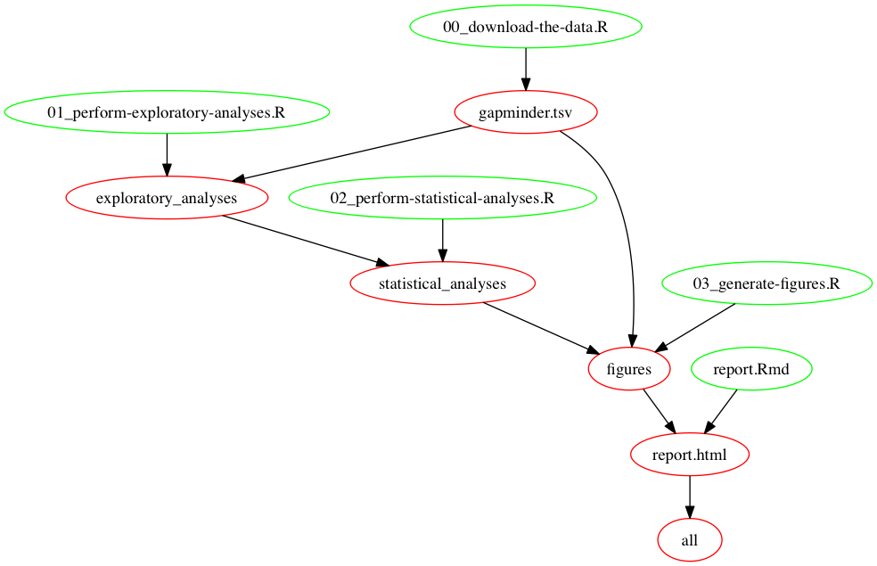

## Prerequisites
You should have installed the make and makefile2graph.

## Steps
To Run the data anlaysis pipeline, you should take the following steps:

Step 0: clone or download this folder to your local machine, open the shell or the command line window, and then enter the root directory of this folder

Step 1: clear all the tsv, csv, png, html files and report.md using the following command:

```
make clean
```

Step 2: automate the pipline using the following command:

```
make
```

Step 3: generate the graphical view of the pipeline using the following command:

```
make -Bnd | make2graph | dot -Tpng -o graphical-view-of-my-pipeline.png
```

## The graphical view of my pipeline



## Links
**Five R scripts**

1. [00_download-the-data.R](00_download-the-data.R)
2. [01_perform-exploratory-analyses.R](01_perform-exploratory-analyses.R)
3. [02_perform-statistical-analyses.R](02_perform-statistical-analyses.R)
4. [03_generate-figures.R](03_generate-figures.R)
5. [04_report.R](04_report.R)

[**The raw gapminder data**](gapminder.tsv)

[**The reordered gapminder data**](gap_reordered.csv)

**Figures of exploratory analyses**

- [The median life expectancy for each continent on years](lifeExp_continent.png)
- [The weighted mean of GDP per capita on population for each continent on years](gdpPercap_continent.png)
- [The distribution of the population for each continent on years](pop_continent.png)
- [The life expectancy with GDP per capita for each continent](lifeExp_gdpPercap.png)

[**The linear regression results**](fit_result.csv)

[**The best fitted countries**](best_countries.csv)

[**The worst fitted countries**](worst_countries.csv)

**Figures of the 4 best fitted countries for each continent**

- [Africa](Africa.png)
- [Americas](Americas.png)
- [Asia](Asia.png)
- [Europe](Europe.png)
- [Oceania](Oceania.png)