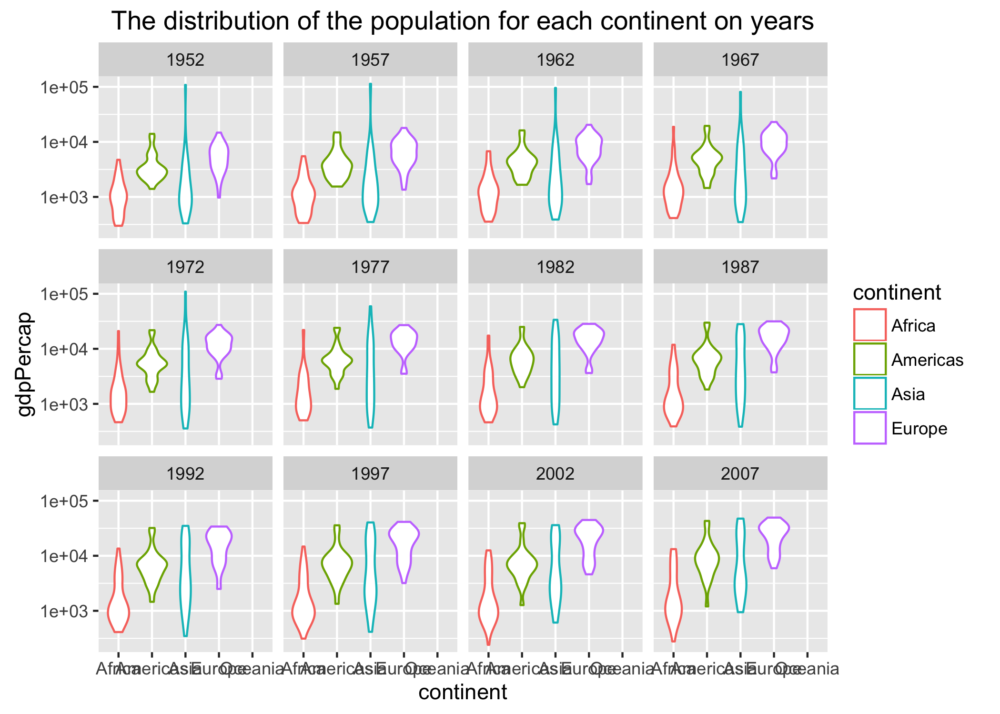

```{r setup, include=FALSE}
knitr::opts_chunk$set(echo = TRUE)
```

## Loading packages

```{r}
library(dplyr)
library(gapminder)
library(ggplot2)
library(knitr)
library(downloader)
library(forcats)
```

## Graphical view of my pipeline


## Download the gapminder data

```{r}
download.file("https://raw.githubusercontent.com/jennybc/gapminder/master/inst/gapminder.tsv", destfile="gapminder.tsv")
```

## Perform exploratory analyses
```{r}
## load the gapminder data frame
gapminder <- read.delim("gapminder.tsv")
str(gapminder)

## The median life expectancy for each continent on years
gap_lifeExp <- gapminder %>% 
  select(year, continent, lifeExp) %>% 
  group_by(year, continent) %>% 
  summarise(medianLifeExp = median(lifeExp))

p <- gap_lifeExp %>% 
  ggplot(aes(x = year, y = medianLifeExp, fill = continent)) +
  geom_bar(stat = "identity", position = "dodge") +
  ggtitle("The median life expectancy for each continent on years")

ggsave("lifeExp_continent.png", p)

## The weighted mean of GDP per capita on population for each continent on years
gap_gdpPercap <- gapminder %>% 
  select(year, continent, gdpPercap, pop) %>% 
  group_by(year, continent) %>% 
  summarise(weightedMeanGdpPercap = weighted.mean(gdpPercap, pop))

p <- gap_gdpPercap %>% 
  ggplot(aes(x = year, y = weightedMeanGdpPercap, color = continent)) +
  geom_point() +
  geom_path() +
  ggtitle("The weighted mean of GDP per capita on population for each continent on years")

ggsave("gdpPercap_continent.png", p)

## The distribution of the population for each continent on years
p <- gapminder %>% 
  ggplot(aes(x = continent, y = gdpPercap, color = continent)) +
  scale_y_log10() +
  geom_violin() +
  facet_wrap(~ year) +
  ggtitle("The distribution of the population for each continent on years")

ggsave("pop_continent.png", p)

## The life expectancy with GDP per capita for each continent 
p <- gapminder %>% 
  mutate(country = fct_reorder(country, -1 * pop)) %>% 
  ggplot(aes(x = gdpPercap, y = lifeExp, size = pop, fill = continent)) + 
  scale_x_log10(limits = c(200, 65000)) +
  geom_point(pch = 21, show.legend = FALSE) +
  scale_size_continuous(range = c(1,10)) +
  facet_wrap(~ continent) +
  ggtitle("The life expectancy with GDP per capita for each continent")

ggsave("lifeExp_gdpPercap.png", p)

## Reorder the continent and country based on their median life expectancy and sort the actual data in the ascending order of life expectancy
gap_reordered <- gapminder %>% 
  mutate(country = fct_reorder(country, lifeExp)) %>% 
  mutate(continent = fct_reorder(continent, lifeExp)) %>% 
  arrange(lifeExp)

## Write the reordered gapminder data to a file
write.csv(gap_reordered, "gap_reordered.csv")
```

I performed some exploratory analyses on the gapminder data including the variation of the life expectancy on years for each continent, the variation of the GDP per capita on years for each continent, etc. The R script is [](01_perform-exploratory-analyses.R). The figures are as follows:

1. The median life expectancy for each continent on years


2. The weighted mean of GDP per capita on population for each continent on years


3. The distribution of the population for each continent on years


4. The life expectancy with GDP per capita for each continent


For further statistical anlaysis, I reordered the continent and country variable according to the value of lifeExp. This is the [reordered data](gap_reordered.csv). 

## Perform statistical analyses
```{r}
## Import the reordered gapminder data created in the first script
gapminder <- read.csv("gap_reordered.csv")

## Linear regression model
lin_fit <- function(dat, offset = 1952) {
  the_fit <- lm(lifeExp ~ I(year - offset), dat)
  result <- data.frame("continent" = dat$continent %>% unique(),
                       "intercept" = coef(the_fit)[1],
                       "slope" = coef(the_fit)[2],
                       "res_err_var" =  (summary(the_fit)$sigma)**2)
  return(result)
}

fit_result <- gapminder %>% 
  group_by(country) %>% 
  do(lin_fit(.))

write.csv(fit_result, "fit_result.csv")

## Find 4 worst and best fitted countries for each continent

best_countries <- fit_result %>% 
  group_by(continent) %>% 
  filter(min_rank(res_err_var) <= 4) %>% 
  arrange(continent, res_err_var)

worst_countries <- fit_result %>% 
  group_by(continent) %>% 
  filter(min_rank(desc(res_err_var)) <= 4) %>% 
  arrange(continent, res_err_var)

write.csv(best_countries, "best_countries.csv")
write.csv(worst_countries, "worst_countries.csv")
```

First I read the reordered gapminder data created in the previous step. Then I fit a linear regression of life expectancy on year within each country and saved the estimated intercepts, slopes, and residual error variance as a data frame to a file. This file is [](fit_result.csv). Finally I found the 4 best and worst fitted countries for each continent based on residual error variance and saved them to two files. The two files are [](best_countries.csv) and[](worst_countries.csv). The R script is [](02_perform-statistical-analyses.R)

## Generate figures
```{r}
best_countries <- read.csv("best_countries.csv")
gapminder <- read.csv("gap_reordered.csv")

## Africa

p <- gapminder %>% 
  filter(country %in% best_countries$country, continent == "Africa") %>% 
  ggplot(aes(x = year, y = lifeExp, color = country)) +
  geom_point() +
  geom_smooth(lwd = 1, se = FALSE, method = "lm") +
  facet_wrap(~ country) +
  ggtitle("4 best fitted countries for Africa")

ggsave("Africa.png", p)

## Americas

p <- gapminder %>% 
  filter(country %in% best_countries$country, continent == "Americas") %>% 
  ggplot(aes(x = year, y = lifeExp, color = country)) +
  geom_point() +
  geom_smooth(lwd = 1, se = FALSE, method = "lm") +
  facet_wrap(~ country) +
  ggtitle("4 best fitted countries for Americas")

ggsave("Americas.png", p)

## Asia

p <- gapminder %>% 
  filter(country %in% best_countries$country, continent == "Asia") %>% 
  ggplot(aes(x = year, y = lifeExp, color = country)) +
  geom_point() +
  geom_smooth(lwd = 1, se = FALSE, method = "lm") +
  facet_wrap(~ country) +
  ggtitle("4 best fitted countries for Asia")

ggsave("Asia.png", p)

## Europe

p <- gapminder %>% 
  filter(country %in% best_countries$country, continent == "Europe") %>% 
  ggplot(aes(x = year, y = lifeExp, color = country)) +
  geom_point() +
  geom_smooth(lwd = 1, se = FALSE, method = "lm") +
  facet_wrap(~ country) +
  ggtitle("4 best fitted countries for Europe")

ggsave("Europe.png", p)

## Oceania

p <- gapminder %>% 
  filter(country %in% best_countries$country, continent == "Oceania") %>% 
  ggplot(aes(x = year, y = lifeExp, color = country)) +
  geom_point() +
  geom_smooth(lwd = 1, se = FALSE, method = "lm") +
  facet_wrap(~ country) +
  ggtitle("4 best fitted countries for Oceania")

ggsave("Oceania.png", p)
```

I plotted the linear regression figures of the 4 best fitted countries for each continent and saved each of them to a file. The figures are as follows:

1. Africa


2. Americas


3. Asia


4. Europe


5. Oceania


## Automate the pipeline
```{}
all: report.html

clean:
	rm -f *.tsv *.png *.csv report.md *.html
  
gapminder.tsv: 00_download-the-data.R
	Rscript 00_download-the-data.R
  
exploratory_analyses: 01_perform-exploratory-analyses.R gapminder.tsv
	Rscript 01_perform-exploratory-analyses.R
  
statistical_analyses: 02_perform-statistical-analyses.R exploratory_analyses
	Rscript 02_perform-statistical-analyses.R
  
figures: 03_generate-figures.R statistical_analyses gapminder.tsv
	Rscript 03_generate-figures.R
  
report.html: report.Rmd figures
	Rscript 04_report.R
```

After I finished writing the five R scripts and this R markdown file, I automated the pipeline using make. The content of the Makefile is shown above.

## Report my process
Before I started doing this homework, I knew little about pipline. The examples given by the homework page are really useful. I just followed these examples to get the ideas about how to pipeline my R scripts. The links provided are also helpful. I encountered an error that "pandoc version 1.12.3 or higher is required and was not found (see the help page ?rmarkdown::pandoc_available)" when I rendered a R markdown file using make. Fortunately, I fixed it by googling the solution. I just got the path of pandoc using `*Sys.setenv(RSTUDIO_PANDOC)*` and set the path of pandoc using `*Sys.setenv(RSTUDIO_PANDOC = the path)*`. 

## Some usefult links
+ [An example of a data analysis pipeline using Make](https://github.com/sjackman/makefile-example/)
+ [Automating Data Analysis Pipelines](http://sjackman.ca/makefile-slides/#/automating-data-analysis-pipelines)
+ [An introduction to Make](http://kbroman.org/minimal_make/)
+ [makefile2graph](https://github.com/lindenb/makefile2graph)
+ [Homebrew](http://brew.sh)