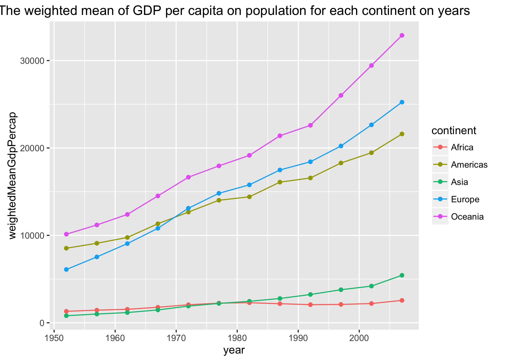
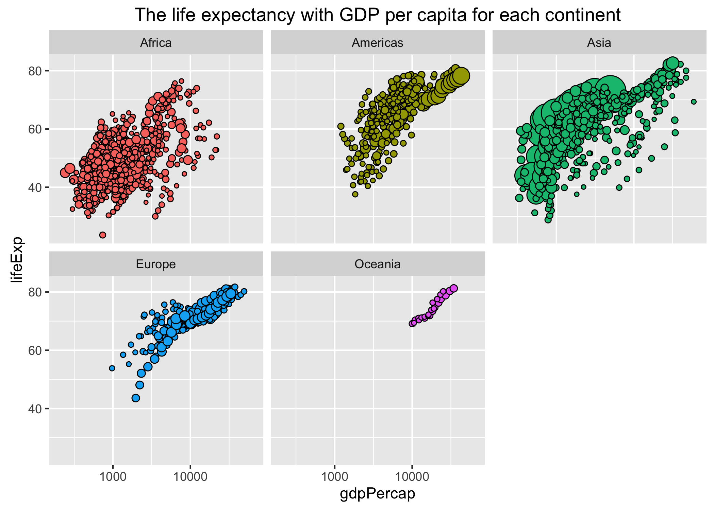
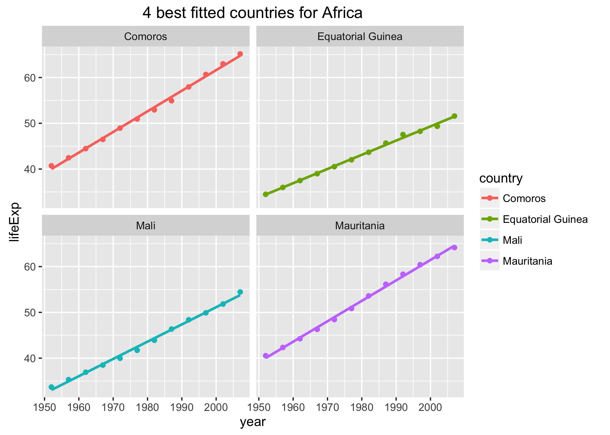
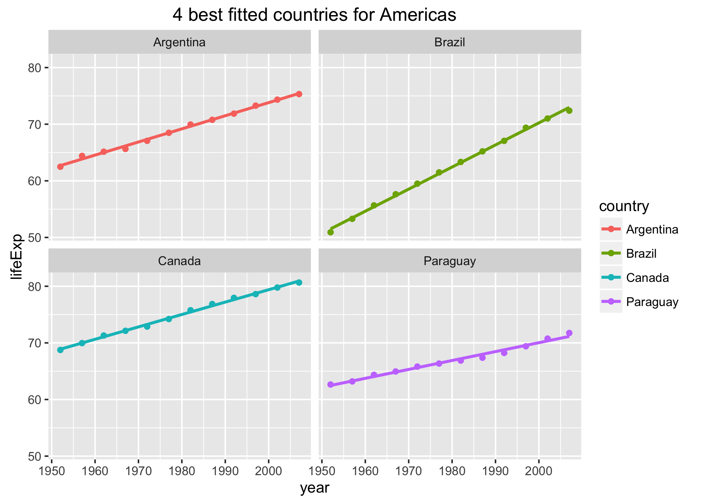

Homework 07: Automating Data-analysis Pipelines
================
Ke Dai
2016年11月18日

Loading packages
----------------

``` r
library(dplyr)
```

    ## 
    ## Attaching package: 'dplyr'

    ## The following objects are masked from 'package:stats':
    ## 
    ##     filter, lag

    ## The following objects are masked from 'package:base':
    ## 
    ##     intersect, setdiff, setequal, union

``` r
library(gapminder)
library(ggplot2)
library(knitr)
library(downloader)
```

Graphical view of my pipeline
-----------------------------

Download the gapminder data
---------------------------

``` r
# download.file("https://raw.githubusercontent.com/jennybc/gapminder/master/inst/gapminder.tsv", destfile="gapminder.tsv")
read_chunk('00_download-the-data.R')
```

Perform exploratory analyses
----------------------------

I performed some exploratory analyses on the gapminder data including the variation of the life expectancy on years for each continent, the variation of the GDP per capita on years for each continent, etc. The R script is [](01_perform-exploratory-analyses.R). The figures are as follows:

1.  The median life expectancy for each continent on years 

2.  The weighted mean of GDP per capita on population for each continent on years 

3.  The distribution of the population for each continent on years 

4.  The life expectancy with GDP per capita for each continent 

For further statistical anlaysis, I reordered the continent and country variable according to the value of lifeExp. This is the [reordered data](gap_reordered.csv). \#\# Perform statistical analyses

First I read the reordered gapminder data created in the previous step. Then I fit a linear regression of life expectancy on year within each country and saved the estimated intercepts, slopes, and residual error variance as a data frame to a file. This file is [](fit_result.csv). Finally I found the 4 best and worst fitted countries for each continent based on residual error variance and saved them to two files. The two files are [](best_countries.csv) and[](worst_countries.csv). The R script is [](02_perform-statistical-analyses.R)

Generate figures
----------------

I plotted the linear regression figures of the 4 best fitted countries for each continent and saved each of them to a file. The figures are as follows:

1.  Africa 

2.  Americas 

3.  Asia 

4.  Europe 

5.  Oceania 

Automate the pipeline
---------------------
