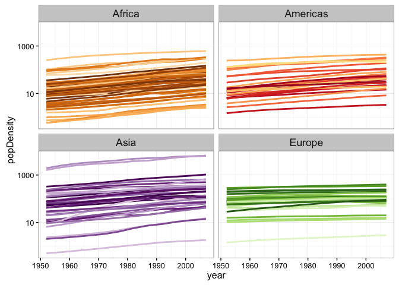

Homework 10: Get data from the web
================
Ke Dai
2016年12月6日

Import data and tools
---------------------

``` r
library(gapminder)
library(countrycode)
library(geonames)
```

    ## No geonamesUsername set. See http://geonames.wordpress.com/2010/03/16/ddos-part-ii/ and set one with options(geonamesUsername="foo") for some services to work

``` r
library(ggplot2)
library(dplyr)
```

    ## 
    ## Attaching package: 'dplyr'

    ## The following objects are masked from 'package:stats':
    ## 
    ##     filter, lag

    ## The following objects are masked from 'package:base':
    ## 
    ##     intersect, setdiff, setequal, union

``` r
library(knitr)
options(geonamesUsername = "ke_dai")
```

Use an R package that wraps an API
----------------------------------

Combine gapminder and data from geonames. Install the geonames package (on CRAN, on GitHub). Make a user account and use geonames to access data about the world’s countries. Use data from geonames and gapminder to investigate the population density against time.

``` r
## change country variable in gapminder to countryCode variable
gapminderCode <- gapminder %>% 
  mutate(countryCode = countrycode(country, "country.name", "iso2c"))

## get countryInfo data
countryInfo <- GNcountryInfo()

## select countryCode and areaInSqKm variables from countryInfo
countryArea <- countryInfo %>% 
  select(countryCode, area = areaInSqKm) %>% 
  mutate(area = as.double(area))

kable(countryArea[1:20, ])
```

| countryCode |      area|
|:------------|---------:|
| AD          |       468|
| AE          |     82880|
| AF          |    647500|
| AG          |       443|
| AI          |       102|
| AL          |     28748|
| AM          |     29800|
| AO          |   1246700|
| AQ          |  14000000|
| AR          |   2766890|
| AS          |       199|
| AT          |     83858|
| AU          |   7686850|
| AW          |       193|
| AX          |      1580|
| AZ          |     86600|
| BA          |     51129|
| BB          |       431|
| BD          |    144000|
| BE          |     30510|

``` r
## left join gapminderCode with countryPos
gapminderArea <- gapminderCode %>% 
  left_join(countryArea, by = "countryCode")

kable(gapminderArea[1:20, ])
```

| country     | continent |  year|  lifeExp|       pop|  gdpPercap| countryCode |    area|
|:------------|:----------|-----:|--------:|---------:|----------:|:------------|-------:|
| Afghanistan | Asia      |  1952|   28.801|   8425333|   779.4453| AF          |  647500|
| Afghanistan | Asia      |  1957|   30.332|   9240934|   820.8530| AF          |  647500|
| Afghanistan | Asia      |  1962|   31.997|  10267083|   853.1007| AF          |  647500|
| Afghanistan | Asia      |  1967|   34.020|  11537966|   836.1971| AF          |  647500|
| Afghanistan | Asia      |  1972|   36.088|  13079460|   739.9811| AF          |  647500|
| Afghanistan | Asia      |  1977|   38.438|  14880372|   786.1134| AF          |  647500|
| Afghanistan | Asia      |  1982|   39.854|  12881816|   978.0114| AF          |  647500|
| Afghanistan | Asia      |  1987|   40.822|  13867957|   852.3959| AF          |  647500|
| Afghanistan | Asia      |  1992|   41.674|  16317921|   649.3414| AF          |  647500|
| Afghanistan | Asia      |  1997|   41.763|  22227415|   635.3414| AF          |  647500|
| Afghanistan | Asia      |  2002|   42.129|  25268405|   726.7341| AF          |  647500|
| Afghanistan | Asia      |  2007|   43.828|  31889923|   974.5803| AF          |  647500|
| Albania     | Europe    |  1952|   55.230|   1282697|  1601.0561| AL          |   28748|
| Albania     | Europe    |  1957|   59.280|   1476505|  1942.2842| AL          |   28748|
| Albania     | Europe    |  1962|   64.820|   1728137|  2312.8890| AL          |   28748|
| Albania     | Europe    |  1967|   66.220|   1984060|  2760.1969| AL          |   28748|
| Albania     | Europe    |  1972|   67.690|   2263554|  3313.4222| AL          |   28748|
| Albania     | Europe    |  1977|   68.930|   2509048|  3533.0039| AL          |   28748|
| Albania     | Europe    |  1982|   70.420|   2780097|  3630.8807| AL          |   28748|
| Albania     | Europe    |  1987|   72.000|   3075321|  3738.9327| AL          |   28748|

``` r
## calculate the population density
gapminderPopDensity <- gapminderArea %>% 
  mutate(popDensity = pop/area) %>% 
  select(-area)

kable(gapminderPopDensity[1:20, ])
```

| country     | continent |  year|  lifeExp|       pop|  gdpPercap| countryCode |  popDensity|
|:------------|:----------|-----:|--------:|---------:|----------:|:------------|-----------:|
| Afghanistan | Asia      |  1952|   28.801|   8425333|   779.4453| AF          |    13.01210|
| Afghanistan | Asia      |  1957|   30.332|   9240934|   820.8530| AF          |    14.27171|
| Afghanistan | Asia      |  1962|   31.997|  10267083|   853.1007| AF          |    15.85650|
| Afghanistan | Asia      |  1967|   34.020|  11537966|   836.1971| AF          |    17.81925|
| Afghanistan | Asia      |  1972|   36.088|  13079460|   739.9811| AF          |    20.19994|
| Afghanistan | Asia      |  1977|   38.438|  14880372|   786.1134| AF          |    22.98127|
| Afghanistan | Asia      |  1982|   39.854|  12881816|   978.0114| AF          |    19.89470|
| Afghanistan | Asia      |  1987|   40.822|  13867957|   852.3959| AF          |    21.41769|
| Afghanistan | Asia      |  1992|   41.674|  16317921|   649.3414| AF          |    25.20142|
| Afghanistan | Asia      |  1997|   41.763|  22227415|   635.3414| AF          |    34.32805|
| Afghanistan | Asia      |  2002|   42.129|  25268405|   726.7341| AF          |    39.02456|
| Afghanistan | Asia      |  2007|   43.828|  31889923|   974.5803| AF          |    49.25085|
| Albania     | Europe    |  1952|   55.230|   1282697|  1601.0561| AL          |    44.61865|
| Albania     | Europe    |  1957|   59.280|   1476505|  1942.2842| AL          |    51.36027|
| Albania     | Europe    |  1962|   64.820|   1728137|  2312.8890| AL          |    60.11329|
| Albania     | Europe    |  1967|   66.220|   1984060|  2760.1969| AL          |    69.01558|
| Albania     | Europe    |  1972|   67.690|   2263554|  3313.4222| AL          |    78.73779|
| Albania     | Europe    |  1977|   68.930|   2509048|  3533.0039| AL          |    87.27731|
| Albania     | Europe    |  1982|   70.420|   2780097|  3630.8807| AL          |    96.70575|
| Albania     | Europe    |  1987|   72.000|   3075321|  3738.9327| AL          |   106.97513|

``` r
## plot the graph of population density agianst time
ggplot(subset(gapminderPopDensity, continent != "Oceania"),
       aes(x = year, y = popDensity, group = country, color = country)) +
  geom_line(lwd = 1, show.legend = FALSE) + facet_wrap(~ continent) +
  scale_color_manual(values = country_colors) + theme_bw() +
  theme(strip.text = element_text(size = rel(1.1))) + scale_y_log10()
```



Report my process
-----------------

For this homework, I explored getting data from the internet into R using an R package that wraps an API. It's not very difficult for me as I have tried combining gapminder and data from geonames in Homework 04. Congratuations! I have finished all of ten assignments. I learned a lot from this course. I appreciate Jennifer's and all the TAs' effort on this course. Finally, hope everyone have a good vacation.
