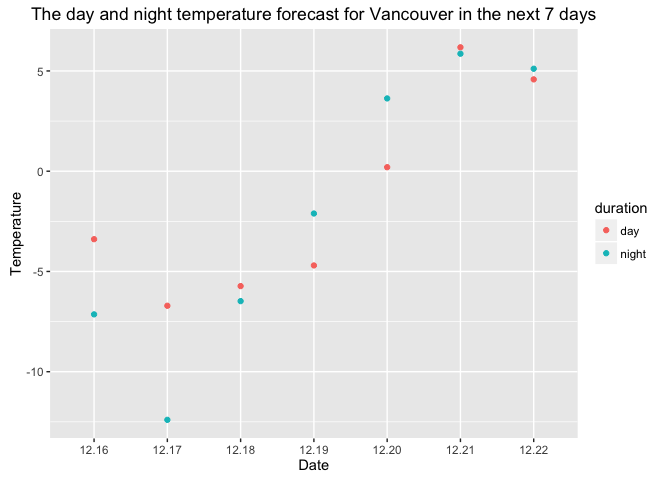

Homework 10: Get data from the web
================
Ke Dai
2016年12月6日

Import data and tools
---------------------

``` r
library(gapminder)
library(countrycode)
library(geonames)
```

    ## No geonamesUsername set. See http://geonames.wordpress.com/2010/03/16/ddos-part-ii/ and set one with options(geonamesUsername="foo") for some services to work

``` r
library(ggplot2)
library(tidyverse)
```

    ## Loading tidyverse: tibble
    ## Loading tidyverse: tidyr
    ## Loading tidyverse: readr
    ## Loading tidyverse: purrr
    ## Loading tidyverse: dplyr

    ## Conflicts with tidy packages ----------------------------------------------

    ## filter(): dplyr, stats
    ## lag():    dplyr, stats

``` r
library(stringr)
library(knitr)
library(httr)
library(purrr)
options(geonamesUsername = "ke_dai")
```

Make API queries “by hand” using httr
-------------------------------------

Get 7 day weather forecast for Vancouver from OpenWeatherMap.

``` r
## Get the raw data
response <- GET('api.openweathermap.org/data/2.5/forecast/daily?q=Vancouver&units=metric&cnt=7&APPID=2aa01b3164554605bbc8a44a976ae76a')
status_code(response)
```

    ## [1] 200

``` r
headers(response)[["content-type"]]
```

    ## [1] "application/json; charset=utf-8"

``` r
rawData <- content(response, type = "application/json")
str(rawData, max.level = 3)
```

    ## List of 5
    ##  $ city   :List of 5
    ##   ..$ id        : int 6173331
    ##   ..$ name      : chr "Vancouver"
    ##   ..$ coord     :List of 2
    ##   .. ..$ lon: num -123
    ##   .. ..$ lat: num 49.2
    ##   ..$ country   : chr "CA"
    ##   ..$ population: int 0
    ##  $ cod    : chr "200"
    ##  $ message: num 0.0191
    ##  $ cnt    : int 7
    ##  $ list   :List of 7
    ##   ..$ :List of 8
    ##   .. ..$ dt      : int 1481832000
    ##   .. ..$ temp    :List of 6
    ##   .. ..$ pressure: num 1007
    ##   .. ..$ humidity: int 100
    ##   .. ..$ weather :List of 1
    ##   .. ..$ speed   : num 1.41
    ##   .. ..$ deg     : int 66
    ##   .. ..$ clouds  : int 0
    ##   ..$ :List of 8
    ##   .. ..$ dt      : int 1481918400
    ##   .. ..$ temp    :List of 6
    ##   .. ..$ pressure: num 1017
    ##   .. ..$ humidity: int 100
    ##   .. ..$ weather :List of 1
    ##   .. ..$ speed   : num 2.11
    ##   .. ..$ deg     : int 58
    ##   .. ..$ clouds  : int 0
    ##   ..$ :List of 9
    ##   .. ..$ dt      : int 1482004800
    ##   .. ..$ temp    :List of 6
    ##   .. ..$ pressure: num 1024
    ##   .. ..$ humidity: int 100
    ##   .. ..$ weather :List of 1
    ##   .. ..$ speed   : num 1.77
    ##   .. ..$ deg     : int 75
    ##   .. ..$ clouds  : int 56
    ##   .. ..$ snow    : num 0.32
    ##   ..$ :List of 9
    ##   .. ..$ dt      : int 1482091200
    ##   .. ..$ temp    :List of 6
    ##   .. ..$ pressure: num 1012
    ##   .. ..$ humidity: int 0
    ##   .. ..$ weather :List of 1
    ##   .. ..$ speed   : num 2.18
    ##   .. ..$ deg     : int 71
    ##   .. ..$ clouds  : int 94
    ##   .. ..$ snow    : num 2.24
    ##   ..$ :List of 10
    ##   .. ..$ dt      : int 1482177600
    ##   .. ..$ temp    :List of 6
    ##   .. ..$ pressure: num 1005
    ##   .. ..$ humidity: int 0
    ##   .. ..$ weather :List of 1
    ##   .. ..$ speed   : num 2.23
    ##   .. ..$ deg     : int 128
    ##   .. ..$ clouds  : int 95
    ##   .. ..$ rain    : num 3.37
    ##   .. ..$ snow    : num 5.16
    ##   ..$ :List of 10
    ##   .. ..$ dt      : int 1482264000
    ##   .. ..$ temp    :List of 6
    ##   .. ..$ pressure: num 986
    ##   .. ..$ humidity: int 0
    ##   .. ..$ weather :List of 1
    ##   .. ..$ speed   : num 6.21
    ##   .. ..$ deg     : int 234
    ##   .. ..$ clouds  : int 76
    ##   .. ..$ rain    : num 21.5
    ##   .. ..$ snow    : num 4.69
    ##   ..$ :List of 10
    ##   .. ..$ dt      : int 1482350400
    ##   .. ..$ temp    :List of 6
    ##   .. ..$ pressure: num 990
    ##   .. ..$ humidity: int 0
    ##   .. ..$ weather :List of 1
    ##   .. ..$ speed   : num 3.98
    ##   .. ..$ deg     : int 139
    ##   .. ..$ clouds  : int 99
    ##   .. ..$ rain    : num 12.3
    ##   .. ..$ snow    : num 3.32

``` r
## Transfrom the raw data into a data frame
weatherVancouver <- tibble(
  temp = rawData$list %>% map("temp"),
  pressure = rawData$list %>% map_chr("pressure"),
  humidity = rawData$list %>% map_chr("humidity"),
  windSpeed = rawData$list %>% map_chr("speed"),
  windDeg = rawData$list %>% map_chr("deg")
)

kable(weatherVancouver)
```

| temp                                         | pressure    | humidity | windSpeed | windDeg |
|:---------------------------------------------|:------------|:---------|:----------|:--------|
| -3.39, -7.14, -3.39, -7.14, -3.39, -3.39     | 1007.310000 | 100      | 1.410000  | 66      |
| -6.71, -12.40, -6.71, -12.40, -10.20, -10.83 | 1016.800000 | 100      | 2.110000  | 58      |
| -5.73, -10.06, -5.73, -6.48, -6.45, -10.06   | 1024.290000 | 100      | 1.770000  | 75      |
| -4.70, -6.17, -2.11, -2.11, -2.95, -6.17     | 1012.030000 | 0        | 2.180000  | 71      |
| 0.20, -1.24, 3.63, 3.63, 2.24, -1.24         | 1004.960000 | 0        | 2.230000  | 128     |
| 6.18, 4.74, 6.86, 5.86, 6.86, 4.74           | 986.240000  | 0        | 6.210000  | 234     |
| 4.58, 4.58, 5.32, 5.11, 5.32, 4.92           | 989.830000  | 0        | 3.980000  | 139     |

``` r
## Turn the nested data frame into a regular one
weatherVancouver <- weatherVancouver %>% 
  mutate(
    day = map(temp, "day"),
    night = map(temp, "night")
  ) %>% 
  select(-temp) %>% 
  unnest()

kable(weatherVancouver)
```

| pressure    | humidity | windSpeed | windDeg |    day|   night|
|:------------|:---------|:----------|:--------|------:|-------:|
| 1007.310000 | 100      | 1.410000  | 66      |  -3.39|   -7.14|
| 1016.800000 | 100      | 2.110000  | 58      |  -6.71|  -12.40|
| 1024.290000 | 100      | 1.770000  | 75      |  -5.73|   -6.48|
| 1012.030000 | 0        | 2.180000  | 71      |  -4.70|   -2.11|
| 1004.960000 | 0        | 2.230000  | 128     |   0.20|    3.63|
| 986.240000  | 0        | 6.210000  | 234     |   6.18|    5.86|
| 989.830000  | 0        | 3.980000  | 139     |   4.58|    5.11|

``` r
## create a date tibble
date <- tibble(date = str_c("12.", 16:22))
date
```

    ## # A tibble: 7 × 1
    ##    date
    ##   <chr>
    ## 1 12.16
    ## 2 12.17
    ## 3 12.18
    ## 4 12.19
    ## 5 12.20
    ## 6 12.21
    ## 7 12.22

``` r
## combine date with weatherVancouver
weatherVancouver <- cbind(date, weatherVancouver)
kable(weatherVancouver)
```

| date  | pressure    | humidity | windSpeed | windDeg |    day|   night|
|:------|:------------|:---------|:----------|:--------|------:|-------:|
| 12.16 | 1007.310000 | 100      | 1.410000  | 66      |  -3.39|   -7.14|
| 12.17 | 1016.800000 | 100      | 2.110000  | 58      |  -6.71|  -12.40|
| 12.18 | 1024.290000 | 100      | 1.770000  | 75      |  -5.73|   -6.48|
| 12.19 | 1012.030000 | 0        | 2.180000  | 71      |  -4.70|   -2.11|
| 12.20 | 1004.960000 | 0        | 2.230000  | 128     |   0.20|    3.63|
| 12.21 | 986.240000  | 0        | 6.210000  | 234     |   6.18|    5.86|
| 12.22 | 989.830000  | 0        | 3.980000  | 139     |   4.58|    5.11|

``` r
## gather weatherVanvouer
weatherVancouver <- weatherVancouver %>% 
  gather(`day`, `night`, key = "duration", value = "temp")

kable(weatherVancouver)
```

| date  | pressure    | humidity | windSpeed | windDeg | duration |    temp|
|:------|:------------|:---------|:----------|:--------|:---------|-------:|
| 12.16 | 1007.310000 | 100      | 1.410000  | 66      | day      |   -3.39|
| 12.17 | 1016.800000 | 100      | 2.110000  | 58      | day      |   -6.71|
| 12.18 | 1024.290000 | 100      | 1.770000  | 75      | day      |   -5.73|
| 12.19 | 1012.030000 | 0        | 2.180000  | 71      | day      |   -4.70|
| 12.20 | 1004.960000 | 0        | 2.230000  | 128     | day      |    0.20|
| 12.21 | 986.240000  | 0        | 6.210000  | 234     | day      |    6.18|
| 12.22 | 989.830000  | 0        | 3.980000  | 139     | day      |    4.58|
| 12.16 | 1007.310000 | 100      | 1.410000  | 66      | night    |   -7.14|
| 12.17 | 1016.800000 | 100      | 2.110000  | 58      | night    |  -12.40|
| 12.18 | 1024.290000 | 100      | 1.770000  | 75      | night    |   -6.48|
| 12.19 | 1012.030000 | 0        | 2.180000  | 71      | night    |   -2.11|
| 12.20 | 1004.960000 | 0        | 2.230000  | 128     | night    |    3.63|
| 12.21 | 986.240000  | 0        | 6.210000  | 234     | night    |    5.86|
| 12.22 | 989.830000  | 0        | 3.980000  | 139     | night    |    5.11|

``` r
## plot the variation of day and night temperature 
weatherVancouver %>% 
  ggplot(aes(x = date, y = temp, color = duration)) +
  geom_point() +
  labs(title = "The day and night temperature forecast for Vancouver in the next 7 days", x = "Date", y = "Temperature")
```



``` r
## plot the variation of pressure
weatherVancouver %>% 
  ggplot(aes(x = date, y = pressure)) +
  geom_bar(stat = "identity", fill = "red") +
  labs(title = "The pressure forecast for Vancouver in the next 7 days", x = "Date", y = "Pressure")
```


Use an R package that wraps an API
----------------------------------

Combine gapminder and data from geonames. Install the geonames package (on CRAN, on GitHub). Make a user account and use geonames to access data about the world’s countries. Use data from geonames and gapminder to investigate the population density against time.

``` r
## change country variable in gapminder to countryCode variable
gapminderCode <- gapminder %>% 
  mutate(countryCode = countrycode(country, "country.name", "iso2c"))

## get countryInfo data
countryInfo <- GNcountryInfo()

## select countryCode and areaInSqKm variables from countryInfo
countryArea <- countryInfo %>% 
  select(countryCode, area = areaInSqKm) %>% 
  mutate(area = as.double(area))

kable(countryArea[1:20, ])
```

| countryCode |      area|
|:------------|---------:|
| AD          |       468|
| AE          |     82880|
| AF          |    647500|
| AG          |       443|
| AI          |       102|
| AL          |     28748|
| AM          |     29800|
| AO          |   1246700|
| AQ          |  14000000|
| AR          |   2766890|
| AS          |       199|
| AT          |     83858|
| AU          |   7686850|
| AW          |       193|
| AX          |      1580|
| AZ          |     86600|
| BA          |     51129|
| BB          |       431|
| BD          |    144000|
| BE          |     30510|

``` r
## left join gapminderCode with countryPos
gapminderArea <- gapminderCode %>% 
  left_join(countryArea, by = "countryCode")

kable(gapminderArea[1:20, ])
```

| country     | continent |  year|  lifeExp|       pop|  gdpPercap| countryCode |    area|
|:------------|:----------|-----:|--------:|---------:|----------:|:------------|-------:|
| Afghanistan | Asia      |  1952|   28.801|   8425333|   779.4453| AF          |  647500|
| Afghanistan | Asia      |  1957|   30.332|   9240934|   820.8530| AF          |  647500|
| Afghanistan | Asia      |  1962|   31.997|  10267083|   853.1007| AF          |  647500|
| Afghanistan | Asia      |  1967|   34.020|  11537966|   836.1971| AF          |  647500|
| Afghanistan | Asia      |  1972|   36.088|  13079460|   739.9811| AF          |  647500|
| Afghanistan | Asia      |  1977|   38.438|  14880372|   786.1134| AF          |  647500|
| Afghanistan | Asia      |  1982|   39.854|  12881816|   978.0114| AF          |  647500|
| Afghanistan | Asia      |  1987|   40.822|  13867957|   852.3959| AF          |  647500|
| Afghanistan | Asia      |  1992|   41.674|  16317921|   649.3414| AF          |  647500|
| Afghanistan | Asia      |  1997|   41.763|  22227415|   635.3414| AF          |  647500|
| Afghanistan | Asia      |  2002|   42.129|  25268405|   726.7341| AF          |  647500|
| Afghanistan | Asia      |  2007|   43.828|  31889923|   974.5803| AF          |  647500|
| Albania     | Europe    |  1952|   55.230|   1282697|  1601.0561| AL          |   28748|
| Albania     | Europe    |  1957|   59.280|   1476505|  1942.2842| AL          |   28748|
| Albania     | Europe    |  1962|   64.820|   1728137|  2312.8890| AL          |   28748|
| Albania     | Europe    |  1967|   66.220|   1984060|  2760.1969| AL          |   28748|
| Albania     | Europe    |  1972|   67.690|   2263554|  3313.4222| AL          |   28748|
| Albania     | Europe    |  1977|   68.930|   2509048|  3533.0039| AL          |   28748|
| Albania     | Europe    |  1982|   70.420|   2780097|  3630.8807| AL          |   28748|
| Albania     | Europe    |  1987|   72.000|   3075321|  3738.9327| AL          |   28748|

``` r
## calculate the population density
gapminderPopDensity <- gapminderArea %>% 
  mutate(popDensity = pop/area) %>% 
  select(-area)

kable(gapminderPopDensity[1:20, ])
```

| country     | continent |  year|  lifeExp|       pop|  gdpPercap| countryCode |  popDensity|
|:------------|:----------|-----:|--------:|---------:|----------:|:------------|-----------:|
| Afghanistan | Asia      |  1952|   28.801|   8425333|   779.4453| AF          |    13.01210|
| Afghanistan | Asia      |  1957|   30.332|   9240934|   820.8530| AF          |    14.27171|
| Afghanistan | Asia      |  1962|   31.997|  10267083|   853.1007| AF          |    15.85650|
| Afghanistan | Asia      |  1967|   34.020|  11537966|   836.1971| AF          |    17.81925|
| Afghanistan | Asia      |  1972|   36.088|  13079460|   739.9811| AF          |    20.19994|
| Afghanistan | Asia      |  1977|   38.438|  14880372|   786.1134| AF          |    22.98127|
| Afghanistan | Asia      |  1982|   39.854|  12881816|   978.0114| AF          |    19.89470|
| Afghanistan | Asia      |  1987|   40.822|  13867957|   852.3959| AF          |    21.41769|
| Afghanistan | Asia      |  1992|   41.674|  16317921|   649.3414| AF          |    25.20142|
| Afghanistan | Asia      |  1997|   41.763|  22227415|   635.3414| AF          |    34.32805|
| Afghanistan | Asia      |  2002|   42.129|  25268405|   726.7341| AF          |    39.02456|
| Afghanistan | Asia      |  2007|   43.828|  31889923|   974.5803| AF          |    49.25085|
| Albania     | Europe    |  1952|   55.230|   1282697|  1601.0561| AL          |    44.61865|
| Albania     | Europe    |  1957|   59.280|   1476505|  1942.2842| AL          |    51.36027|
| Albania     | Europe    |  1962|   64.820|   1728137|  2312.8890| AL          |    60.11329|
| Albania     | Europe    |  1967|   66.220|   1984060|  2760.1969| AL          |    69.01558|
| Albania     | Europe    |  1972|   67.690|   2263554|  3313.4222| AL          |    78.73779|
| Albania     | Europe    |  1977|   68.930|   2509048|  3533.0039| AL          |    87.27731|
| Albania     | Europe    |  1982|   70.420|   2780097|  3630.8807| AL          |    96.70575|
| Albania     | Europe    |  1987|   72.000|   3075321|  3738.9327| AL          |   106.97513|

``` r
## plot the graph of population density agianst time
ggplot(subset(gapminderPopDensity, continent != "Oceania"),
       aes(x = year, y = popDensity, group = country, color = country)) +
  geom_line(lwd = 1, show.legend = FALSE) + facet_wrap(~ continent) +
  scale_color_manual(values = country_colors) + theme_bw() +
  theme(strip.text = element_text(size = rel(1.1))) + scale_y_log10()
```


Report my process
-----------------

For this homework, I explored getting data from the internet into R using an R package that wraps an API. It's not very difficult for me as I have tried combining gapminder and data from geonames in Homework 04. Congratuations! I have finished all of ten assignments. I learned a lot from this course. I appreciate Jennifer's and all the TAs' effort on this course. Finally, hope everyone have a good vacation.
